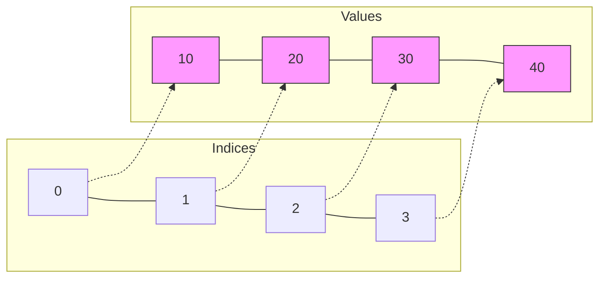

# Arrays: The "Box" Analogy

Think of an Array as a **row of numbered boxes**.
*   Each box holds one item.
*   The numbers (indices) start at **0**.
*   You can jump to any box instantly if you know its number.

## 1. Visualization

`arr = [10, 20, 30, 40]`



> [!TIP]
> **Why use Arrays?**
> Because reading `arr[500]` takes the exact same time as reading `arr[0]`. It's **Instant Access**.

## 2. Practical Operations (Python)

### A. Creating
```python
# Empty list
nums = []

# List with values
scores = [98, 85, 76]

# List of size N with default value (VERY USEFUL)
zeros = [0] * 10  # [0, 0, 0, ..., 0]
```

### B. Adding Items
> [!WARNING]
> **Performance Trap!**
> Adding to the **End** is fast. Adding to the **Start** is slow (everyone has to shift).

```python
nums = [1, 2, 3]

# 1. Append (Fast - O(1))
nums.append(4)      # [1, 2, 3, 4] -> Good!

# 2. Insert (Slow - O(N))
nums.insert(0, 99)  # [99, 1, 2, 3, 4] -> Bad for large lists!
```

### C. Removing Items
Same rule applies: Removing from the end is cheap. Removing from the start is expensive.

```python
# 1. Pop from End (Fast)
last = nums.pop()   # Returns 4, nums is [99, 1, 2, 3]

# 2. Pop from Index (Slow)
first = nums.pop(0) # Returns 99, nums is [1, 2, 3] -> Everyone shifts left!
```

## 3. Iterating (The Right Way)

**Scenario 1: Just the values**
```python
for score in scores:
    print(score)
```

**Scenario 2: I need the Index too!**
> [!NOTE]
> Don't use `range(len(arr))` unless you have to. Use `enumerate`.

```python
# Professional Way
for i, score in enumerate(scores):
    print(f"Student {i} got {score}")

# Amateur Way
for i in range(len(scores)):
    print(f"Student {i} got {scores[i]}")
```

## 4. Slicing (The Magic Trick)
Python lets you grab a chunk of the array easily.
`arr[start : end : step]`

```python
nums = [0, 1, 2, 3, 4, 5]

print(nums[1:4])   # [1, 2, 3] (Start inclusive, End exclusive)
print(nums[:3])    # [0, 1, 2] (Start to index 3)
print(nums[3:])    # [3, 4, 5] (Index 3 to end)
print(nums[::-1])  # [5, 4, 3, 2, 1, 0] (Reverse!)
```

> [!CAUTION]
> **Slicing creates a COPY.**
> `new_list = nums[:]` copies the whole list. If `nums` has 1 million items, this takes time and memory.
