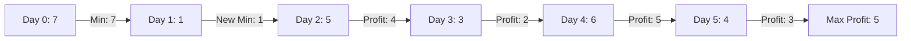

# ⚔️ LeetCode 121: Best Time to Buy and Sell Stock

**Difficulty**: Easy
**Pattern**: One Pass / Greedy

## 1. Problem Detail

You are given an array `prices` where `prices[i]` is the price of a given stock on the `i-th` day.

You want to maximize your profit by choosing a **single day** to buy one stock and choosing a **different day in the future** to sell that stock.

Return the maximum profit you can achieve from this transaction. If you cannot achieve any profit, return `0`.

**Example 1:**
```
Input: prices = [7,1,5,3,6,4]
Output: 5
Explanation: Buy on day 2 (price = 1) and sell on day 5 (price = 6), profit = 6-1 = 5.
Note that buying on day 2 and selling on day 1 is not allowed because you must buy before you sell.
```

**Example 2:**
```
Input: prices = [7,6,4,3,1]
Output: 0
Explanation: In this case, no transactions are done and the max profit = 0.
```

**Constraints:**
*   `1 <= prices.length <= 10^5`
*   `0 <= prices[i] <= 10^4`

---

## 2. Approach: One Pass (Greedy)

We need to find the largest price difference between two days such that the buy day is before the sell day.
A brute force approach would compare every pair `(i, j)` where `j > i`, taking O(N^2).

We can optimize this to O(N) by maintaining two variables as we iterate:
1.  `min_price`: The lowest price we have seen *so far*.
2.  `max_profit`: The maximum profit we can make if we sell *today* (current price - `min_price`).

Logic:
*   If `current_price < min_price`, we found a new lowest point to buy. Update `min_price`.
*   Else if `current_price - min_price > max_profit`, we found a better selling opportunity. Update `max_profit`.

*   **Time Complexity**: O(N)
*   **Space Complexity**: O(1)

---

## 3. Visualization

`prices = [7, 1, 5, 3, 6, 4]`



**Trace Table:**

| Day | Price | Min Price (So Far) | Potential Profit (Price - Min) | Max Profit |
| :--- | :--- | :--- | :--- | :--- |
| 0 | 7 | 7 | 7 - 7 = 0 | 0 |
| 1 | 1 | **1** (Update) | 1 - 1 = 0 | 0 |
| 2 | 5 | 1 | 5 - 1 = 4 | **4** |
| 3 | 3 | 1 | 3 - 1 = 2 | 4 |
| 4 | 6 | 1 | 6 - 1 = 5 | **5** |
| 5 | 4 | 1 | 4 - 1 = 3 | 5 |

---

## 4. Solution

```python
def maxProfit(prices: list[int]) -> int:
    min_price = float('inf')
    max_profit = 0
    
    for price in prices:
        if price < min_price:
            min_price = price
        elif price - min_price > max_profit:
            max_profit = price - min_price
            
    return max_profit
```

---

## 5. Variations

### Variation 1: Best Time to Buy and Sell Stock II (LeetCode 122)

#### Problem Detail
You are given an integer array `prices`. On each day, you may decide to buy and/or sell the stock. You can only hold at most one share of the stock at any time. However, you can buy it then immediately sell it on the same day. Find and return the **maximum profit** you can achieve.

#### Approach: Greedy (Valley Peak)
Since we can make as many transactions as we want, we should capture **every** upward trend.
If `prices[i] > prices[i-1]`, we buy at `i-1` and sell at `i`. We simply sum up all positive differences.

*   **Time**: O(N)
*   **Space**: O(1)

#### Visualization
`[1, 7, 2, 3, 6, 7, 6, 7]`

```
1 -> 7: Increase (+6)
7 -> 2: Decrease (Ignore)
2 -> 3: Increase (+1)
3 -> 6: Increase (+3)
6 -> 7: Increase (+1)
7 -> 6: Decrease (Ignore)
6 -> 7: Increase (+1)

Total Profit = 6 + 1 + 3 + 1 + 1 = 12
```

#### Solution
```python
def maxProfit(prices: list[int]) -> int:
    profit = 0
    for i in range(1, len(prices)):
        if prices[i] > prices[i-1]:
            profit += prices[i] - prices[i-1]
    return profit
```

---

### Variation 2: Best Time to Buy and Sell Stock III (LeetCode 123)

#### Problem Detail
Find the maximum profit you can achieve. You may complete **at most two** transactions.
Note: You may not engage in multiple transactions simultaneously (i.e., you must sell the stock before you buy again).

#### Approach: Dynamic Programming (State Machine)
We track 4 states for each day:
1.  `buy1`: Max profit after 1st buy (negative price).
2.  `sell1`: Max profit after 1st sell.
3.  `buy2`: Max profit after 2nd buy (profit from sell1 - price).
4.  `sell2`: Max profit after 2nd sell.

*   `buy1 = max(buy1, -price)`
*   `sell1 = max(sell1, buy1 + price)`
*   `buy2 = max(buy2, sell1 - price)`
*   `sell2 = max(sell2, buy2 + price)`

*   **Time**: O(N)
*   **Space**: O(1)

#### Visualization
`prices = [3, 3, 5, 0, 0, 3, 1, 4]`

| Day | Price | buy1 | sell1 | buy2 | sell2 |
| :--- | :--- | :--- | :--- | :--- | :--- |
| 0 | 3 | -3 | 0 | -3 | 0 |
| 2 | 5 | -3 | 2 | -3 | 2 |
| 3 | 0 | **0** | 2 | **2** | 2 |
| 5 | 3 | 0 | **3** | 2 | **5** |
| 7 | 4 | 0 | 4 | 2 | **6** |

#### Solution
```python
def maxProfit(prices: list[int]) -> int:
    buy1, buy2 = float('inf'), float('inf')
    sell1, sell2 = 0, 0
    
    for p in prices:
        buy1 = min(buy1, p)
        sell1 = max(sell1, p - buy1)
        buy2 = min(buy2, p)
        sell2 = max(sell2, p - buy2)
        
    return sell2
```

---

### Variation 3: Best Time to Buy and Sell Stock IV (LeetCode 188)

#### Problem Detail
You may complete **at most k** transactions.

#### Approach: Dynamic Programming
Generalization of III. We use a DP table `dp[k+1][n]` or optimized to 1D array.
`dp[i][j]` = Max profit using at most `i` transactions by day `j`.
Recurrence: `dp[i][j] = max(dp[i][j-1], prices[j] + max(dp[i-1][t] - prices[t]))` for `0 <= t < j`.
The inner max can be optimized to run in O(1) during the loop.

*   **Time**: O(NK)
*   **Space**: O(NK) or O(K)

#### Visualization
Concept: We maintain `k` pairs of (buy, sell) states, similar to the 2 pairs in Variation III.

#### Solution
```python
def maxProfit(k: int, prices: list[int]) -> int:
    if not prices: return 0
    
    # If k is large enough, it's equivalent to infinite transactions (Variation II)
    if k >= len(prices) // 2:
        return sum(max(prices[i+1]-prices[i], 0) for i in range(len(prices)-1))
        
    # dp[i][0] = max profit with i transactions, holding a stock
    # dp[i][1] = max profit with i transactions, not holding a stock
    # Here we use a simpler approach similar to Var III but with arrays
    
    buy = [float('inf')] * (k + 1)
    sell = [0] * (k + 1)
    
    for price in prices:
        for i in range(1, k + 1):
            buy[i] = min(buy[i], price - sell[i-1])
            sell[i] = max(sell[i], price - buy[i])
            
    return sell[k]
```
