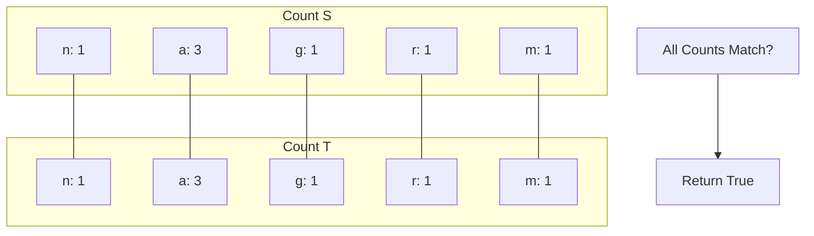

# ⚔️ LeetCode 242: Valid Anagram

**Difficulty**: Easy
**Pattern**: Hash Map / Frequency Array

## 1. Problem Detail

Given two strings `s` and `t`, return `true` if `t` is an anagram of `s`, and `false` otherwise.

An **Anagram** is a word or phrase formed by rearranging the letters of a different word or phrase, typically using all the original letters exactly once.

**Example 1:**
```
Input: s = "anagram", t = "nagaram"
Output: true
```

**Example 2:**
```
Input: s = "rat", t = "car"
Output: false
```

**Constraints:**
*   `1 <= s.length, t.length <= 5 * 10^4`
*   `s` and `t` consist of lowercase English letters.

---

## 2. Approach: Frequency Counter

Two strings are anagrams if and only if they have the same length and the same frequency of every character.

1.  Check if `len(s) != len(t)`. If so, return `False`.
2.  Use a Hash Map (or an array of size 26) to count character frequencies in `s`.
3.  Iterate through `t` and decrement the counts in the map.
4.  If the counts match (or if the second map matches the first), return `True`.

*   **Time Complexity**: O(N)
*   **Space Complexity**: O(1) (Since the alphabet size is fixed at 26).

---

## 3. Visualization

`s = "anagram", t = "nagaram"`



**Trace:**
`s = "rat", t = "car"`
Map S: `{r:1, a:1, t:1}`
Map T: `{c:1, a:1, r:1}`
Compare: `r` matches. `a` matches. `t` in S but not T. `c` in T but not S.
Result: **False**.

---

## 4. Solution

```python
def isAnagram(s: str, t: str) -> bool:
    if len(s) != len(t):
        return False
        
    countS, countT = {}, {}
    
    for i in range(len(s)):
        countS[s[i]] = countS.get(s[i], 0) + 1
        countT[t[i]] = countT.get(t[i], 0) + 1
        
    return countS == countT
```

**Optimization (Single Map):**
```python
def isAnagram(s: str, t: str) -> bool:
    if len(s) != len(t): return False
    count = [0] * 26
    
    for char in s:
        count[ord(char) - ord('a')] += 1
        
    for char in t:
        count[ord(char) - ord('a')] -= 1
        if count[ord(char) - ord('a')] < 0:
            return False
            
    return True
```

---

## 5. Variations

### Variation 1: Group Anagrams (LeetCode 49)

#### Problem Detail
Given an array of strings `strs`, group the anagrams together. You can return the answer in any order.

#### Approach: Hash Map with Sorted Key
All anagrams, when sorted, result in the same string.
`"eat" -> "aet"`, `"tea" -> "aet"`, `"ate" -> "aet"`.
We can use this sorted string as the **Key** in our Hash Map. The **Value** will be a list of original strings.

*   **Time**: O(N * K log K), where N is number of strings and K is max length of a string.
*   **Space**: O(N * K)

#### Visualization
`strs = ["eat", "tea", "tan", "ate", "nat", "bat"]`

| String | Sorted Key | Action | Map State |
| :--- | :--- | :--- | :--- |
| "eat" | "aet" | Append | `{"aet": ["eat"]}` |
| "tea" | "aet" | Append | `{"aet": ["eat", "tea"]}` |
| "tan" | "ant" | Append | `{"aet": [..], "ant": ["tan"]}` |
| "ate" | "aet" | Append | `{"aet": ["eat", "tea", "ate"], ...}` |
| "nat" | "ant" | Append | `{"ant": ["tan", "nat"], ...}` |
| "bat" | "abt" | Append | `{"abt": ["bat"], ...}` |

#### Solution
```python
def groupAnagrams(strs: list[str]) -> list[list[str]]:
    anagram_map = {}
    
    for s in strs:
        # Tuple is hashable, list is not
        key = tuple(sorted(s))
        
        if key not in anagram_map:
            anagram_map[key] = []
        anagram_map[key].append(s)
        
    return list(anagram_map.values())
```
