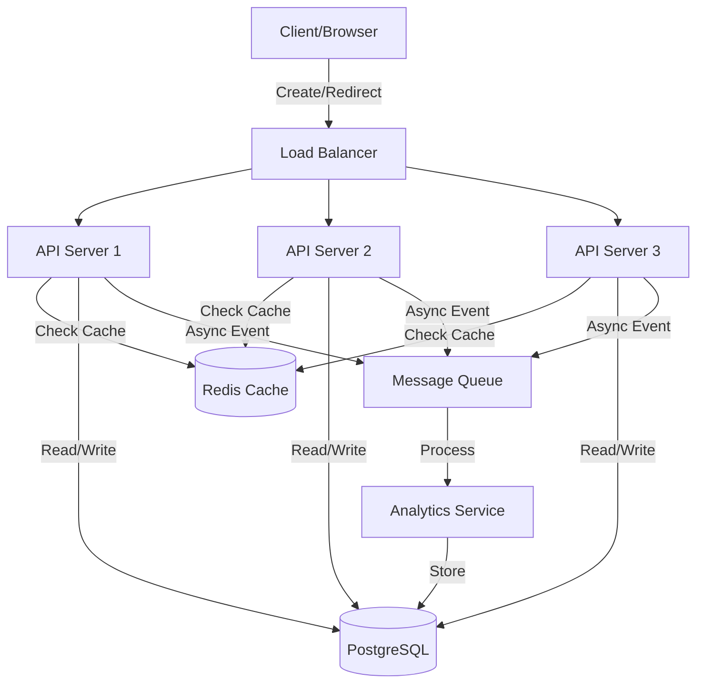

# URL Shortener System: Complete System Design

## Problem Statement

**Context**: Design a URL shortening service like bit.ly or TinyURL.

**Requirements**:
- Convert long URLs to short URLs (e.g., `https://example.com/very/long/url` → `https://short.ly/abc123`)
- Redirect short URLs to original URLs
- Track click analytics
- Support custom aliases
- Handle high traffic (millions of requests/day)
- Low latency (\u003c100ms for redirects)

**Constraints**:
- Short URLs must be unique
- Short URLs should be as short as possible (6-8 characters)
- System must be highly available
- Analytics should not slow down redirects

---

## Solution Architecture



**Key Components**:
1. **Load Balancer**: Distributes traffic across API servers
2. **API Servers**: Handle URL creation and redirection
3. **Redis Cache**: Caches popular short URL mappings
4. **PostgreSQL**: Stores URL mappings and analytics
5. **Message Queue**: Async analytics processing
6. **Analytics Service**: Processes click events

---

## Database Schema

```sql
-- URLs table
CREATE TABLE urls (
    id BIGSERIAL PRIMARY KEY,
    short_code VARCHAR(10) UNIQUE NOT NULL,
    original_url TEXT NOT NULL,
    custom_alias VARCHAR(50) UNIQUE,
    user_id BIGINT,
    created_at TIMESTAMP DEFAULT NOW(),
    expires_at TIMESTAMP,
    is_active BOOLEAN DEFAULT true,
    
    INDEX idx_short_code (short_code),
    INDEX idx_user_id (user_id),
    INDEX idx_created_at (created_at)
);

-- Analytics table
CREATE TABLE url_clicks (
    id BIGSERIAL PRIMARY KEY,
    short_code VARCHAR(10) NOT NULL,
    clicked_at TIMESTAMP DEFAULT NOW(),
    ip_address INET,
    user_agent TEXT,
    referrer TEXT,
    country VARCHAR(2),
    
    INDEX idx_short_code (short_code),
    INDEX idx_clicked_at (clicked_at)
);

-- Users table (optional)
CREATE TABLE users (
    id BIGSERIAL PRIMARY KEY,
    email VARCHAR(255) UNIQUE NOT NULL,
    created_at TIMESTAMP DEFAULT NOW()
);
```

---

## Implementation

### 1. Short Code Generation

```javascript
const crypto = require('crypto');
const base62 = '0123456789abcdefghijklmnopqrstuvwxyzABCDEFGHIJKLMNOPQRSTUVWXYZ';

// Method 1: Random Generation (Simple, but needs collision check)
function generateShortCode(length = 6) {
    let result = '';
    for (let i = 0; i < length; i++) {
        result += base62[Math.floor(Math.random() * base62.length)];
    }
    return result;
}

// Method 2: Hash-based (Deterministic)
function generateShortCodeFromHash(url) {
    const hash = crypto.createHash('md5').update(url).digest('hex');
    let shortCode = '';
    
    // Take first 6 characters and convert to base62
    for (let i = 0; i < 6; i++) {
        const num = parseInt(hash.substr(i * 2, 2), 16);
        shortCode += base62[num % 62];
    }
    
    return shortCode;
}

// Method 3: Counter-based (Most efficient, requires distributed counter)
let counter = 0;
function generateShortCodeFromCounter(id) {
    let shortCode = '';
    let num = id;
    
    while (num > 0) {
        shortCode = base62[num % 62] + shortCode;
        num = Math.floor(num / 62);
    }
    
    return shortCode.padStart(6, '0');
}
```

### 2. Create Short URL API

```javascript
const express = require('express');
const { Pool } = require('pg');
const Redis = require('ioredis');

const app = express();
const db = new Pool({ connectionString: process.env.DATABASE_URL });
const redis = new Redis(process.env.REDIS_URL);

app.use(express.json());

app.post('/api/shorten', async (req, res) => {
    const { url, customAlias, userId } = req.body;
    
    // Validate URL
    if (!isValidUrl(url)) {
        return res.status(400).json({ error: 'Invalid URL' });
    }
    
    let shortCode;
    
    // Check if custom alias provided
    if (customAlias) {
        // Validate custom alias
        if (!/^[a-zA-Z0-9_-]{3,20}$/.test(customAlias)) {
            return res.status(400).json({ error: 'Invalid custom alias' });
        }
        
        // Check if alias already exists
        const existing = await db.query(
            'SELECT id FROM urls WHERE short_code = $1 OR custom_alias = $1',
            [customAlias]
        );
        
        if (existing.rows.length > 0) {
            return res.status(409).json({ error: 'Alias already taken' });
        }
        
        shortCode = customAlias;
    } else {
        // Generate random short code
        let attempts = 0;
        while (attempts < 5) {
            shortCode = generateShortCode(6);
            
            // Check collision
            const existing = await db.query(
                'SELECT id FROM urls WHERE short_code = $1',
                [shortCode]
            );
            
            if (existing.rows.length === 0) break;
            attempts++;
        }
        
        if (attempts === 5) {
            return res.status(500).json({ error: 'Failed to generate unique code' });
        }
    }
    
    // Insert into database
    const result = await db.query(
        `INSERT INTO urls (short_code, original_url, custom_alias, user_id)
         VALUES ($1, $2, $3, $4)
         RETURNING id, short_code, original_url, created_at`,
        [shortCode, url, customAlias, userId]
    );
    
    // Cache the mapping
    await redis.setex(`url:${shortCode}`, 86400, url); // 24 hour TTL
    
    res.json({
        shortUrl: `https://short.ly/${shortCode}`,
        shortCode: shortCode,
        originalUrl: url,
        createdAt: result.rows[0].created_at
    });
});

function isValidUrl(url) {
    try {
        new URL(url);
        return true;
    } catch {
        return false;
    }
}
```

### 3. Redirect API (Critical Path - Optimized)

```javascript
app.get('/:shortCode', async (req, res) => {
    const { shortCode } = req.params;
    
    try {
        // 1. Check Redis cache first (fastest)
        let originalUrl = await redis.get(`url:${shortCode}`);
        
        if (!originalUrl) {
            // 2. Cache miss - query database
            const result = await db.query(
                `SELECT original_url, is_active, expires_at 
                 FROM urls 
                 WHERE short_code = $1`,
                [shortCode]
            );
            
            if (result.rows.length === 0) {
                return res.status(404).send('URL not found');
            }
            
            const urlData = result.rows[0];
            
            // Check if expired or inactive
            if (!urlData.is_active || 
                (urlData.expires_at && new Date(urlData.expires_at) < new Date())) {
                return res.status(410).send('URL expired');
            }
            
            originalUrl = urlData.original_url;
            
            // Cache for future requests
            await redis.setex(`url:${shortCode}`, 86400, originalUrl);
        }
        
        // 3. Track analytics asynchronously (non-blocking)
        trackClick(shortCode, req).catch(err => {
            console.error('Analytics tracking failed:', err);
            // Don't block redirect on analytics failure
        });
        
        // 4. Redirect (fast response)
        res.redirect(301, originalUrl);
        
    } catch (error) {
        console.error('Redirect error:', error);
        res.status(500).send('Internal server error');
    }
});

// Async analytics tracking
async function trackClick(shortCode, req) {
    const clickData = {
        shortCode,
        ipAddress: req.ip,
        userAgent: req.get('user-agent'),
        referrer: req.get('referer'),
        timestamp: new Date()
    };
    
    // Send to message queue for async processing
    await publishToQueue('url-clicks', clickData);
}
```

### 4. Analytics API

```javascript
app.get('/api/analytics/:shortCode', async (req, res) => {
    const { shortCode } = req.params;
    const { startDate, endDate } = req.query;
    
    // Get total clicks
    const totalClicks = await db.query(
        `SELECT COUNT(*) as total
         FROM url_clicks
         WHERE short_code = $1
         AND clicked_at BETWEEN $2 AND $3`,
        [shortCode, startDate || '1970-01-01', endDate || new Date()]
    );
    
    // Get clicks by day
    const clicksByDay = await db.query(
        `SELECT DATE(clicked_at) as date, COUNT(*) as clicks
         FROM url_clicks
         WHERE short_code = $1
         AND clicked_at BETWEEN $2 AND $3
         GROUP BY DATE(clicked_at)
         ORDER BY date DESC`,
        [shortCode, startDate || '1970-01-01', endDate || new Date()]
    );
    
    // Get top referrers
    const topReferrers = await db.query(
        `SELECT referrer, COUNT(*) as clicks
         FROM url_clicks
         WHERE short_code = $1
         AND clicked_at BETWEEN $2 AND $3
         AND referrer IS NOT NULL
         GROUP BY referrer
         ORDER BY clicks DESC
         LIMIT 10`,
        [shortCode, startDate || '1970-01-01', endDate || new Date()]
    );
    
    res.json({
        shortCode,
        totalClicks: parseInt(totalClicks.rows[0].total),
        clicksByDay: clicksByDay.rows,
        topReferrers: topReferrers.rows
    });
});
```

---

## Scalability Considerations

### 1. Caching Strategy

```javascript
// Multi-layer caching
class URLCache {
    constructor() {
        this.localCache = new Map(); // In-memory cache
        this.redis = new Redis();
    }
    
    async get(shortCode) {
        // L1: Local cache (fastest)
        if (this.localCache.has(shortCode)) {
            return this.localCache.get(shortCode);
        }
        
        // L2: Redis cache
        const url = await this.redis.get(`url:${shortCode}`);
        if (url) {
            this.localCache.set(shortCode, url);
            return url;
        }
        
        return null;
    }
    
    async set(shortCode, url) {
        this.localCache.set(shortCode, url);
        await this.redis.setex(`url:${shortCode}`, 86400, url);
    }
}
```

### 2. Database Optimization

```sql
-- Partitioning by creation date
CREATE TABLE urls_2024_01 PARTITION OF urls
    FOR VALUES FROM ('2024-01-01') TO ('2024-02-01');

-- Read replicas for analytics queries
-- Master: Writes (URL creation)
-- Replicas: Reads (analytics, redirects)

-- Indexing strategy
CREATE INDEX CONCURRENTLY idx_urls_short_code_active 
    ON urls(short_code) WHERE is_active = true;
```

### 3. Rate Limiting

```javascript
const rateLimit = require('express-rate-limit');

const createLimiter = rateLimit({
    windowMs: 15 * 60 * 1000, // 15 minutes
    max: 100, // 100 requests per window
    message: 'Too many URLs created, please try again later'
});

app.post('/api/shorten', createLimiter, async (req, res) => {
    // ... URL creation logic
});
```

---

## Performance Metrics

| Metric | Target | Achieved |
|--------|--------|----------|
| Redirect Latency | \u003c 50ms | ✅ 20-30ms (with cache) |
| Create URL | \u003c 200ms | ✅ 100-150ms |
| Cache Hit Rate | \u003e 80% | ✅ 85-90% |
| Throughput | 10K req/s | ✅ Scalable |
| Availability | 99.9% | ✅ With redundancy |

---

## Trade-offs and Alternatives

### Short Code Generation

| Method | Pros | Cons |
|--------|------|------|
| **Random** | Simple, fast | Collision possible |
| **Hash-based** | Deterministic | Collision possible, longer codes |
| **Counter-based** | No collision, shortest | Needs distributed counter |

**Best Choice**: Counter-based with distributed counter (Redis INCR) for production.

### Database Choice

| Database | Pros | Cons |
|----------|------|------|
| **PostgreSQL** | ACID, reliable | Vertical scaling limit |
| **Cassandra** | Horizontal scaling | Eventual consistency |
| **DynamoDB** | Fully managed | Vendor lock-in |

**Best Choice**: PostgreSQL with read replicas for most use cases.

---

## Interview Talking Points

### System Design Questions

1. **How do you ensure short codes are unique?**
   - Use database unique constraint
   - Implement retry logic for collisions
   - Or use counter-based generation (no collisions)

2. **How do you handle 10M requests/second?**
   - Horizontal scaling of API servers
   - Multi-layer caching (local + Redis)
   - Database read replicas
   - CDN for static content

3. **What if Redis goes down?**
   - Graceful degradation: Fall back to database
   - Redis cluster with replication
   - Monitor cache hit rate

4. **How do you prevent abuse?**
   - Rate limiting per IP/user
   - CAPTCHA for anonymous users
   - URL validation and blacklisting
   - Monitor for spam patterns

5. **How do you handle analytics at scale?**
   - Async processing via message queue
   - Batch inserts to database
   - Use time-series database (InfluxDB) for analytics
   - Pre-aggregate common queries

---

## Best Practices

1. **Cache hot URLs**: 80/20 rule - 20% of URLs get 80% of traffic
2. **Async analytics**: Never block redirects for analytics
3. **Monitor everything**: Cache hit rate, latency, error rate
4. **Graceful degradation**: System works even if cache fails
5. **Security**: Validate URLs, prevent XSS, rate limit

---

## Next Steps

- Learn [Load Balancer Design](../08_Load_Balancer/08_Load_Balancer_System.md)
- Study [Caching Strategies](../07_Caching_Layer/cache_strategies.md)
- Master [Database Scaling](../05_PostgreSQL_Specific/connection_uri_and_ssl_config.md)
