# URL Shortener: Visual Diagrams

## 1. System Architecture

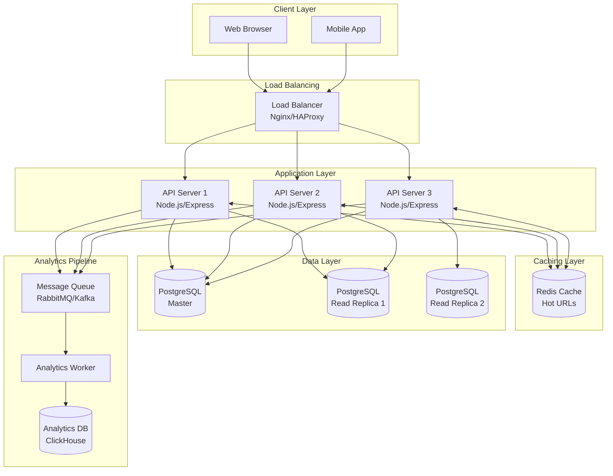

## 2. URL Creation Flow

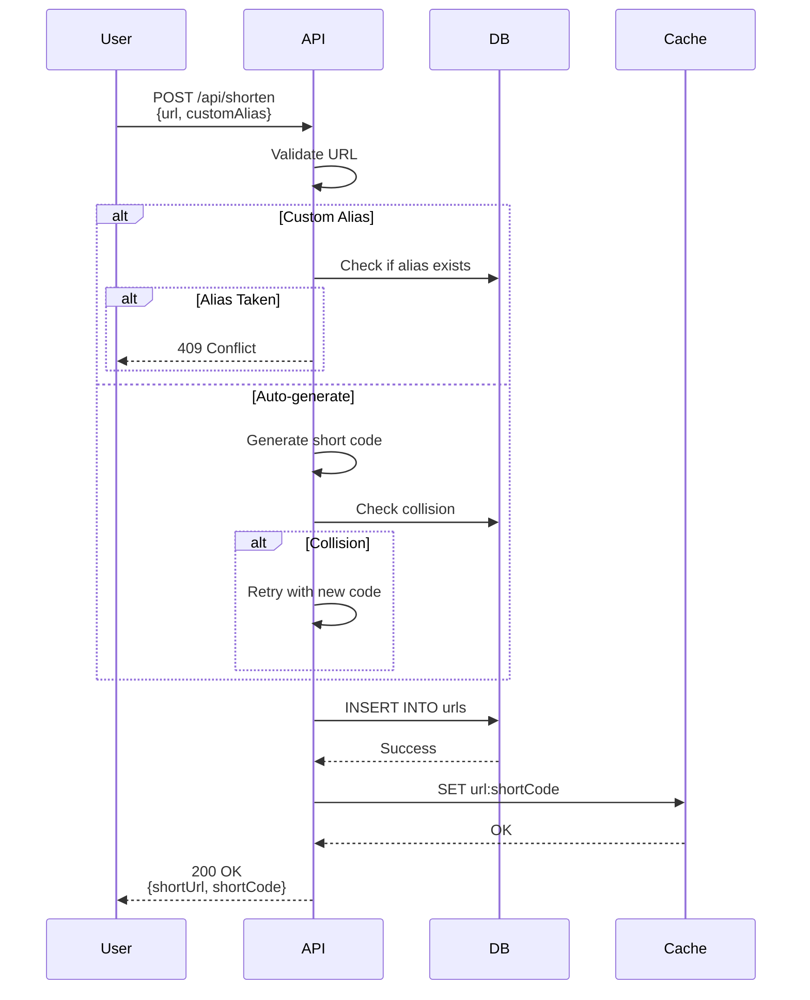

## 3. URL Redirect Flow (Critical Path)

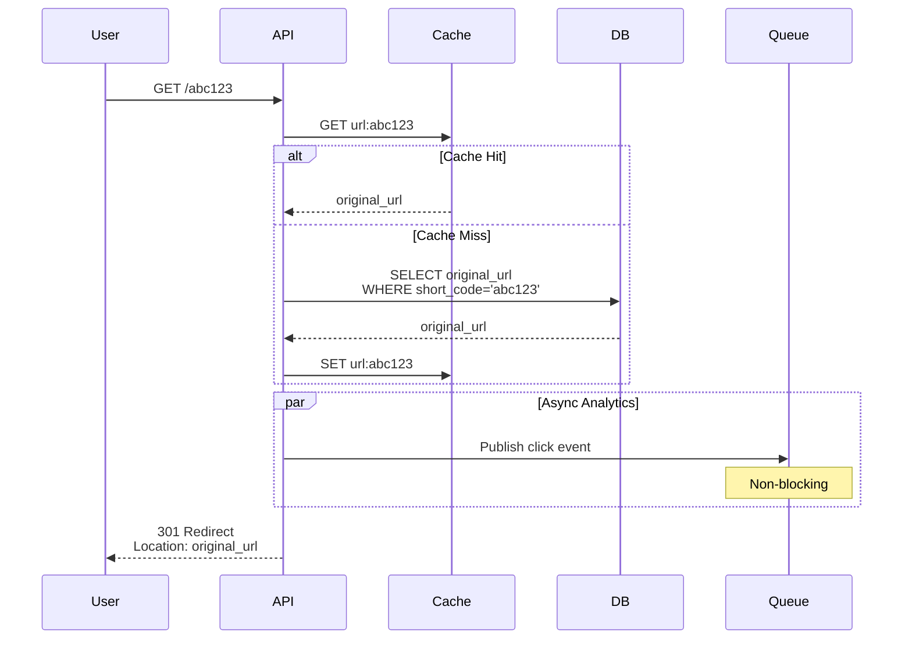

## 4. Short Code Generation Strategies

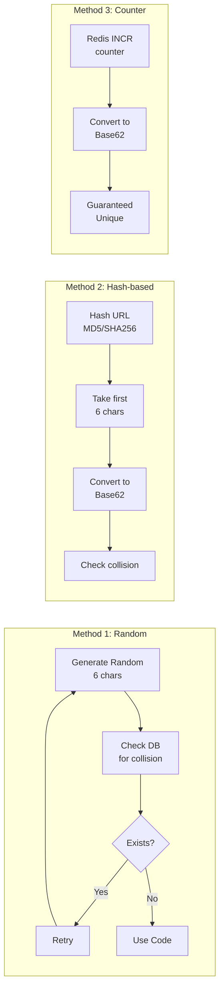

## 5. Database Schema Visualization

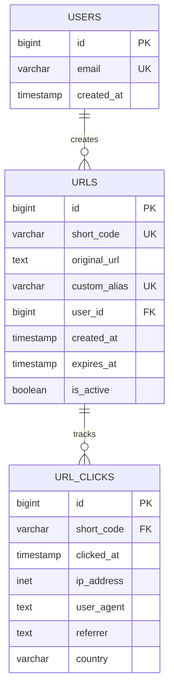

## 6. Caching Strategy

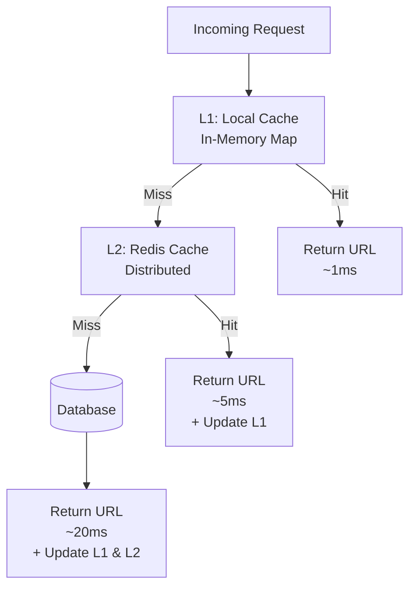

## 7. Analytics Pipeline

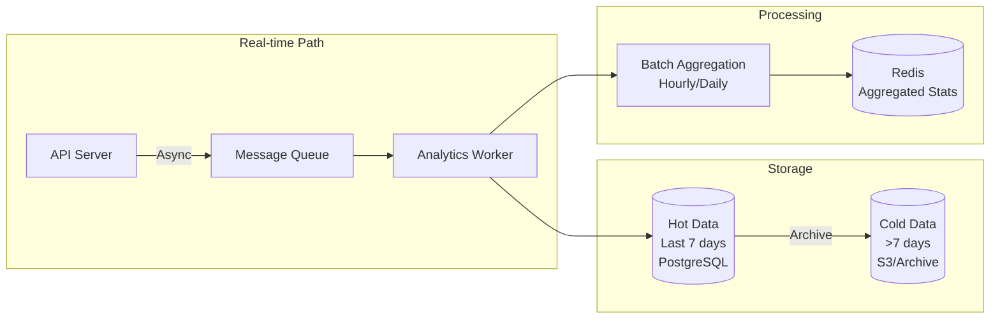

## 8. Scaling Architecture

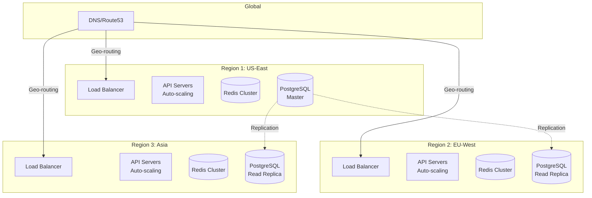

## 9. Failure Handling

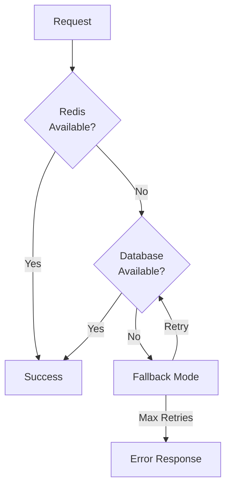

## 10. Performance Optimization

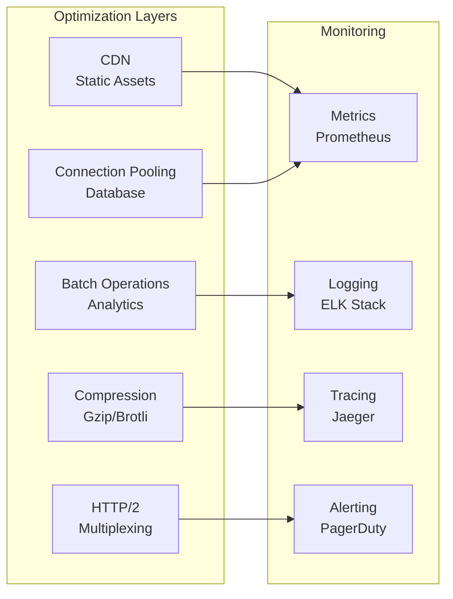

## Key Metrics to Monitor

| Metric | Target | Alert Threshold |
|--------|--------|-----------------|
| Redirect Latency (p95) | \u003c 50ms | \u003e 100ms |
| Cache Hit Rate | \u003e 80% | \u003c 70% |
| Error Rate | \u003c 0.1% | \u003e 1% |
| Database Connections | \u003c 80% | \u003e 90% |
| Queue Depth | \u003c 1000 | \u003e 5000 |

## Capacity Planning

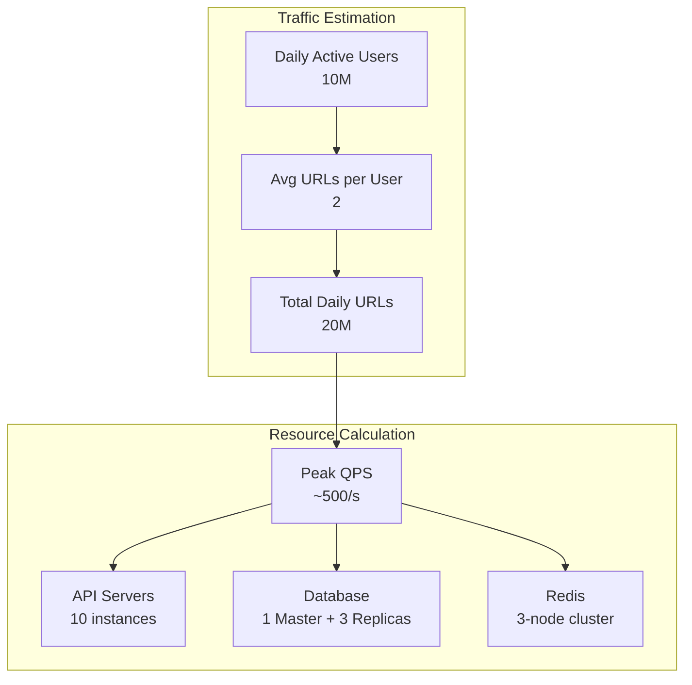
