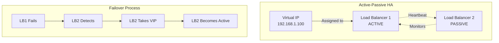

# Load Balancer System: Complete System Design

## Problem Statement

**Context**: Design a Load Balancer to distribute incoming traffic across multiple backend servers.

**Requirements**:
- Distribute requests evenly across healthy servers
- Detect and remove unhealthy servers
- Support multiple load balancing algorithms
- Handle SSL/TLS termination
- Support session persistence (sticky sessions)
- Scale to handle millions of requests per second

**Constraints**:
- Must be highly available (99.99% uptime)
- Low latency overhead (\u003c5ms)
- Support horizontal scaling
- Handle server failures gracefully

---

## Solution Architecture

```mermaid
graph TB
    subgraph "Client Layer"
        C1[Client 1]
        C2[Client 2]
        C3[Client 3]
    end
    
    subgraph "Load Balancer Layer"
        LB1[Load Balancer 1<br/>Active]
        LB2[Load Balancer 2<br/>Standby]
        HC[Health Check<br/>Service]
    end
    
    subgraph "Backend Servers"
        S1[Server 1<br/>✓ Healthy]
        S2[Server 2<br/>✓ Healthy]
        S3[Server 3<br/>✗ Unhealthy]
        S4[Server 4<br/>✓ Healthy]
    end
    
    subgraph "Monitoring"
        M[Metrics & Logs]
    end
    
    C1 --> LB1
    C2 --> LB1
    C3 --> LB1
    
    LB1 -.->|Heartbeat| LB2
    
    LB1 --> S1
    LB1 --> S2
    LB1 --> S4
    LB1 -.x|Excluded| S3
    
    HC -->|Check| S1
    HC -->|Check| S2
    HC -->|Check| S3
    HC -->|Check| S4
    
    HC -->|Update| LB1
    
    LB1 --> M
    S1 --> M
    S2 --> M
    S4 --> M
```

---

## Load Balancing Algorithms

### 1. Round Robin

```javascript
class RoundRobinLoadBalancer {
    constructor(servers) {
        this.servers = servers;
        this.currentIndex = 0;
    }
    
    getNextServer() {
        const server = this.servers[this.currentIndex];
        this.currentIndex = (this.currentIndex + 1) % this.servers.length;
        return server;
    }
}

// Usage
const lb = new RoundRobinLoadBalancer([
    { host: 'server1.com', port: 3000 },
    { host: 'server2.com', port: 3000 },
    { host: 'server3.com', port: 3000 }
]);

// Request 1 → server1
// Request 2 → server2
// Request 3 → server3
// Request 4 → server1 (cycles back)
```

### 2. Weighted Round Robin

```javascript
class WeightedRoundRobinLoadBalancer {
    constructor(servers) {
        // servers = [{ host, port, weight }]
        this.servers = servers;
        this.currentIndex = 0;
        this.currentWeight = 0;
        this.maxWeight = Math.max(...servers.map(s => s.weight));
        this.gcd = this.calculateGCD(servers.map(s => s.weight));
    }
    
    getNextServer() {
        while (true) {
            this.currentIndex = (this.currentIndex + 1) % this.servers.length;
            
            if (this.currentIndex === 0) {
                this.currentWeight = this.currentWeight - this.gcd;
                if (this.currentWeight <= 0) {
                    this.currentWeight = this.maxWeight;
                }
            }
            
            if (this.servers[this.currentIndex].weight >= this.currentWeight) {
                return this.servers[this.currentIndex];
            }
        }
    }
    
    calculateGCD(weights) {
        return weights.reduce((a, b) => {
            while (b !== 0) {
                let temp = b;
                b = a % b;
                a = temp;
            }
            return a;
        });
    }
}

// Usage
const lb = new WeightedRoundRobinLoadBalancer([
    { host: 'server1.com', port: 3000, weight: 5 },  // 50% traffic
    { host: 'server2.com', port: 3000, weight: 3 },  // 30% traffic
    { host: 'server3.com', port: 3000, weight: 2 }   // 20% traffic
]);
```

### 3. Least Connections

```javascript
class LeastConnectionsLoadBalancer {
    constructor(servers) {
        this.servers = servers.map(s => ({
            ...s,
            activeConnections: 0
        }));
    }
    
    getNextServer() {
        // Find server with least active connections
        return this.servers.reduce((min, server) => 
            server.activeConnections < min.activeConnections ? server : min
        );
    }
    
    incrementConnections(server) {
        server.activeConnections++;
    }
    
    decrementConnections(server) {
        server.activeConnections--;
    }
}

// Usage
const lb = new LeastConnectionsLoadBalancer([
    { host: 'server1.com', port: 3000 },
    { host: 'server2.com', port: 3000 },
    { host: 'server3.com', port: 3000 }
]);

const server = lb.getNextServer();
lb.incrementConnections(server);
// ... handle request ...
lb.decrementConnections(server);
```

### 4. IP Hash (Session Persistence)

```javascript
const crypto = require('crypto');

class IPHashLoadBalancer {
    constructor(servers) {
        this.servers = servers;
    }
    
    getServerForIP(clientIP) {
        // Hash the IP address
        const hash = crypto.createHash('md5').update(clientIP).digest('hex');
        const hashValue = parseInt(hash.substring(0, 8), 16);
        
        // Map to server index
        const serverIndex = hashValue % this.servers.length;
        return this.servers[serverIndex];
    }
}

// Usage
const lb = new IPHashLoadBalancer([
    { host: 'server1.com', port: 3000 },
    { host: 'server2.com', port: 3000 },
    { host: 'server3.com', port: 3000 }
]);

// Same IP always goes to same server
const server = lb.getServerForIP('192.168.1.100');
```

---

## Health Check Implementation

```javascript
const axios = require('axios');

class HealthChecker {
    constructor(servers, checkInterval = 5000) {
        this.servers = servers.map(s => ({
            ...s,
            healthy: true,
            consecutiveFailures: 0
        }));
        this.checkInterval = checkInterval;
        this.maxFailures = 3;
    }
    
    start() {
        this.intervalId = setInterval(() => {
            this.checkAllServers();
        }, this.checkInterval);
    }
    
    stop() {
        if (this.intervalId) {
            clearInterval(this.intervalId);
        }
    }
    
    async checkAllServers() {
        const checks = this.servers.map(server => this.checkServer(server));
        await Promise.all(checks);
    }
    
    async checkServer(server) {
        try {
            const response = await axios.get(
                `http://${server.host}:${server.port}/health`,
                { timeout: 2000 }
            );
            
            if (response.status === 200) {
                // Server is healthy
                server.consecutiveFailures = 0;
                if (!server.healthy) {
                    console.log(`Server ${server.host} is now healthy`);
                    server.healthy = true;
                }
            } else {
                this.handleFailure(server);
            }
        } catch (error) {
            this.handleFailure(server);
        }
    }
    
    handleFailure(server) {
        server.consecutiveFailures++;
        
        if (server.consecutiveFailures >= this.maxFailures && server.healthy) {
            console.log(`Server ${server.host} marked as unhealthy`);
            server.healthy = false;
        }
    }
    
    getHealthyServers() {
        return this.servers.filter(s => s.healthy);
    }
}

// Usage
const healthChecker = new HealthChecker([
    { host: 'server1.com', port: 3000 },
    { host: 'server2.com', port: 3000 },
    { host: 'server3.com', port: 3000 }
]);

healthChecker.start();
```

---

## Complete Load Balancer Implementation

```javascript
const express = require('express');
const httpProxy = require('http-proxy');

class LoadBalancer {
    constructor(config) {
        this.algorithm = config.algorithm || 'round-robin';
        this.servers = config.servers;
        this.healthChecker = new HealthChecker(this.servers);
        this.proxy = httpProxy.createProxyServer({});
        
        // Initialize algorithm
        this.initializeAlgorithm();
        
        // Start health checks
        this.healthChecker.start();
        
        // Setup proxy error handling
        this.proxy.on('error', (err, req, res) => {
            console.error('Proxy error:', err);
            res.status(502).send('Bad Gateway');
        });
    }
    
    initializeAlgorithm() {
        switch (this.algorithm) {
            case 'round-robin':
                this.balancer = new RoundRobinLoadBalancer(this.servers);
                break;
            case 'least-connections':
                this.balancer = new LeastConnectionsLoadBalancer(this.servers);
                break;
            case 'ip-hash':
                this.balancer = new IPHashLoadBalancer(this.servers);
                break;
            default:
                this.balancer = new RoundRobinLoadBalancer(this.servers);
        }
    }
    
    handleRequest(req, res) {
        // Get healthy servers
        const healthyServers = this.healthChecker.getHealthyServers();
        
        if (healthyServers.length === 0) {
            return res.status(503).send('Service Unavailable');
        }
        
        // Select server based on algorithm
        let server;
        if (this.algorithm === 'ip-hash') {
            server = this.balancer.getServerForIP(req.ip);
        } else {
            server = this.balancer.getNextServer();
        }
        
        // Ensure selected server is healthy
        if (!server.healthy) {
            server = healthyServers[0];
        }
        
        // Track connection for least-connections
        if (this.algorithm === 'least-connections') {
            this.balancer.incrementConnections(server);
            res.on('finish', () => {
                this.balancer.decrementConnections(server);
            });
        }
        
        // Proxy the request
        const target = `http://${server.host}:${server.port}`;
        this.proxy.web(req, res, { target });
    }
    
    start(port = 80) {
        const app = express();
        
        // All requests go through load balancer
        app.use((req, res) => {
            this.handleRequest(req, res);
        });
        
        app.listen(port, () => {
            console.log(`Load Balancer running on port ${port}`);
            console.log(`Algorithm: ${this.algorithm}`);
            console.log(`Backend servers: ${this.servers.length}`);
        });
    }
}

// Usage
const lb = new LoadBalancer({
    algorithm: 'least-connections',
    servers: [
        { host: 'localhost', port: 3001 },
        { host: 'localhost', port: 3002 },
        { host: 'localhost', port: 3003 }
    ]
});

lb.start(8080);
```

---

## SSL/TLS Termination

```javascript
const https = require('https');
const fs = require('fs');

class SecureLoadBalancer extends LoadBalancer {
    start(port = 443) {
        const app = express();
        
        app.use((req, res) => {
            this.handleRequest(req, res);
        });
        
        // SSL/TLS configuration
        const options = {
            key: fs.readFileSync('private-key.pem'),
            cert: fs.readFileSync('certificate.pem')
        };
        
        https.createServer(options, app).listen(port, () => {
            console.log(`Secure Load Balancer running on port ${port}`);
        });
    }
}
```

---

## Comparison of Algorithms

| Algorithm | Use Case | Pros | Cons |
|-----------|----------|------|------|
| **Round Robin** | Equal servers | Simple, fair distribution | Ignores server load |
| **Weighted RR** | Different server capacities | Accounts for capacity | Complex configuration |
| **Least Connections** | Long-lived connections | Balances load well | Overhead tracking connections |
| **IP Hash** | Session persistence | Sticky sessions | Uneven distribution |
| **Least Response Time** | Variable processing time | Optimal performance | Complex to implement |

---

## High Availability Setup



---

## Performance Metrics

| Metric | Target | Monitoring |
|--------|--------|------------|
| Latency Overhead | \u003c 5ms | p50, p95, p99 |
| Throughput | 100K req/s | Requests per second |
| Health Check Interval | 5s | Check frequency |
| Failover Time | \u003c 3s | Time to detect and switch |
| CPU Usage | \u003c 70% | Load balancer CPU |

---

## Interview Talking Points

### Key Questions

1. **What happens if a server fails mid-request?**
   - Health check marks server unhealthy
   - New requests go to healthy servers
   - In-flight requests may fail (need retry logic)

2. **How do you handle sticky sessions?**
   - IP Hash algorithm
   - Cookie-based routing
   - Consistent hashing for distributed systems

3. **How to scale load balancer itself?**
   - DNS round-robin across multiple LBs
   - Anycast routing
   - Cloud load balancers (ELB, ALB)

4. **Layer 4 vs Layer 7 load balancing?**
   - L4: TCP/UDP level, faster, less flexible
   - L7: HTTP level, content-based routing, slower

---

## Best Practices

1. **Always use health checks**: Detect failures quickly
2. **Set appropriate timeouts**: Prevent hanging connections
3. **Monitor metrics**: Track latency, throughput, errors
4. **Use connection pooling**: Reuse backend connections
5. **Implement circuit breakers**: Prevent cascading failures
6. **Log everything**: Debug issues effectively

---

## Next Steps

- Learn [High Availability Patterns](../02_Flash_Sale_Disaster/02_Flash_Sale_System.md)
- Study [Caching Strategies](../../express-backend-knowledge-base/07_caching_layer/cache_strategies.md)
- Master [Monitoring](../../express-backend-knowledge-base/14_observability/metrics_with_prometheus.md)
