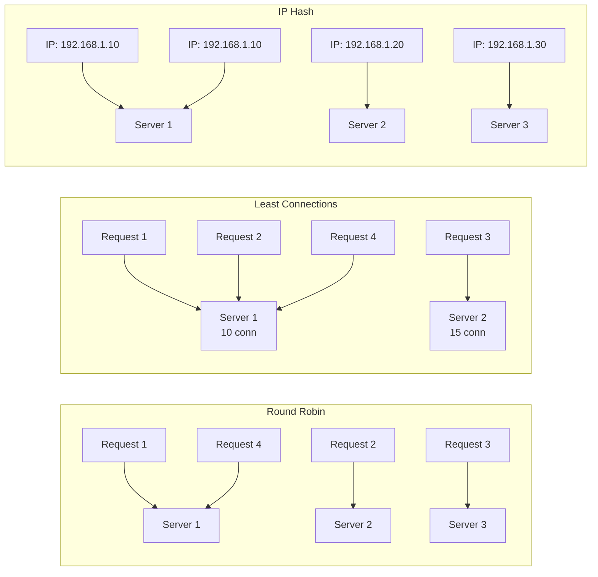
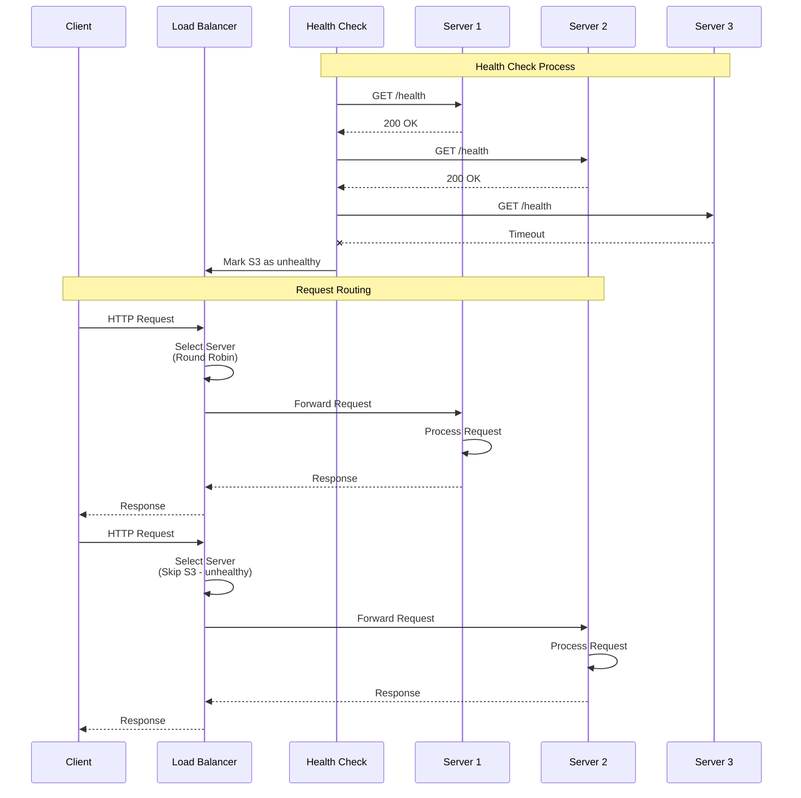
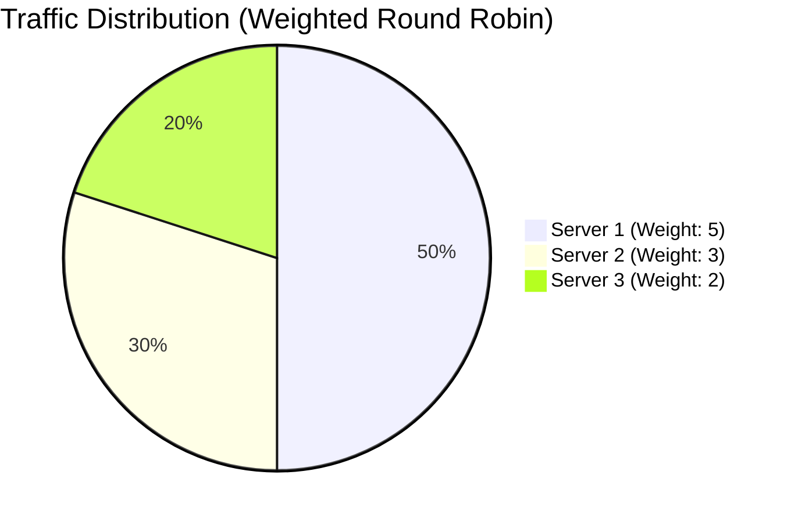
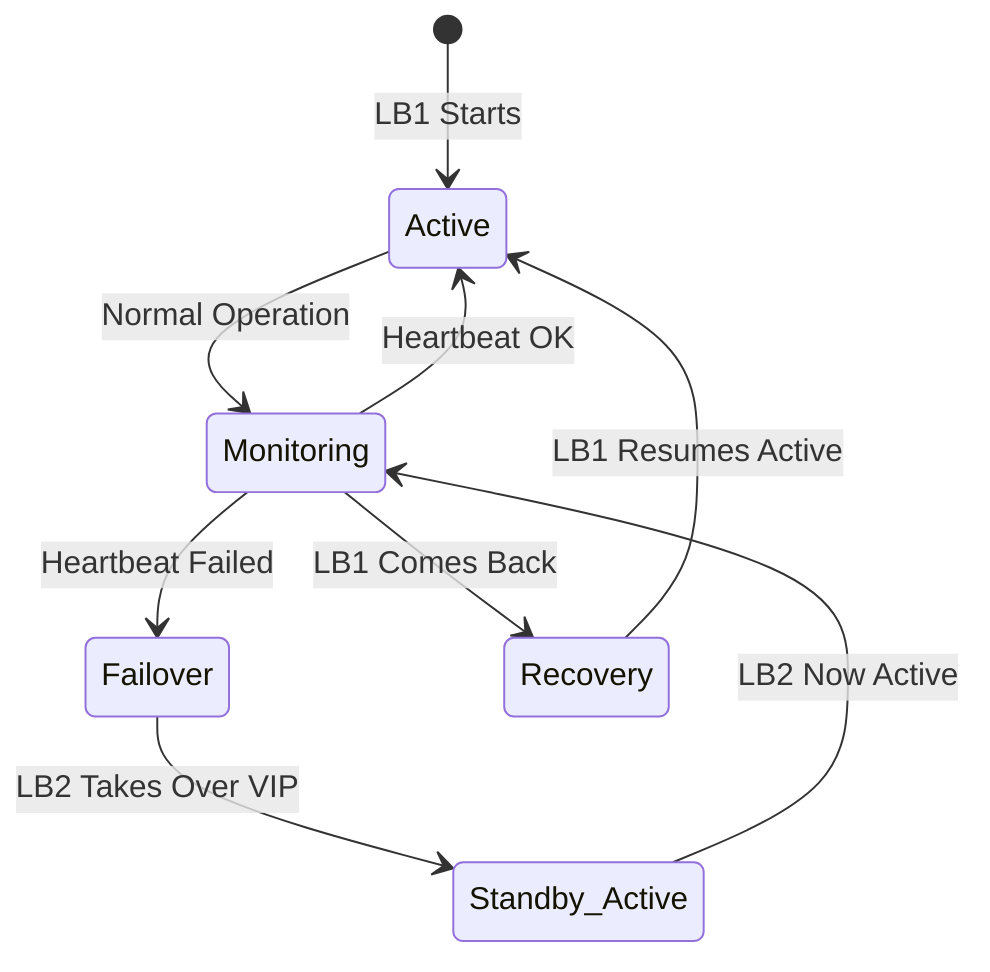
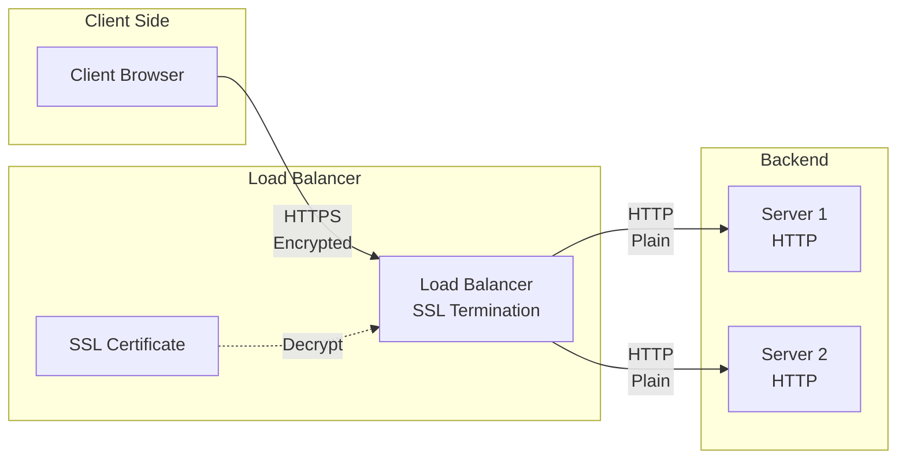
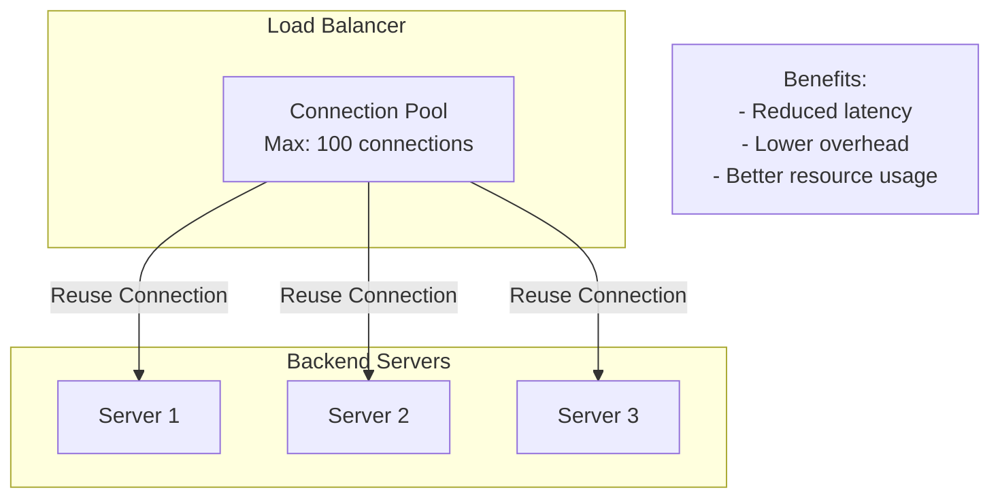
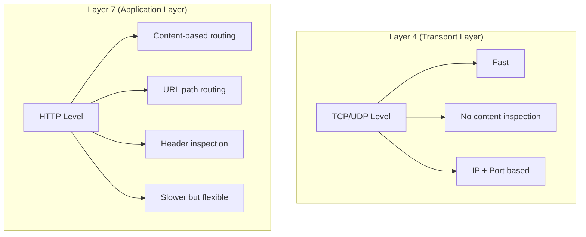
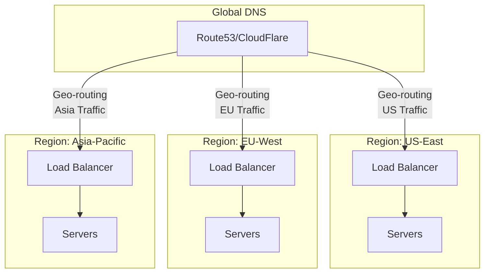
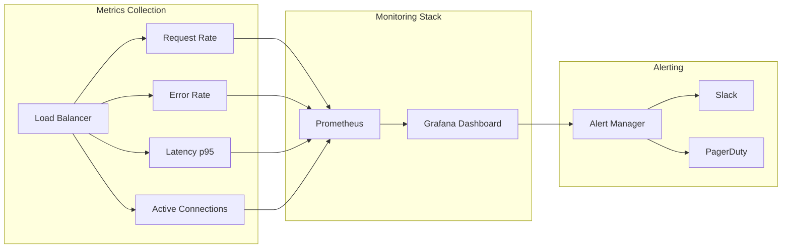
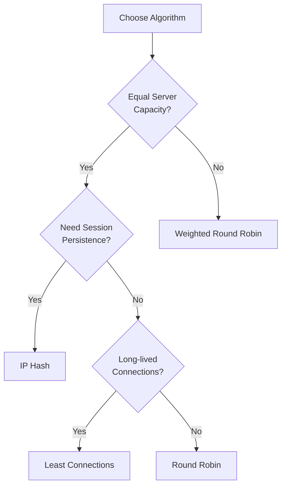

# Load Balancer: Visual Diagrams

## 1. Load Balancer Architecture

```mermaid
graph TB
    subgraph "Client Layer"
        C1[Client 1]
        C2[Client 2]
        C3[Client 3]
        C4[Client 4]
    end
    
    subgraph "Load Balancer Cluster"
        LB1[Load Balancer 1<br/>ACTIVE<br/>192.168.1.100]
        LB2[Load Balancer 2<br/>STANDBY<br/>192.168.1.101]
        VIP[Virtual IP<br/>192.168.1.100]
    end
    
    subgraph "Health Check Service"
        HC[Health Checker<br/>Monitors every 5s]
    end
    
    subgraph "Backend Servers"
        S1[Server 1<br/>✓ Healthy<br/>Connections: 45]
        S2[Server 2<br/>✓ Healthy<br/>Connections: 38]
        S3[Server 3<br/>✗ Unhealthy<br/>Down]
        S4[Server 4<br/>✓ Healthy<br/>Connections: 52]
    end
    
    C1 --> VIP
    C2 --> VIP
    C3 --> VIP
    C4 --> VIP
    
    VIP --> LB1
    LB1 -.->|Heartbeat| LB2
    
    LB1 --> S1
    LB1 --> S2
    LB1 -.x|Excluded| S3
    LB1 --> S4
    
    HC -->|Check| S1
    HC -->|Check| S2
    HC -->|Check| S3
    HC -->|Check| S4
    HC -->|Update Pool| LB1
    
    style S3 fill:#f99,stroke:#f00
    style S1 fill:#9f9,stroke:#0f0
    style S2 fill:#9f9,stroke:#0f0
    style S4 fill:#9f9,stroke:#0f0
    style LB1 fill:#99f,stroke:#00f
```

## 2. Load Balancing Algorithms Comparison



## 3. Request Flow with Load Balancer



## 4. Weighted Round Robin Distribution



## 5. High Availability Failover



## 6. SSL/TLS Termination



## 7. Connection Pooling



## 8. Layer 4 vs Layer 7 Load Balancing



## 9. Scaling Architecture



## 10. Monitoring Dashboard



## Key Metrics to Monitor

| Metric | Description | Alert Threshold |
|--------|-------------|-----------------|
| Request Rate | Requests per second | \u003e 10K/s |
| Error Rate | % of failed requests | \u003e 1% |
| Latency (p95) | 95th percentile response time | \u003e 100ms |
| Active Connections | Current open connections | \u003e 90% capacity |
| Backend Health | % of healthy servers | \u003c 70% |
| CPU Usage | Load balancer CPU | \u003e 80% |

## Algorithm Selection Guide


