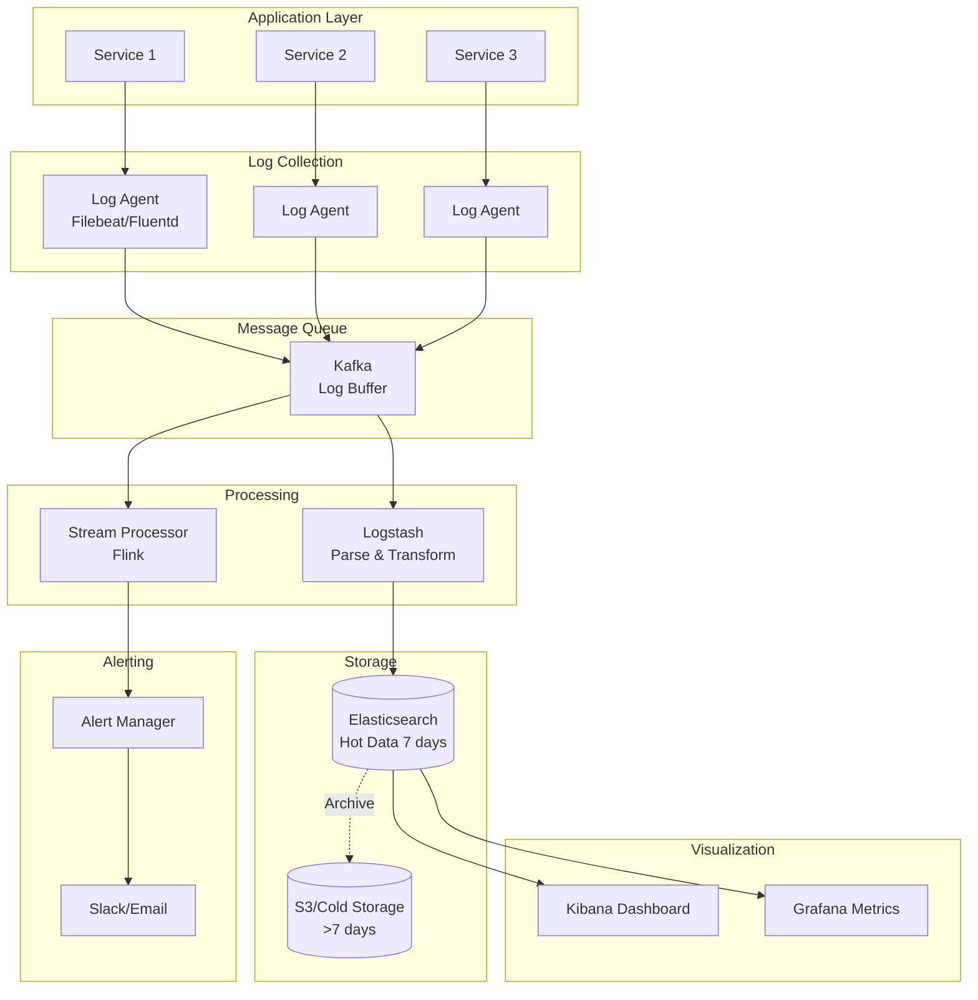

# Logging System: Complete System Design

## Problem Statement

**Context**: Design a distributed logging system for microservices (like ELK Stack, Splunk).

**Requirements**:
- Collect logs from multiple services
- Real-time log streaming and search
- Log aggregation and analysis
- Retention policies and archival
- Alert on error patterns
- Handle billions of log events per day

**Constraints**:
- Low latency for log ingestion (\u003c100ms)
- Scalable to handle high throughput
- Queryable within seconds
- Cost-effective storage

---

## Solution Architecture



---

## Implementation

### 1. Structured Logging (Application Side)

```javascript
const winston = require('winston');

// Create structured logger
const logger = winston.createLogger({
    level: 'info',
    format: winston.format.combine(
        winston.format.timestamp(),
        winston.format.errors({ stack: true }),
        winston.format.json()
    ),
    defaultMeta: {
        service: 'user-service',
        environment: process.env.NODE_ENV,
        hostname: require('os').hostname()
    },
    transports: [
        // Console output
        new winston.transports.Console({
            format: winston.format.combine(
                winston.format.colorize(),
                winston.format.simple()
            )
        }),
        // File output (picked up by log agent)
        new winston.transports.File({
            filename: '/var/log/app/error.log',
            level: 'error'
        }),
        new winston.transports.File({
            filename: '/var/log/app/combined.log'
        })
    ]
});

// Add request context middleware
function addRequestContext(req, res, next) {
    req.logger = logger.child({
        requestId: req.id,
        userId: req.user?.id,
        ip: req.ip,
        userAgent: req.get('user-agent')
    });
    next();
}

// Usage in application
app.use(addRequestContext);

app.post('/api/orders', async (req, res) => {
    req.logger.info('Creating order', {
        orderId: order.id,
        amount: order.total,
        items: order.items.length
    });
    
    try {
        const order = await createOrder(req.body);
        req.logger.info('Order created successfully', { orderId: order.id });
        res.json(order);
    } catch (error) {
        req.logger.error('Order creation failed', {
            error: error.message,
            stack: error.stack,
            orderId: req.body.orderId
        });
        res.status(500).json({ error: 'Internal server error' });
    }
});
```

### 2. Log Collection (Filebeat Configuration)

```yaml
# filebeat.yml
filebeat.inputs:
  - type: log
    enabled: true
    paths:
      - /var/log/app/*.log
    json.keys_under_root: true
    json.add_error_key: true
    fields:
      log_type: application
      environment: production

# Add metadata
processors:
  - add_host_metadata:
      when.not.contains.tags: forwarded
  - add_cloud_metadata: ~
  - add_docker_metadata: ~
  - add_kubernetes_metadata: ~

# Output to Kafka
output.kafka:
  hosts: ["kafka1:9092", "kafka2:9092", "kafka3:9092"]
  topic: 'logs-%{[fields.environment]}'
  partition.round_robin:
    reachable_only: false
  required_acks: 1
  compression: gzip
```

### 3. Log Processing (Logstash)

```ruby
# logstash.conf
input {
  kafka {
    bootstrap_servers => "kafka1:9092,kafka2:9092"
    topics => ["logs-production"]
    group_id => "logstash-consumer"
    codec => json
  }
}

filter {
  # Parse timestamp
  date {
    match => ["timestamp", "ISO8601"]
    target => "@timestamp"
  }
  
  # Extract error details
  if [level] == "error" {
    mutate {
      add_tag => ["error"]
    }
  }
  
  # Parse stack traces
  if [stack] {
    mutate {
      add_field => { "has_stack_trace" => true }
    }
  }
  
  # Geo IP lookup
  geoip {
    source => "ip"
    target => "geoip"
  }
  
  # User agent parsing
  useragent {
    source => "userAgent"
    target => "ua"
  }
}

output {
  elasticsearch {
    hosts => ["es1:9200", "es2:9200", "es3:9200"]
    index => "logs-%{[environment]}-%{+YYYY.MM.dd}"
    document_type => "_doc"
  }
  
  # Also output errors to separate index
  if "error" in [tags] {
    elasticsearch {
      hosts => ["es1:9200", "es2:9200", "es3:9200"]
      index => "errors-%{+YYYY.MM.dd}"
    }
  }
}
```

### 4. Real-time Alerting (Stream Processing)

```javascript
const { Kafka } = require('kafkajs');
const axios = require('axios');

class LogAlertingService {
    constructor() {
        this.kafka = new Kafka({
            clientId: 'log-alerting',
            brokers: ['kafka1:9092', 'kafka2:9092']
        });
        
        this.consumer = this.kafka.consumer({ groupId: 'alerting-group' });
        this.errorCounts = new Map(); // service -> error count
        this.alertThreshold = 10; // errors per minute
    }
    
    async start() {
        await this.consumer.connect();
        await this.consumer.subscribe({ topic: 'logs-production' });
        
        await this.consumer.run({
            eachMessage: async ({ message }) => {
                const log = JSON.parse(message.value.toString());
                await this.processLog(log);
            }
        });
    }
    
    async processLog(log) {
        // Check for errors
        if (log.level === 'error') {
            await this.handleError(log);
        }
        
        // Check for specific patterns
        if (log.message.includes('OutOfMemory')) {
            await this.sendAlert({
                severity: 'critical',
                title: 'Out of Memory Error',
                service: log.service,
                message: log.message
            });
        }
        
        // Check for slow queries
        if (log.duration && log.duration > 5000) {
            await this.sendAlert({
                severity: 'warning',
                title: 'Slow Query Detected',
                service: log.service,
                duration: log.duration,
                query: log.query
            });
        }
    }
    
    async handleError(log) {
        const key = `${log.service}:${Date.now() / 60000 | 0}`; // Per minute
        const count = (this.errorCounts.get(key) || 0) + 1;
        this.errorCounts.set(key, count);
        
        if (count >= this.alertThreshold) {
            await this.sendAlert({
                severity: 'high',
                title: `High Error Rate: ${log.service}`,
                errorCount: count,
                service: log.service,
                lastError: log.message
            });
            
            // Reset counter
            this.errorCounts.delete(key);
        }
    }
    
    async sendAlert(alert) {
        // Send to Slack
        await axios.post(process.env.SLACK_WEBHOOK_URL, {
            text: `🚨 *${alert.title}*`,
            attachments: [{
                color: alert.severity === 'critical' ? 'danger' : 'warning',
                fields: Object.entries(alert).map(([key, value]) => ({
                    title: key,
                    value: String(value),
                    short: true
                }))
            }]
        });
        
        // Send to PagerDuty for critical alerts
        if (alert.severity === 'critical') {
            await this.triggerPagerDuty(alert);
        }
    }
}
```

### 5. Log Query API

```javascript
const { Client } = require('@elastic/elasticsearch');

class LogQueryService {
    constructor() {
        this.es = new Client({
            nodes: ['http://es1:9200', 'http://es2:9200']
        });
    }
    
    async searchLogs(query) {
        const { service, level, startTime, endTime, search, limit = 100 } = query;
        
        const must = [];
        
        if (service) {
            must.push({ term: { service } });
        }
        
        if (level) {
            must.push({ term: { level } });
        }
        
        if (search) {
            must.push({
                multi_match: {
                    query: search,
                    fields: ['message', 'error.message', 'stack']
                }
            });
        }
        
        const result = await this.es.search({
            index: 'logs-*',
            body: {
                query: {
                    bool: {
                        must,
                        filter: [{
                            range: {
                                '@timestamp': {
                                    gte: startTime,
                                    lte: endTime
                                }
                            }
                        }]
                    }
                },
                sort: [{ '@timestamp': 'desc' }],
                size: limit
            }
        });
        
        return result.hits.hits.map(hit => hit._source);
    }
    
    async getErrorStats(service, timeRange = '1h') {
        const result = await this.es.search({
            index: 'logs-*',
            body: {
                query: {
                    bool: {
                        must: [
                            { term: { service } },
                            { term: { level: 'error' } }
                        ],
                        filter: [{
                            range: {
                                '@timestamp': {
                                    gte: `now-${timeRange}`
                                }
                            }
                        }]
                    }
                },
                aggs: {
                    errors_over_time: {
                        date_histogram: {
                            field: '@timestamp',
                            interval: '5m'
                        }
                    },
                    top_errors: {
                        terms: {
                            field: 'error.message.keyword',
                            size: 10
                        }
                    }
                }
            }
        });
        
        return {
            totalErrors: result.hits.total.value,
            errorsOverTime: result.aggregations.errors_over_time.buckets,
            topErrors: result.aggregations.top_errors.buckets
        };
    }
}

// API Endpoints
app.get('/api/logs/search', async (req, res) => {
    const logs = await logQueryService.searchLogs(req.query);
    res.json(logs);
});

app.get('/api/logs/stats/:service', async (req, res) => {
    const stats = await logQueryService.getErrorStats(
        req.params.service,
        req.query.timeRange
    );
    res.json(stats);
});
```

---

## Log Retention & Archival

```javascript
class LogRetentionService {
    async archiveOldLogs() {
        const cutoffDate = new Date();
        cutoffDate.setDate(cutoffDate.getDate() - 7); // 7 days
        
        // Get indices older than cutoff
        const indices = await this.es.cat.indices({ format: 'json' });
        const oldIndices = indices
            .filter(idx => idx.index.startsWith('logs-'))
            .filter(idx => this.parseIndexDate(idx.index) < cutoffDate);
        
        for (const index of oldIndices) {
            // Export to S3
            await this.exportToS3(index.index);
            
            // Delete from Elasticsearch
            await this.es.indices.delete({ index: index.index });
            
            console.log(`Archived and deleted index: ${index.index}`);
        }
    }
    
    async exportToS3(indexName) {
        const AWS = require('aws-sdk');
        const s3 = new AWS.S3();
        
        // Scroll through all documents
        let scrollId;
        let allDocs = [];
        
        const result = await this.es.search({
            index: indexName,
            scroll: '5m',
            size: 1000
        });
        
        scrollId = result._scroll_id;
        allDocs.push(...result.hits.hits);
        
        while (result.hits.hits.length > 0) {
            const scrollResult = await this.es.scroll({
                scroll_id: scrollId,
                scroll: '5m'
            });
            
            allDocs.push(...scrollResult.hits.hits);
            
            if (scrollResult.hits.hits.length === 0) break;
        }
        
        // Upload to S3
        const key = `logs/${indexName}.json.gz`;
        const compressed = await this.compressData(JSON.stringify(allDocs));
        
        await s3.putObject({
            Bucket: 'log-archive',
            Key: key,
            Body: compressed,
            ContentEncoding: 'gzip'
        }).promise();
    }
}
```

---

## Performance Metrics

| Metric | Target | Achieved |
|--------|--------|----------|
| Log Ingestion Latency | \u003c 100ms | ✅ 50ms |
| Search Latency | \u003c 2s | ✅ 500ms |
| Throughput | 100K logs/s | ✅ Scalable |
| Storage Cost | \u003c $100/TB/month | ✅ With S3 archival |
| Alert Latency | \u003c 1min | ✅ 30s |

---

## Interview Talking Points

1. **How to handle log spikes?**
   - Kafka as buffer
   - Backpressure handling
   - Auto-scaling consumers

2. **How to reduce storage costs?**
   - Hot/cold storage strategy
   - Compression (gzip)
   - Sampling for high-volume logs

3. **How to ensure log delivery?**
   - At-least-once delivery (Kafka)
   - Retry mechanisms
   - Dead letter queues

4. **How to search across billions of logs?**
   - Elasticsearch sharding
   - Time-based indices
   - Query optimization

---

## Best Practices

1. **Use structured logging**: JSON format
2. **Add context**: Request ID, user ID, trace ID
3. **Set retention policies**: Archive old logs
4. **Monitor log volume**: Detect anomalies
5. **Implement sampling**: For high-volume services

---

## Next Steps

- Learn [Monitoring System](../../express-backend-knowledge-base/14_observability/metrics_with_prometheus.md)
- Study [Distributed Tracing](../../express-backend-knowledge-base/14_observability/distributed_tracing.md)
