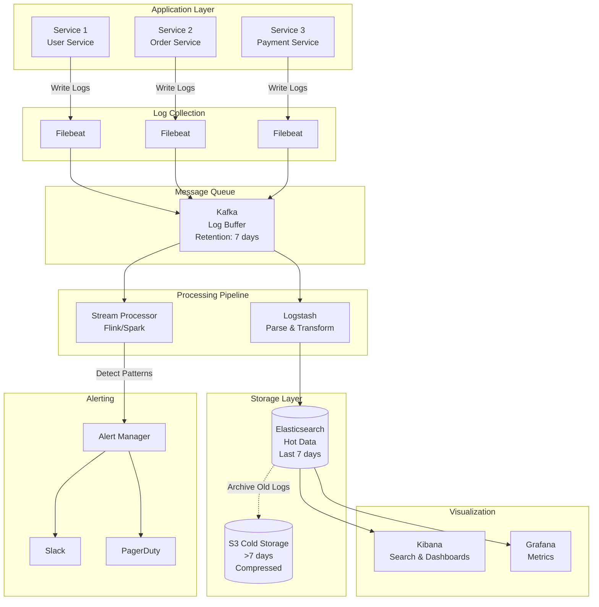
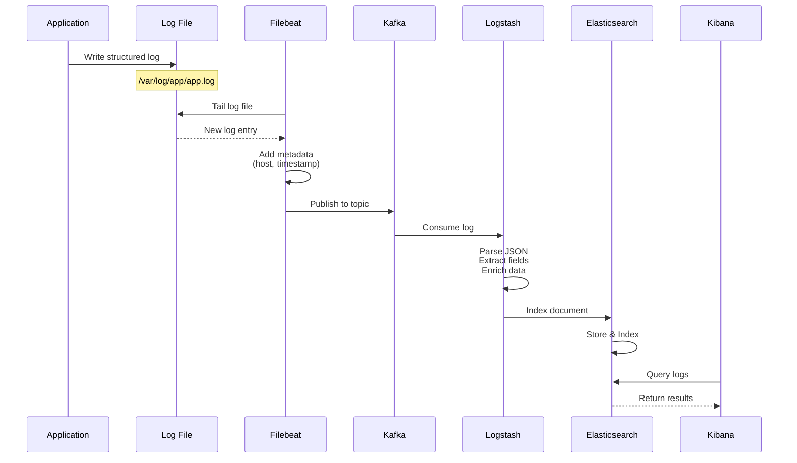
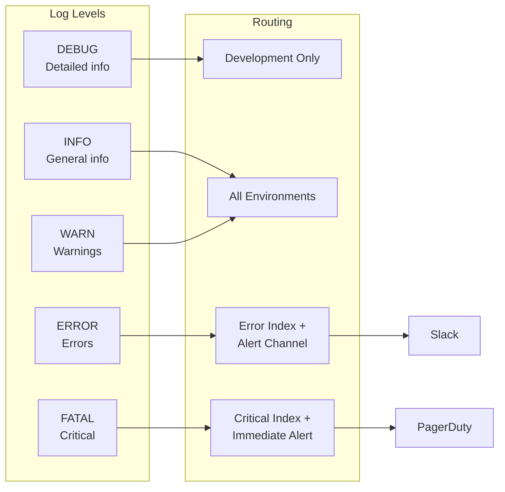
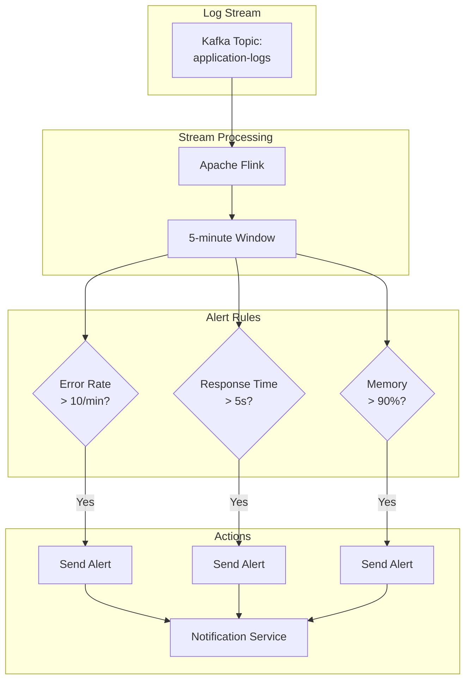
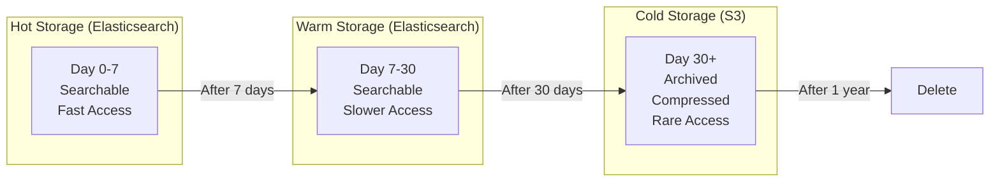
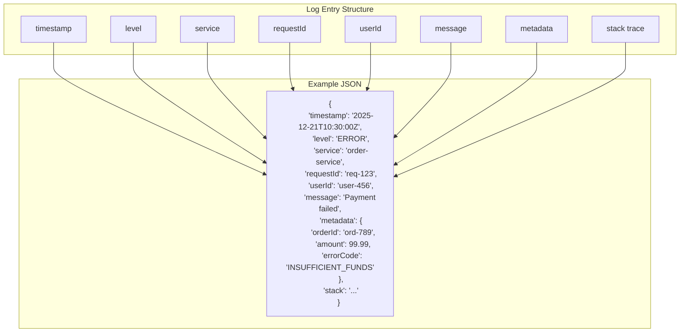
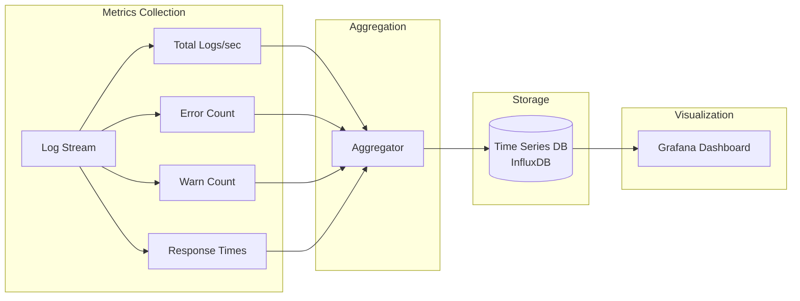
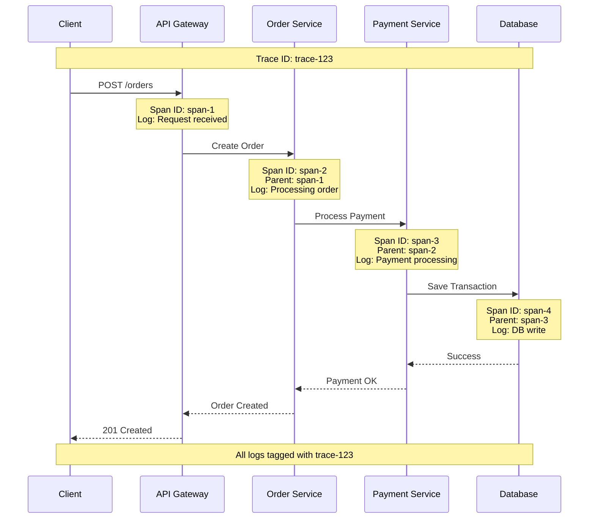
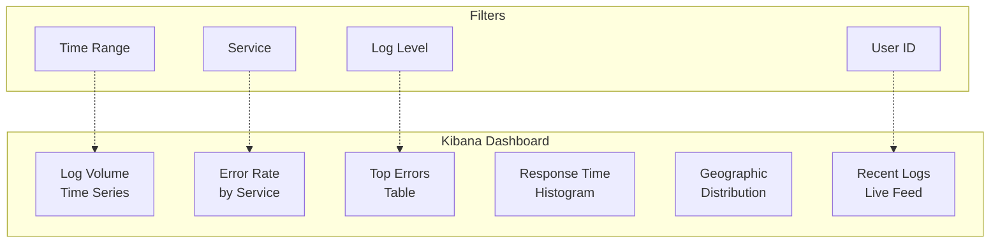
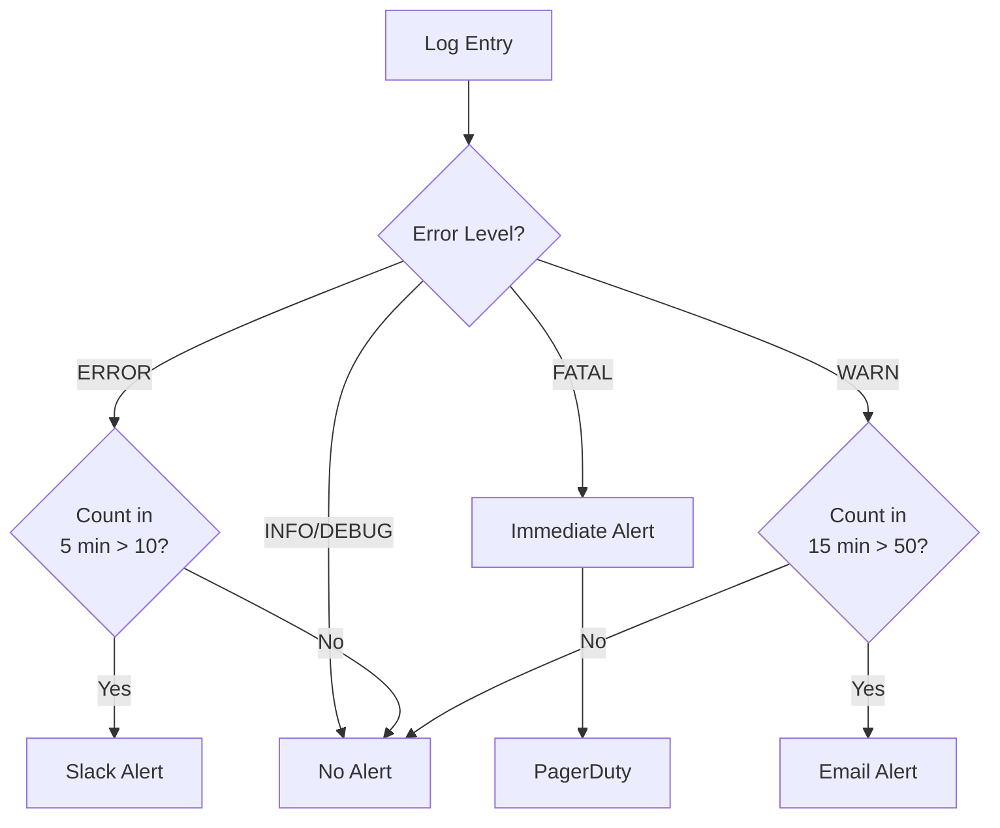

# Logging System: Visual Diagrams

## 1. Complete Logging Architecture



## 2. Log Flow Sequence



## 3. Log Levels and Routing



## 4. Real-time Alerting Pipeline



## 5. Log Retention Strategy



## 6. Structured Logging Format



## 7. Elasticsearch Index Strategy

```mermaid
graph TB
    subgraph "Index Pattern"
        Pattern[logs-{environment}-{date}]
    end
    
    subgraph "Examples"
        Prod1[logs-production-2025.12.21]
        Prod2[logs-production-2025.12.22]
        Stage1[logs-staging-2025.12.21]
        Dev1[logs-development-2025.12.21]
    end
    
    Pattern --> Prod1
    Pattern --> Prod2
    Pattern --> Stage1
    Pattern --> Dev1
    
    subgraph "Benefits"
        B1[Easy to delete old data]
        B2[Better query performance]
        B3[Environment isolation]
    end
```

## 8. Log Aggregation Metrics



## 9. Distributed Tracing Integration



## 10. Monitoring Dashboard Layout



## Performance Metrics

| Metric | Target | Current |
|--------|--------|---------|
| Ingestion Rate | 100K logs/s | 85K logs/s |
| Ingestion Latency | \u003c 100ms | 50ms |
| Search Latency | \u003c 2s | 500ms |
| Storage Cost | \u003c $100/TB/month | $75/TB/month |
| Retention (Hot) | 7 days | 7 days |
| Retention (Cold) | 1 year | 1 year |

## Alert Configuration


