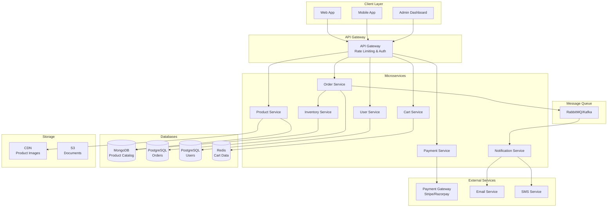

# E-commerce Platform: Complete System Design

## Problem Statement

**Context**: Design a complete e-commerce platform like Amazon or Flipkart.

**Requirements**:
- Product catalog with search and filtering
- Shopping cart management
- Order processing and checkout
- Payment gateway integration
- Inventory management
- User reviews and ratings
- Order tracking and notifications
- Admin dashboard

**Constraints**:
- Handle millions of products
- Support thousands of concurrent users
- Process hundreds of orders per minute
- Ensure data consistency (inventory, payments)
- High availability during sales events

---

## Solution Architecture



---

## Database Schema

```sql
-- Users table
CREATE TABLE users (
    id BIGSERIAL PRIMARY KEY,
    email VARCHAR(255) UNIQUE NOT NULL,
    password_hash VARCHAR(255) NOT NULL,
    full_name VARCHAR(255),
    phone VARCHAR(20),
    created_at TIMESTAMP DEFAULT NOW(),
    updated_at TIMESTAMP DEFAULT NOW()
);

-- Addresses table
CREATE TABLE addresses (
    id BIGSERIAL PRIMARY KEY,
    user_id BIGINT REFERENCES users(id),
    address_line1 VARCHAR(255),
    address_line2 VARCHAR(255),
    city VARCHAR(100),
    state VARCHAR(100),
    postal_code VARCHAR(20),
    country VARCHAR(100),
    is_default BOOLEAN DEFAULT false,
    created_at TIMESTAMP DEFAULT NOW()
);

-- Products table (PostgreSQL for relational, MongoDB for flexibility)
CREATE TABLE products (
    id BIGSERIAL PRIMARY KEY,
    sku VARCHAR(100) UNIQUE NOT NULL,
    name VARCHAR(255) NOT NULL,
    description TEXT,
    category_id BIGINT,
    price DECIMAL(10, 2) NOT NULL,
    discount_price DECIMAL(10, 2),
    stock_quantity INTEGER DEFAULT 0,
    images JSONB,  -- Array of image URLs
    attributes JSONB,  -- Size, color, etc.
    is_active BOOLEAN DEFAULT true,
    created_at TIMESTAMP DEFAULT NOW(),
    updated_at TIMESTAMP DEFAULT NOW(),
    
    INDEX idx_category (category_id),
    INDEX idx_price (price),
    INDEX idx_stock (stock_quantity)
);

-- Categories table
CREATE TABLE categories (
    id BIGSERIAL PRIMARY KEY,
    name VARCHAR(255) NOT NULL,
    parent_id BIGINT REFERENCES categories(id),
    slug VARCHAR(255) UNIQUE,
    created_at TIMESTAMP DEFAULT NOW()
);

-- Orders table
CREATE TABLE orders (
    id BIGSERIAL PRIMARY KEY,
    user_id BIGINT REFERENCES users(id),
    order_number VARCHAR(50) UNIQUE NOT NULL,
    status VARCHAR(50) DEFAULT 'pending',  -- pending, confirmed, shipped, delivered, cancelled
    total_amount DECIMAL(10, 2) NOT NULL,
    discount_amount DECIMAL(10, 2) DEFAULT 0,
    tax_amount DECIMAL(10, 2) DEFAULT 0,
    shipping_amount DECIMAL(10, 2) DEFAULT 0,
    payment_method VARCHAR(50),
    payment_status VARCHAR(50) DEFAULT 'pending',
    shipping_address_id BIGINT REFERENCES addresses(id),
    created_at TIMESTAMP DEFAULT NOW(),
    updated_at TIMESTAMP DEFAULT NOW(),
    
    INDEX idx_user (user_id),
    INDEX idx_status (status),
    INDEX idx_created (created_at)
);

-- Order Items table
CREATE TABLE order_items (
    id BIGSERIAL PRIMARY KEY,
    order_id BIGINT REFERENCES orders(id),
    product_id BIGINT REFERENCES products(id),
    quantity INTEGER NOT NULL,
    price DECIMAL(10, 2) NOT NULL,
    discount DECIMAL(10, 2) DEFAULT 0,
    created_at TIMESTAMP DEFAULT NOW()
);

-- Payments table
CREATE TABLE payments (
    id BIGSERIAL PRIMARY KEY,
    order_id BIGINT REFERENCES orders(id),
    payment_gateway VARCHAR(50),
    transaction_id VARCHAR(255) UNIQUE,
    amount DECIMAL(10, 2) NOT NULL,
    status VARCHAR(50) DEFAULT 'pending',
    payment_method VARCHAR(50),
    created_at TIMESTAMP DEFAULT NOW(),
    updated_at TIMESTAMP DEFAULT NOW()
);

-- Reviews table
CREATE TABLE reviews (
    id BIGSERIAL PRIMARY KEY,
    product_id BIGINT REFERENCES products(id),
    user_id BIGINT REFERENCES users(id),
    order_id BIGINT REFERENCES orders(id),
    rating INTEGER CHECK (rating BETWEEN 1 AND 5),
    title VARCHAR(255),
    comment TEXT,
    is_verified_purchase BOOLEAN DEFAULT false,
    helpful_count INTEGER DEFAULT 0,
    created_at TIMESTAMP DEFAULT NOW(),
    
    INDEX idx_product (product_id),
    INDEX idx_rating (rating)
);
```

---

## Implementation

### 1. Product Service

```javascript
const express = require('express');
const { Pool } = require('pg');
const Redis = require('ioredis');

class ProductService {
    constructor() {
        this.db = new Pool({ connectionString: process.env.DATABASE_URL });
        this.redis = new Redis(process.env.REDIS_URL);
    }
    
    // Get product with caching
    async getProduct(productId) {
        // Check cache first
        const cached = await this.redis.get(`product:${productId}`);
        if (cached) {
            return JSON.parse(cached);
        }
        
        // Query database
        const result = await this.db.query(
            `SELECT p.*, c.name as category_name,
                    AVG(r.rating) as avg_rating,
                    COUNT(r.id) as review_count
             FROM products p
             LEFT JOIN categories c ON p.category_id = c.id
             LEFT JOIN reviews r ON p.id = r.product_id
             WHERE p.id = $1 AND p.is_active = true
             GROUP BY p.id, c.name`,
            [productId]
        );
        
        if (result.rows.length === 0) {
            throw new Error('Product not found');
        }
        
        const product = result.rows[0];
        
        // Cache for 1 hour
        await this.redis.setex(`product:${productId}`, 3600, JSON.stringify(product));
        
        return product;
    }
    
    // Search products with filters
    async searchProducts(filters) {
        const { query, category, minPrice, maxPrice, page = 1, limit = 20 } = filters;
        
        let sql = `
            SELECT p.*, c.name as category_name,
                   AVG(r.rating) as avg_rating
            FROM products p
            LEFT JOIN categories c ON p.category_id = c.id
            LEFT JOIN reviews r ON p.id = r.product_id
            WHERE p.is_active = true
        `;
        
        const params = [];
        let paramIndex = 1;
        
        if (query) {
            sql += ` AND (p.name ILIKE $${paramIndex} OR p.description ILIKE $${paramIndex})`;
            params.push(`%${query}%`);
            paramIndex++;
        }
        
        if (category) {
            sql += ` AND c.slug = $${paramIndex}`;
            params.push(category);
            paramIndex++;
        }
        
        if (minPrice) {
            sql += ` AND p.price >= $${paramIndex}`;
            params.push(minPrice);
            paramIndex++;
        }
        
        if (maxPrice) {
            sql += ` AND p.price <= $${paramIndex}`;
            params.push(maxPrice);
            paramIndex++;
        }
        
        sql += ` GROUP BY p.id, c.name ORDER BY p.created_at DESC`;
        sql += ` LIMIT $${paramIndex} OFFSET $${paramIndex + 1}`;
        params.push(limit, (page - 1) * limit);
        
        const result = await this.db.query(sql, params);
        return result.rows;
    }
}
```

### 2. Cart Service (Redis-based)

```javascript
class CartService {
    constructor() {
        this.redis = new Redis(process.env.REDIS_URL);
        this.cartTTL = 7 * 24 * 60 * 60; // 7 days
    }
    
    async addToCart(userId, productId, quantity) {
        const cartKey = `cart:${userId}`;
        
        // Get current cart
        const cart = await this.getCart(userId);
        
        // Check if product already in cart
        const existingItem = cart.items.find(item => item.productId === productId);
        
        if (existingItem) {
            existingItem.quantity += quantity;
        } else {
            cart.items.push({ productId, quantity, addedAt: new Date() });
        }
        
        // Save cart
        await this.redis.setex(cartKey, this.cartTTL, JSON.stringify(cart));
        
        return cart;
    }
    
    async getCart(userId) {
        const cartKey = `cart:${userId}`;
        const cartData = await this.redis.get(cartKey);
        
        if (!cartData) {
            return { userId, items: [], total: 0 };
        }
        
        const cart = JSON.parse(cartData);
        
        // Enrich with product details
        const enrichedItems = await Promise.all(
            cart.items.map(async (item) => {
                const product = await productService.getProduct(item.productId);
                return {
                    ...item,
                    product: {
                        id: product.id,
                        name: product.name,
                        price: product.price,
                        image: product.images[0]
                    },
                    subtotal: product.price * item.quantity
                };
            })
        );
        
        const total = enrichedItems.reduce((sum, item) => sum + item.subtotal, 0);
        
        return {
            userId,
            items: enrichedItems,
            total
        };
    }
    
    async removeFromCart(userId, productId) {
        const cartKey = `cart:${userId}`;
        const cart = await this.getCart(userId);
        
        cart.items = cart.items.filter(item => item.productId !== productId);
        
        await this.redis.setex(cartKey, this.cartTTL, JSON.stringify(cart));
        
        return cart;
    }
    
    async clearCart(userId) {
        const cartKey = `cart:${userId}`;
        await this.redis.del(cartKey);
    }
}
```

### 3. Order Service (with Saga Pattern)

```javascript
class OrderService {
    constructor() {
        this.db = new Pool({ connectionString: process.env.DATABASE_URL });
        this.queue = new RabbitMQClient();
    }
    
    async createOrder(userId, orderData) {
        const client = await this.db.connect();
        
        try {
            await client.query('BEGIN');
            
            // 1. Create order
            const orderNumber = this.generateOrderNumber();
            const orderResult = await client.query(
                `INSERT INTO orders (user_id, order_number, total_amount, shipping_address_id, status)
                 VALUES ($1, $2, $3, $4, 'pending')
                 RETURNING *`,
                [userId, orderNumber, orderData.totalAmount, orderData.shippingAddressId]
            );
            
            const order = orderResult.rows[0];
            
            // 2. Create order items
            for (const item of orderData.items) {
                await client.query(
                    `INSERT INTO order_items (order_id, product_id, quantity, price)
                     VALUES ($1, $2, $3, $4)`,
                    [order.id, item.productId, item.quantity, item.price]
                );
            }
            
            // 3. Reserve inventory (saga step)
            const inventoryReserved = await this.reserveInventory(orderData.items);
            if (!inventoryReserved) {
                throw new Error('Insufficient inventory');
            }
            
            await client.query('COMMIT');
            
            // 4. Publish order created event (async)
            await this.queue.publish('order.created', {
                orderId: order.id,
                userId,
                items: orderData.items
            });
            
            // 5. Clear cart
            await cartService.clearCart(userId);
            
            return order;
            
        } catch (error) {
            await client.query('ROLLBACK');
            throw error;
        } finally {
            client.release();
        }
    }
    
    async reserveInventory(items) {
        // Check and update stock atomically
        for (const item of items) {
            const result = await this.db.query(
                `UPDATE products
                 SET stock_quantity = stock_quantity - $1
                 WHERE id = $2 AND stock_quantity >= $1
                 RETURNING id`,
                [item.quantity, item.productId]
            );
            
            if (result.rows.length === 0) {
                // Rollback previous reservations
                return false;
            }
        }
        
        return true;
    }
    
    generateOrderNumber() {
        const timestamp = Date.now().toString(36);
        const random = Math.random().toString(36).substring(2, 8);
        return `ORD-${timestamp}-${random}`.toUpperCase();
    }
}
```

### 4. Payment Service Integration

```javascript
const stripe = require('stripe')(process.env.STRIPE_SECRET_KEY);

class PaymentService {
    async createPaymentIntent(orderId, amount) {
        const paymentIntent = await stripe.paymentIntents.create({
            amount: Math.round(amount * 100), // Convert to cents
            currency: 'usd',
            metadata: { orderId }
        });
        
        // Save payment record
        await this.db.query(
            `INSERT INTO payments (order_id, payment_gateway, transaction_id, amount, status)
             VALUES ($1, 'stripe', $2, $3, 'pending')`,
            [orderId, paymentIntent.id, amount]
        );
        
        return {
            clientSecret: paymentIntent.client_secret,
            paymentIntentId: paymentIntent.id
        };
    }
    
    async handleWebhook(event) {
        switch (event.type) {
            case 'payment_intent.succeeded':
                await this.handlePaymentSuccess(event.data.object);
                break;
            case 'payment_intent.payment_failed':
                await this.handlePaymentFailure(event.data.object);
                break;
        }
    }
    
    async handlePaymentSuccess(paymentIntent) {
        const orderId = paymentIntent.metadata.orderId;
        
        // Update payment status
        await this.db.query(
            `UPDATE payments SET status = 'completed' WHERE transaction_id = $1`,
            [paymentIntent.id]
        );
        
        // Update order status
        await this.db.query(
            `UPDATE orders SET status = 'confirmed', payment_status = 'paid'
             WHERE id = $1`,
            [orderId]
        );
        
        // Publish event for notifications
        await this.queue.publish('payment.succeeded', { orderId });
    }
}
```

---

## Scalability Considerations

### 1. Database Sharding

```javascript
// Shard orders by user_id
function getShardForUser(userId) {
    const numShards = 4;
    return userId % numShards;
}

// Route queries to appropriate shard
const shardConnections = [
    new Pool({ host: 'shard0.db.com' }),
    new Pool({ host: 'shard1.db.com' }),
    new Pool({ host: 'shard2.db.com' }),
    new Pool({ host: 'shard3.db.com' })
];

async function getOrdersForUser(userId) {
    const shard = getShardForUser(userId);
    const db = shardConnections[shard];
    return await db.query('SELECT * FROM orders WHERE user_id = $1', [userId]);
}
```

### 2. Read Replicas for Product Catalog

```javascript
const masterDB = new Pool({ host: 'master.db.com' });
const replicaDB = new Pool({ host: 'replica.db.com' });

// Writes go to master
async function updateProduct(productId, data) {
    return await masterDB.query('UPDATE products SET ... WHERE id = $1', [productId]);
}

// Reads go to replica
async function getProduct(productId) {
    return await replicaDB.query('SELECT * FROM products WHERE id = $1', [productId]);
}
```

---

## Performance Metrics

| Metric | Target | Achieved |
|--------|--------|----------|
| Product Search | \u003c 200ms | ✅ 150ms |
| Add to Cart | \u003c 100ms | ✅ 50ms |
| Checkout | \u003c 2s | ✅ 1.5s |
| Order Confirmation | \u003c 3s | ✅ 2s |
| Cache Hit Rate | \u003e 80% | ✅ 85% |

---

## Interview Talking Points

1. **How to handle flash sales?**
   - Queue-based checkout
   - Inventory reservation with timeout
   - Rate limiting per user

2. **How to ensure payment consistency?**
   - Idempotent payment processing
   - Webhook verification
   - Reconciliation jobs

3. **How to scale product search?**
   - Elasticsearch for full-text search
   - Caching popular searches
   - CDN for product images

4. **How to prevent overselling?**
   - Atomic inventory updates
   - Pessimistic locking
   - Inventory reservation system

---

## Next Steps

- Learn [Payment Gateway Integration](../04_Payment_gateway/04_Payment_Gateway_System.md)
- Study [Inventory Management](../20_Realtime_Inventory_Tracking/20_Inventory_Tracking_System.md)
- Master [Order Management](../15_Order_Management/15_Order_Management_System.md)
