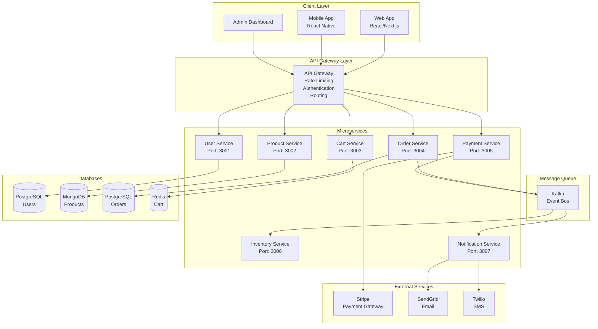
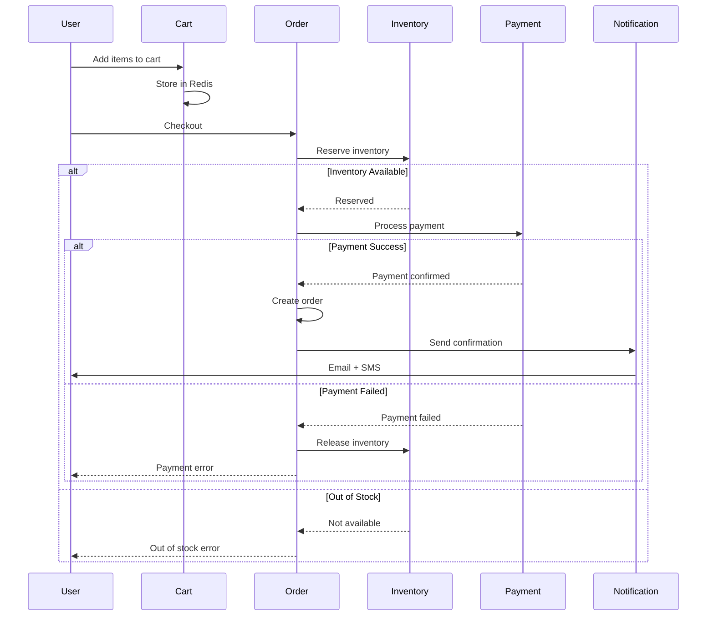
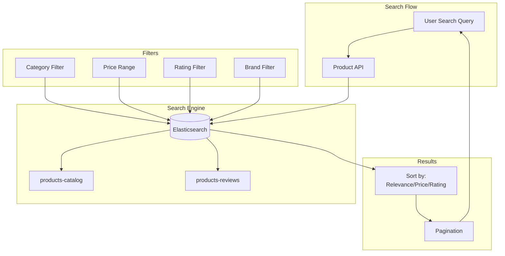
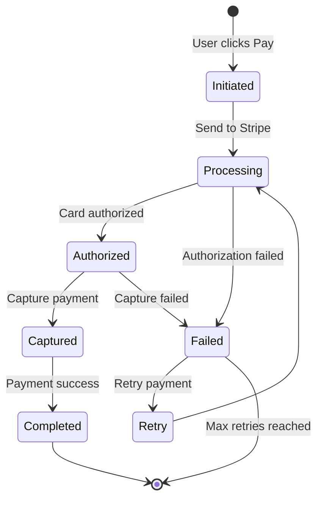
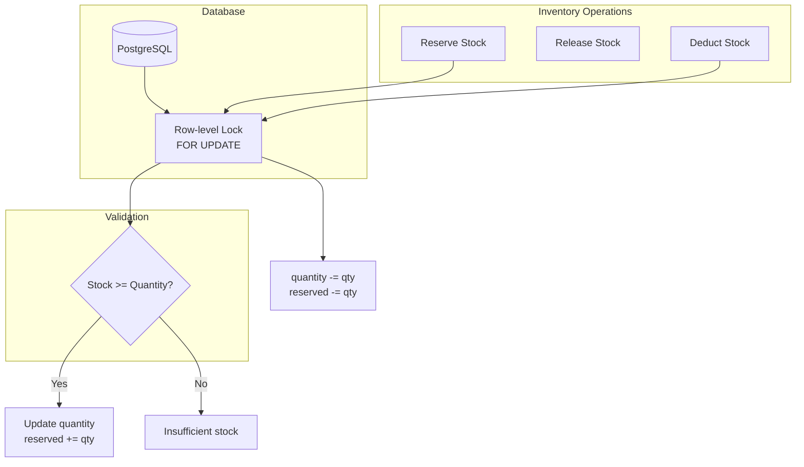
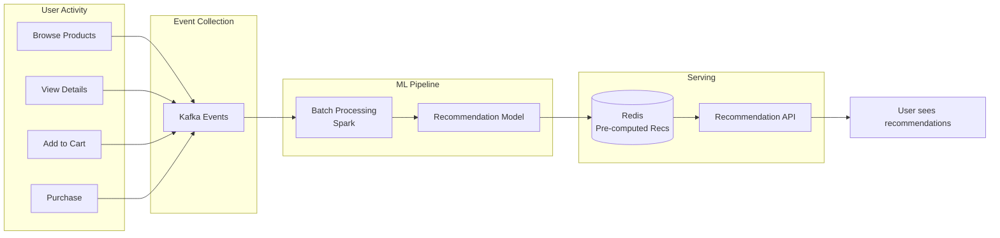
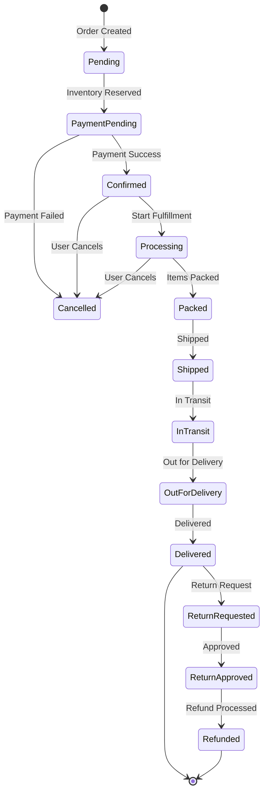
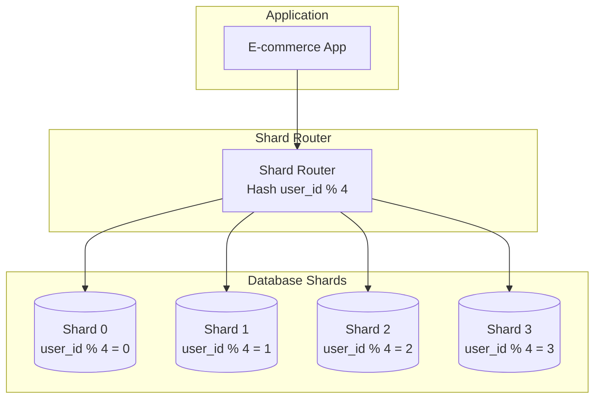
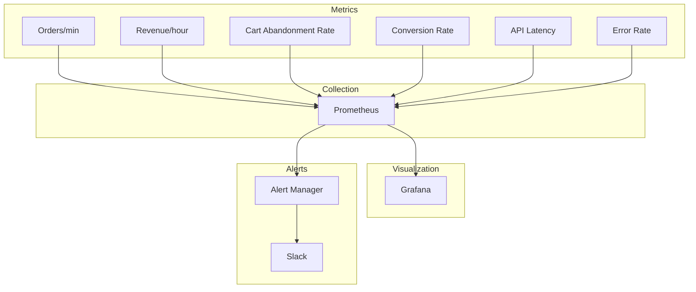
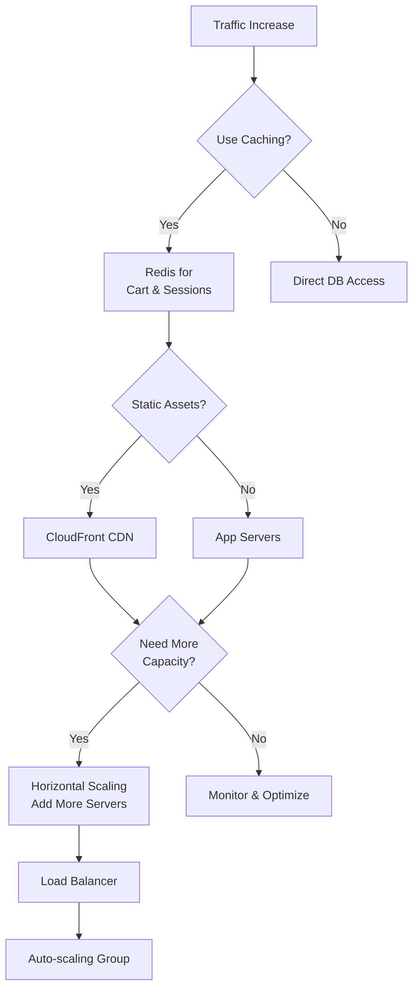

# E-commerce Platform: Visual Diagrams

## 1. Microservices Architecture



## 2. Order Processing Flow



## 3. Shopping Cart Architecture

```mermaid
graph LR
    subgraph "Cart Service"
        API[Cart API]
    end
    
    subgraph "Redis Cache"
        Cache[(Redis<br/>TTL: 7 days)]
        Cache --> C1[cart:user123<br/>items: [...]]
        Cache --> C2[cart:user456<br/>items: [...]]
    end
    
    subgraph "Operations"
        Add[Add Item]
        Remove[Remove Item]
        Update[Update Quantity]
        Clear[Clear Cart]
    end
    
    API --> Cache
    Add --> API
    Remove --> API
    Update --> API
    Clear --> API
```

## 4. Product Search Architecture



## 5. Payment Processing Flow



## 6. Inventory Management



## 7. Recommendation Engine Integration



## 8. Order Status Tracking



## 9. Database Sharding Strategy



## 10. Monitoring Dashboard



## Key Performance Metrics

| Metric | Target | Current |
|--------|--------|---------|
| Product Search | \u003c 200ms | 150ms |
| Add to Cart | \u003c 100ms | 50ms |
| Checkout | \u003c 2s | 1.5s |
| Order Confirmation | \u003c 3s | 2s |
| Payment Processing | \u003c 5s | 3s |
| Cart Abandonment | \u003c 70% | 65% |
| Conversion Rate | \u003e 2% | 2.5% |

## Scalability Patterns


