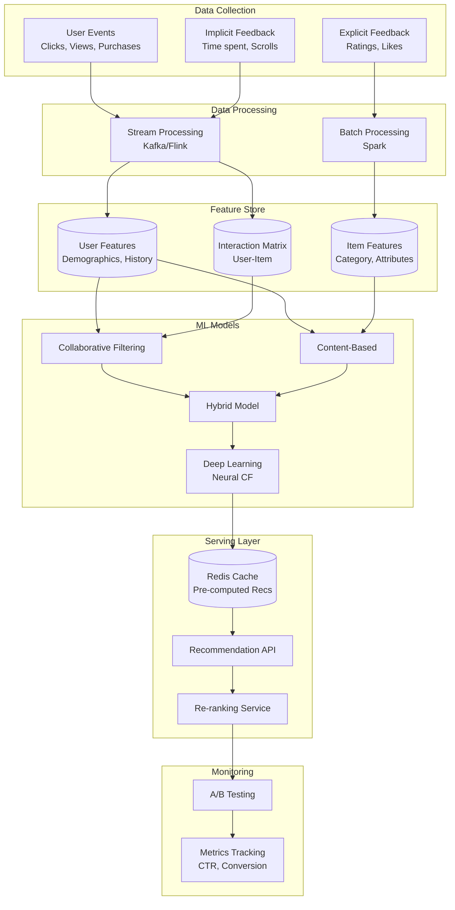

# Recommendation System: Complete System Design

## Problem Statement

**Context**: Design a recommendation engine for e-commerce/content platforms (like Amazon, Netflix, YouTube).

**Requirements**:
- Personalized product/content recommendations
- Real-time and batch recommendations
- Handle cold start problem (new users/items)
- Support multiple recommendation strategies
- A/B testing framework
- Scale to millions of users and items

**Constraints**:
- Recommendations must be relevant (high CTR)
- Low latency (\u003c100ms for real-time)
- Handle sparse data (most users interact with few items)
- Adapt to changing user preferences

---

## Solution Architecture



---

## Recommendation Algorithms

### 1. Collaborative Filtering (User-Based)

```javascript
class CollaborativeFiltering {
    constructor() {
        this.userItemMatrix = new Map(); // userId -> {itemId: rating}
    }
    
    // Calculate similarity between two users (Cosine Similarity)
    calculateSimilarity(user1Items, user2Items) {
        const commonItems = new Set(
            [...user1Items.keys()].filter(item => user2Items.has(item))
        );
        
        if (commonItems.size === 0) return 0;
        
        let dotProduct = 0;
        let norm1 = 0;
        let norm2 = 0;
        
        for (const item of commonItems) {
            const rating1 = user1Items.get(item);
            const rating2 = user2Items.get(item);
            dotProduct += rating1 * rating2;
            norm1 += rating1 * rating1;
            norm2 += rating2 * rating2;
        }
        
        return dotProduct / (Math.sqrt(norm1) * Math.sqrt(norm2));
    }
    
    // Find K most similar users
    findSimilarUsers(userId, k = 10) {
        const userItems = this.userItemMatrix.get(userId);
        const similarities = [];
        
        for (const [otherUserId, otherItems] of this.userItemMatrix) {
            if (otherUserId === userId) continue;
            
            const similarity = this.calculateSimilarity(userItems, otherItems);
            similarities.push({ userId: otherUserId, similarity });
        }
        
        return similarities
            .sort((a, b) => b.similarity - a.similarity)
            .slice(0, k);
    }
    
    // Generate recommendations
    recommend(userId, numRecs = 10) {
        const userItems = this.userItemMatrix.get(userId);
        const similarUsers = this.findSimilarUsers(userId);
        
        const scores = new Map();
        
        // Aggregate scores from similar users
        for (const { userId: similarUserId, similarity } of similarUsers) {
            const similarUserItems = this.userItemMatrix.get(similarUserId);
            
            for (const [itemId, rating] of similarUserItems) {
                // Skip items user has already interacted with
                if (userItems.has(itemId)) continue;
                
                const currentScore = scores.get(itemId) || 0;
                scores.set(itemId, currentScore + similarity * rating);
            }
        }
        
        // Sort and return top N
        return Array.from(scores.entries())
            .sort((a, b) => b[1] - a[1])
            .slice(0, numRecs)
            .map(([itemId, score]) => ({ itemId, score }));
    }
}
```

### 2. Item-Based Collaborative Filtering

```javascript
class ItemBasedCF {
    constructor() {
        this.itemSimilarityMatrix = new Map(); // Pre-computed item similarities
    }
    
    // Pre-compute item-item similarities (offline job)
    async computeItemSimilarities(interactions) {
        const itemUsers = new Map(); // itemId -> Set of userIds
        
        // Build inverted index
        for (const { userId, itemId, rating } of interactions) {
            if (!itemUsers.has(itemId)) {
                itemUsers.set(itemId, new Map());
            }
            itemUsers.get(itemId).set(userId, rating);
        }
        
        // Compute pairwise similarities
        const items = Array.from(itemUsers.keys());
        
        for (let i = 0; i < items.length; i++) {
            const item1 = items[i];
            const similarities = [];
            
            for (let j = i + 1; j < items.length; j++) {
                const item2 = items[j];
                const similarity = this.calculateItemSimilarity(
                    itemUsers.get(item1),
                    itemUsers.get(item2)
                );
                
                if (similarity > 0.1) { // Threshold
                    similarities.push({ itemId: item2, similarity });
                }
            }
            
            this.itemSimilarityMatrix.set(item1, similarities);
        }
    }
    
    calculateItemSimilarity(item1Users, item2Users) {
        const commonUsers = new Set(
            [...item1Users.keys()].filter(user => item2Users.has(user))
        );
        
        if (commonUsers.size === 0) return 0;
        
        let dotProduct = 0;
        let norm1 = 0;
        let norm2 = 0;
        
        for (const user of commonUsers) {
            const rating1 = item1Users.get(user);
            const rating2 = item2Users.get(user);
            dotProduct += rating1 * rating2;
            norm1 += rating1 * rating1;
            norm2 += rating2 * rating2;
        }
        
        return dotProduct / (Math.sqrt(norm1) * Math.sqrt(norm2));
    }
    
    // Generate recommendations based on user's history
    recommend(userHistory, numRecs = 10) {
        const scores = new Map();
        
        // For each item user has interacted with
        for (const { itemId, rating } of userHistory) {
            const similarItems = this.itemSimilarityMatrix.get(itemId) || [];
            
            // Aggregate scores from similar items
            for (const { itemId: similarItemId, similarity } of similarItems) {
                const currentScore = scores.get(similarItemId) || 0;
                scores.set(similarItemId, currentScore + similarity * rating);
            }
        }
        
        // Remove items user has already seen
        const seenItems = new Set(userHistory.map(h => h.itemId));
        for (const itemId of seenItems) {
            scores.delete(itemId);
        }
        
        return Array.from(scores.entries())
            .sort((a, b) => b[1] - a[1])
            .slice(0, numRecs)
            .map(([itemId, score]) => ({ itemId, score }));
    }
}
```

### 3. Content-Based Filtering

```javascript
class ContentBasedRecommender {
    constructor() {
        this.itemFeatures = new Map(); // itemId -> feature vector
    }
    
    // Extract features from item
    extractFeatures(item) {
        return {
            category: item.category,
            tags: item.tags || [],
            price: item.price,
            brand: item.brand,
            attributes: item.attributes || {}
        };
    }
    
    // Calculate similarity between items
    calculateContentSimilarity(item1Features, item2Features) {
        let score = 0;
        
        // Category match
        if (item1Features.category === item2Features.category) {
            score += 0.3;
        }
        
        // Tag overlap
        const tags1 = new Set(item1Features.tags);
        const tags2 = new Set(item2Features.tags);
        const commonTags = new Set([...tags1].filter(t => tags2.has(t)));
        const tagSimilarity = commonTags.size / Math.max(tags1.size, tags2.size);
        score += tagSimilarity * 0.4;
        
        // Price similarity
        const priceDiff = Math.abs(item1Features.price - item2Features.price);
        const maxPrice = Math.max(item1Features.price, item2Features.price);
        const priceSimilarity = 1 - (priceDiff / maxPrice);
        score += priceSimilarity * 0.2;
        
        // Brand match
        if (item1Features.brand === item2Features.brand) {
            score += 0.1;
        }
        
        return score;
    }
    
    // Build user profile from history
    buildUserProfile(userHistory) {
        const profile = {
            categories: new Map(),
            tags: new Map(),
            brands: new Map(),
            avgPrice: 0
        };
        
        let totalPrice = 0;
        
        for (const { itemId, rating } of userHistory) {
            const features = this.itemFeatures.get(itemId);
            
            // Aggregate categories
            const catCount = profile.categories.get(features.category) || 0;
            profile.categories.set(features.category, catCount + rating);
            
            // Aggregate tags
            for (const tag of features.tags) {
                const tagCount = profile.tags.get(tag) || 0;
                profile.tags.set(tag, tagCount + rating);
            }
            
            // Aggregate brands
            const brandCount = profile.brands.get(features.brand) || 0;
            profile.brands.set(features.brand, brandCount + rating);
            
            totalPrice += features.price * rating;
        }
        
        profile.avgPrice = totalPrice / userHistory.length;
        
        return profile;
    }
    
    // Recommend items matching user profile
    recommend(userHistory, candidateItems, numRecs = 10) {
        const userProfile = this.buildUserProfile(userHistory);
        const scores = [];
        
        for (const item of candidateItems) {
            const features = this.itemFeatures.get(item.id);
            let score = 0;
            
            // Category preference
            score += (userProfile.categories.get(features.category) || 0) * 0.3;
            
            // Tag preferences
            for (const tag of features.tags) {
                score += (userProfile.tags.get(tag) || 0) * 0.1;
            }
            
            // Brand preference
            score += (userProfile.brands.get(features.brand) || 0) * 0.2;
            
            // Price similarity
            const priceDiff = Math.abs(features.price - userProfile.avgPrice);
            const priceSimilarity = 1 - (priceDiff / userProfile.avgPrice);
            score += priceSimilarity * 0.2;
            
            scores.push({ itemId: item.id, score });
        }
        
        return scores
            .sort((a, b) => b.score - a.score)
            .slice(0, numRecs);
    }
}
```

### 4. Hybrid Approach

```javascript
class HybridRecommender {
    constructor() {
        this.collaborativeFilter = new ItemBasedCF();
        this.contentBased = new ContentBasedRecommender();
    }
    
    recommend(userId, userHistory, candidateItems, numRecs = 10) {
        // Get recommendations from both approaches
        const cfRecs = this.collaborativeFilter.recommend(userHistory, numRecs * 2);
        const cbRecs = this.contentBased.recommend(userHistory, candidateItems, numRecs * 2);
        
        // Combine scores with weights
        const combinedScores = new Map();
        
        // Collaborative filtering (60% weight)
        for (const { itemId, score } of cfRecs) {
            combinedScores.set(itemId, score * 0.6);
        }
        
        // Content-based (40% weight)
        for (const { itemId, score } of cbRecs) {
            const currentScore = combinedScores.get(itemId) || 0;
            combinedScores.set(itemId, currentScore + score * 0.4);
        }
        
        return Array.from(combinedScores.entries())
            .sort((a, b) => b[1] - a[1])
            .slice(0, numRecs)
            .map(([itemId, score]) => ({ itemId, score }));
    }
}
```

---

## Production Implementation

```javascript
const express = require('express');
const Redis = require('ioredis');

class RecommendationService {
    constructor() {
        this.redis = new Redis(process.env.REDIS_URL);
        this.hybridRecommender = new HybridRecommender();
    }
    
    async getRecommendations(userId, context = {}) {
        const cacheKey = `recs:${userId}:${context.page || 'home'}`;
        
        // Check cache
        const cached = await this.redis.get(cacheKey);
        if (cached) {
            return JSON.parse(cached);
        }
        
        // Get user history
        const userHistory = await this.getUserHistory(userId);
        
        // Handle cold start
        if (userHistory.length === 0) {
            return await this.getColdStartRecommendations(context);
        }
        
        // Get candidate items
        const candidates = await this.getCandidateItems(userId, context);
        
        // Generate recommendations
        const recommendations = this.hybridRecommender.recommend(
            userId,
            userHistory,
            candidates,
            20
        );
        
        // Re-rank based on business rules
        const reranked = await this.rerank(recommendations, context);
        
        // Cache for 1 hour
        await this.redis.setex(cacheKey, 3600, JSON.stringify(reranked));
        
        return reranked;
    }
    
    async getColdStartRecommendations(context) {
        // For new users, show:
        // 1. Trending items
        // 2. Popular in category
        // 3. New arrivals
        
        const trending = await this.getTrendingItems(10);
        const popular = await this.getPopularItems(10);
        
        return [...trending, ...popular].slice(0, 20);
    }
    
    async rerank(recommendations, context) {
        // Apply business rules:
        // - Boost items with high margin
        // - Boost items in stock
        // - Diversify categories
        // - Apply promotional rules
        
        return recommendations.map((rec, index) => ({
            ...rec,
            position: index + 1,
            reason: this.getRecommendationReason(rec)
        }));
    }
    
    getRecommendationReason(rec) {
        // Explain why item was recommended
        if (rec.source === 'collaborative') {
            return 'Customers who bought similar items also bought this';
        } else if (rec.source === 'content') {
            return 'Based on your interests';
        } else {
            return 'Recommended for you';
        }
    }
}

// API Endpoints
const app = express();
const recService = new RecommendationService();

app.get('/api/recommendations/:userId', async (req, res) => {
    const { userId } = req.params;
    const { page, category } = req.query;
    
    const recommendations = await recService.getRecommendations(userId, {
        page,
        category
    });
    
    res.json(recommendations);
});

// Track user interactions
app.post('/api/events', async (req, res) => {
    const { userId, itemId, eventType, timestamp } = req.body;
    
    // Store event for model training
    await storeEvent({ userId, itemId, eventType, timestamp });
    
    // Update real-time features
    await updateUserFeatures(userId, itemId, eventType);
    
    res.json({ success: true });
});
```

---

## A/B Testing Framework

```javascript
class ABTestingFramework {
    constructor() {
        this.experiments = new Map();
    }
    
    // Assign user to experiment variant
    assignVariant(userId, experimentId) {
        const experiment = this.experiments.get(experimentId);
        if (!experiment) return 'control';
        
        // Consistent hashing for stable assignment
        const hash = this.hashUserId(userId);
        const bucket = hash % 100;
        
        let cumulative = 0;
        for (const [variant, percentage] of Object.entries(experiment.variants)) {
            cumulative += percentage;
            if (bucket < cumulative) {
                return variant;
            }
        }
        
        return 'control';
    }
    
    hashUserId(userId) {
        let hash = 0;
        for (let i = 0; i < userId.length; i++) {
            hash = ((hash << 5) - hash) + userId.charCodeAt(i);
            hash = hash & hash;
        }
        return Math.abs(hash);
    }
    
    // Track metrics
    async trackMetric(userId, experimentId, metricName, value) {
        const variant = this.assignVariant(userId, experimentId);
        
        await this.redis.hincrby(
            `experiment:${experimentId}:${variant}:${metricName}`,
            'count',
            1
        );
        
        await this.redis.hincrbyfloat(
            `experiment:${experimentId}:${variant}:${metricName}`,
            'sum',
            value
        );
    }
}
```

---

## Performance Metrics

| Metric | Target | Monitoring |
|--------|--------|------------|
| CTR (Click-Through Rate) | \u003e 5% | Track clicks on recommendations |
| Conversion Rate | \u003e 2% | Track purchases from recommendations |
| Coverage | \u003e 80% | % of items recommended |
| Diversity | \u003e 0.7 | Category diversity in recommendations |
| Latency | \u003c 100ms | p95 response time |

---

## Interview Talking Points

1. **Cold Start Problem Solutions**:
   - New users: Popular items, trending, demographic-based
   - New items: Content-based features, similar items
   - Hybrid approach combining multiple signals

2. **Scalability**:
   - Pre-compute recommendations offline (batch)
   - Cache popular recommendations
   - Use approximate nearest neighbors (ANN)
   - Shard by user_id

3. **Real-time vs Batch**:
   - Batch: Train models, compute similarities (daily)
   - Real-time: Update user features, re-rank (milliseconds)

4. **Evaluation Metrics**:
   - Online: CTR, conversion, revenue
   - Offline: Precision@K, Recall@K, NDCG
   - A/B testing for business impact

---

## Next Steps

- Learn [E-commerce Platform](../10_Ecommerce_Platform/10_Ecommerce_Platform_System.md)
- Study [Rating System](../21_Rating_System_Ecommerce/21_Rating_System.md)
- Master [Real-time Processing](../09_Logging_System/09_Logging_System.md)
