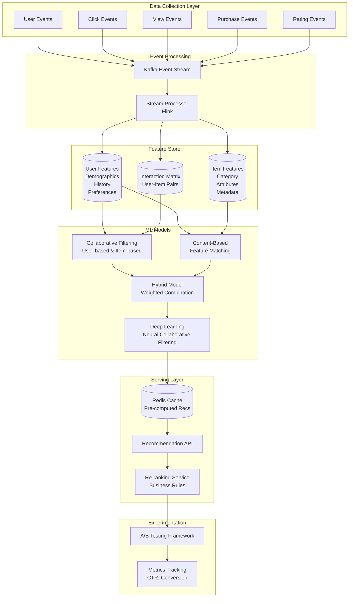
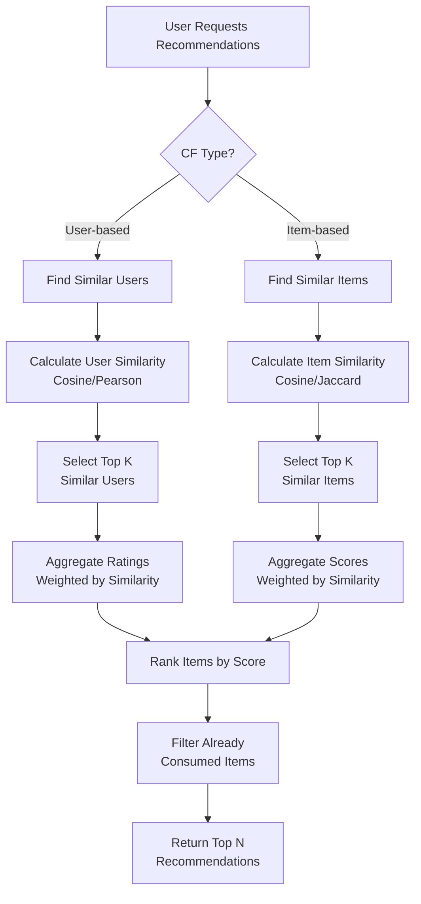
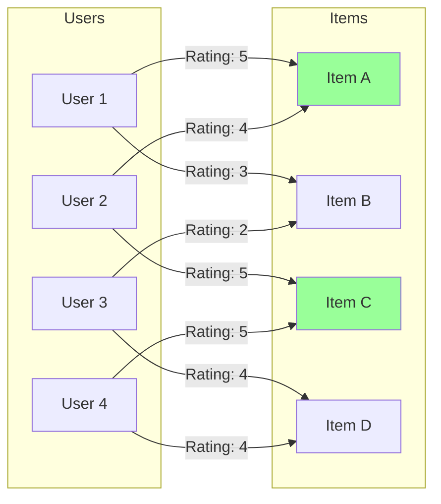
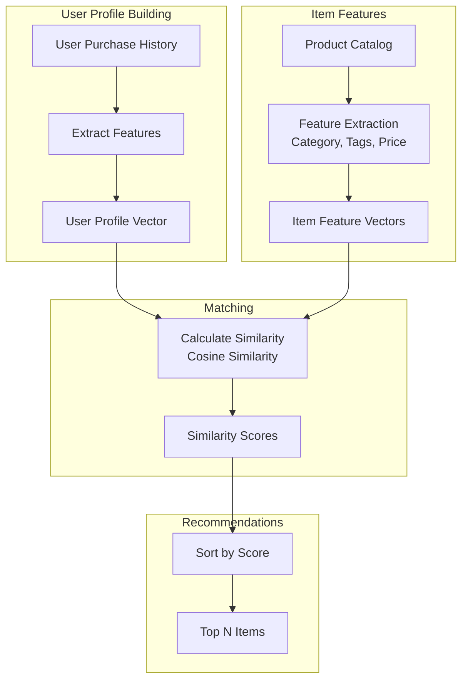
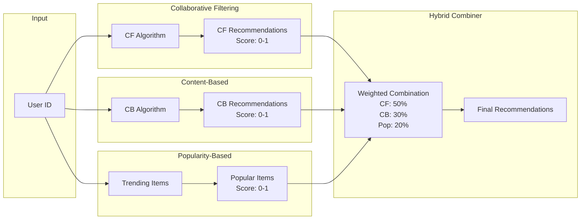
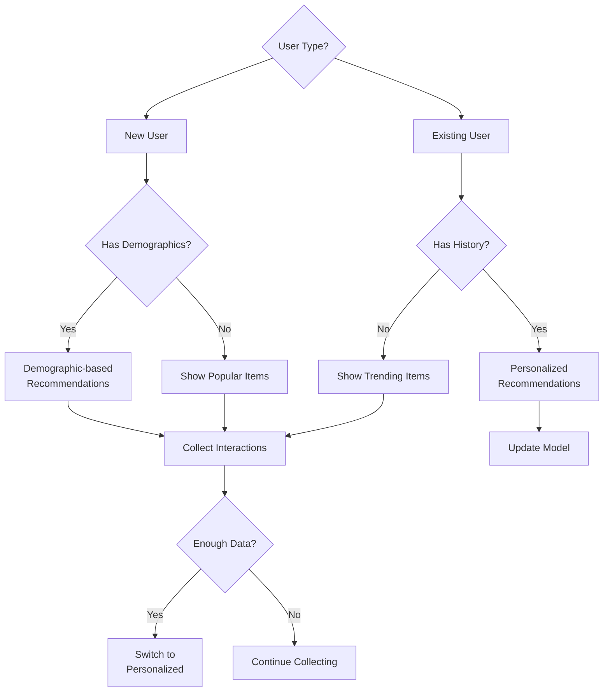
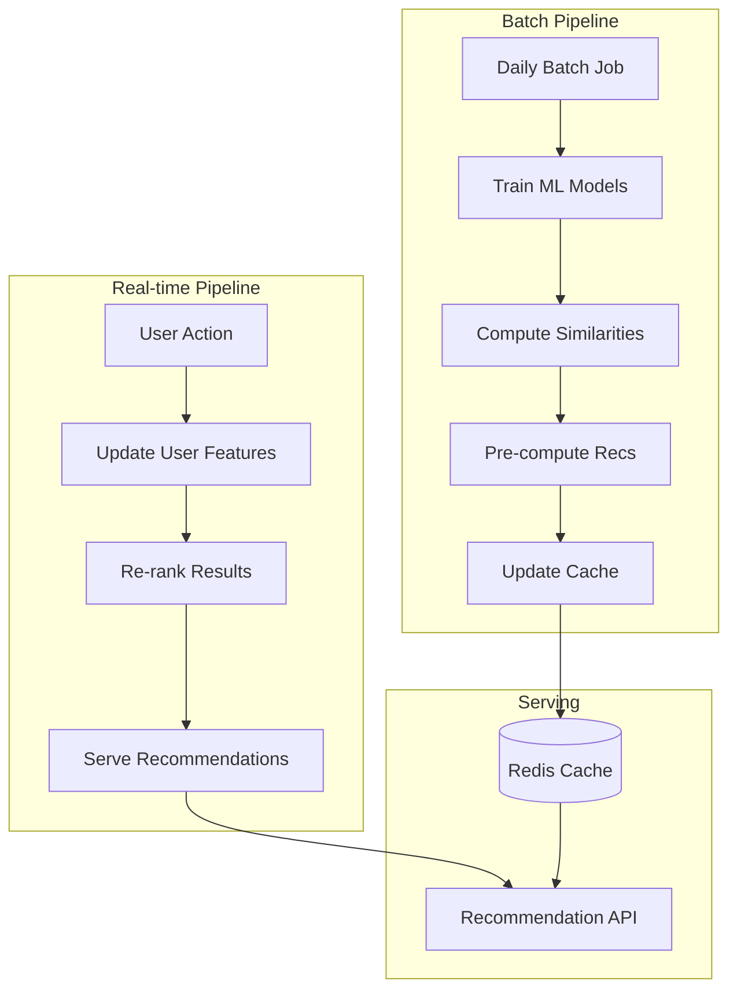
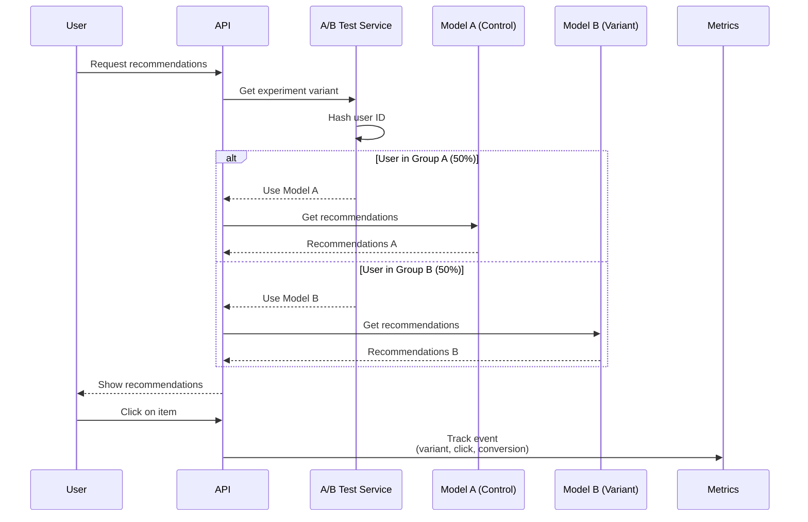
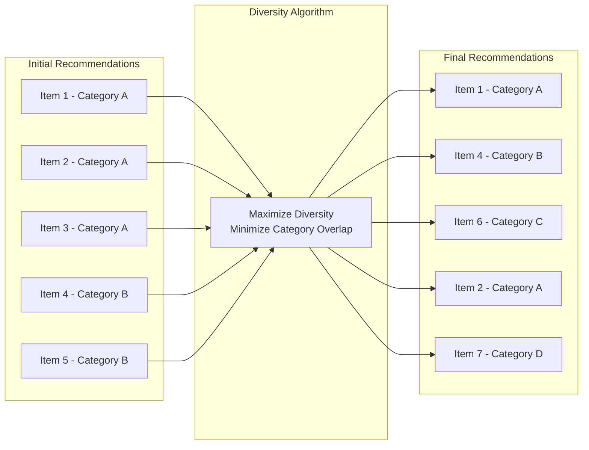
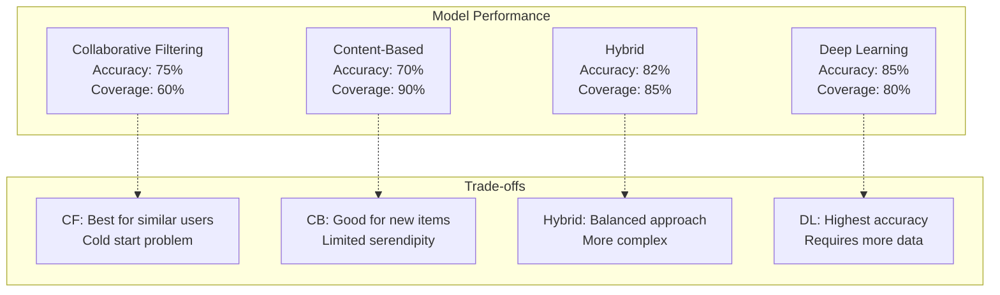

# Recommendation System: Visual Diagrams

## 1. Complete Recommendation Architecture



## 2. Collaborative Filtering Process



## 3. User-Item Interaction Matrix



## 4. Content-Based Filtering



## 5. Hybrid Recommendation Approach



## 6. Cold Start Problem Solutions



## 7. Real-time vs Batch Processing



## 8. A/B Testing Framework



## 9. Recommendation Diversity



## 10. Performance Monitoring

```mermaid
graph TB
    subgraph "Online Metrics"
        CTR[Click-Through Rate<br/>Target: >5%]
        Conv[Conversion Rate<br/>Target: >2%]
        Eng[Engagement Time<br/>Target: >3 min]
    end
    
    subgraph "Offline Metrics"
        Prec[Precision@K<br/>Target: >0.7]
        Recall[Recall@K<br/>Target: >0.5]
        NDCG[NDCG@K<br/>Target: >0.8]
    end
    
    subgraph "Business Metrics"
        Rev[Revenue per User<br/>Target: +10%]
        AOV[Average Order Value<br/>Target: +15%]
        Ret[User Retention<br/>Target: +20%]
    end
    
    subgraph "Dashboard"
        Grafana[Grafana Dashboard]
    end
    
    CTR --> Grafana
    Conv --> Grafana
    Eng --> Grafana
    Prec --> Grafana
    Recall --> Grafana
    NDCG --> Grafana
    Rev --> Grafana
    AOV --> Grafana
    Ret --> Grafana
```

## Evaluation Metrics

| Metric Type | Metric | Formula | Target |
|-------------|--------|---------|--------|
| **Online** | CTR | Clicks / Impressions | \u003e 5% |
| **Online** | Conversion Rate | Purchases / Clicks | \u003e 2% |
| **Online** | Revenue Lift | (Test - Control) / Control | \u003e 10% |
| **Offline** | Precision@10 | Relevant in Top 10 / 10 | \u003e 0.7 |
| **Offline** | Recall@10 | Relevant in Top 10 / Total Relevant | \u003e 0.5 |
| **Offline** | NDCG@10 | Normalized Discounted Cumulative Gain | \u003e 0.8 |

## Model Comparison


