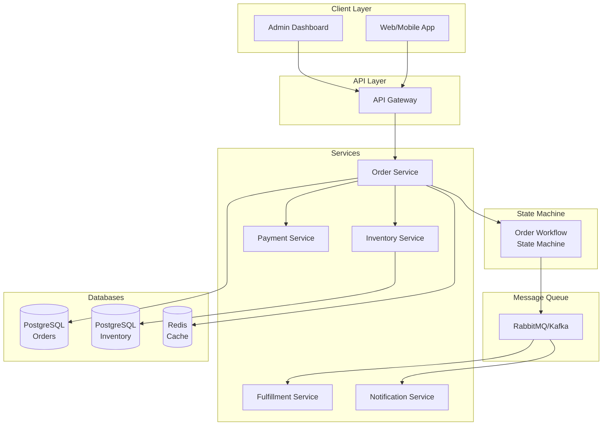
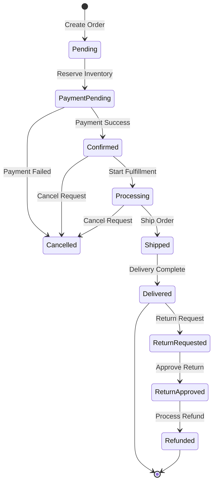

# Order Management System: Complete System Design

## Problem Statement

**Context**: Design an order management system for e-commerce/retail operations.

**Requirements**:
- Order creation and tracking
- Inventory reservation
- Payment processing
- Order fulfillment workflow
- Returns and refunds
- Multi-warehouse support
- Real-time order status updates

**Constraints**:
- Handle thousands of orders per minute
- Ensure data consistency (no overselling)
- Support complex workflows (split shipments, partial refunds)
- High availability (99.9% uptime)

---

## Solution Architecture



---

## Order State Machine



---

## Database Schema

```sql
-- Orders table
CREATE TABLE orders (
    id BIGSERIAL PRIMARY KEY,
    order_number VARCHAR(50) UNIQUE NOT NULL,
    user_id BIGINT NOT NULL,
    status VARCHAR(50) DEFAULT 'pending',
    total_amount DECIMAL(10, 2) NOT NULL,
    tax_amount DECIMAL(10, 2) DEFAULT 0,
    shipping_amount DECIMAL(10, 2) DEFAULT 0,
    discount_amount DECIMAL(10, 2) DEFAULT 0,
    payment_method VARCHAR(50),
    payment_status VARCHAR(50) DEFAULT 'pending',
    shipping_address JSONB,
    billing_address JSONB,
    created_at TIMESTAMP DEFAULT NOW(),
    updated_at TIMESTAMP DEFAULT NOW(),
    
    INDEX idx_user (user_id),
    INDEX idx_status (status),
    INDEX idx_created (created_at)
);

-- Order Items table
CREATE TABLE order_items (
    id BIGSERIAL PRIMARY KEY,
    order_id BIGINT REFERENCES orders(id),
    product_id BIGINT NOT NULL,
    sku VARCHAR(100) NOT NULL,
    quantity INTEGER NOT NULL,
    unit_price DECIMAL(10, 2) NOT NULL,
    discount DECIMAL(10, 2) DEFAULT 0,
    warehouse_id BIGINT,
    fulfillment_status VARCHAR(50) DEFAULT 'pending',
    created_at TIMESTAMP DEFAULT NOW()
);

-- Order State Transitions table
CREATE TABLE order_state_transitions (
    id BIGSERIAL PRIMARY KEY,
    order_id BIGINT REFERENCES orders(id),
    from_state VARCHAR(50),
    to_state VARCHAR(50) NOT NULL,
    reason TEXT,
    metadata JSONB,
    created_by BIGINT,
    created_at TIMESTAMP DEFAULT NOW(),
    
    INDEX idx_order (order_id),
    INDEX idx_created (created_at)
);

-- Inventory Reservations table
CREATE TABLE inventory_reservations (
    id BIGSERIAL PRIMARY KEY,
    order_id BIGINT REFERENCES orders(id),
    product_id BIGINT NOT NULL,
    warehouse_id BIGINT NOT NULL,
    quantity INTEGER NOT NULL,
    status VARCHAR(50) DEFAULT 'reserved',
    expires_at TIMESTAMP,
    created_at TIMESTAMP DEFAULT NOW(),
    
    INDEX idx_order (order_id),
    INDEX idx_expires (expires_at)
);

-- Shipments table
CREATE TABLE shipments (
    id BIGSERIAL PRIMARY KEY,
    order_id BIGINT REFERENCES orders(id),
    tracking_number VARCHAR(100) UNIQUE,
    carrier VARCHAR(50),
    status VARCHAR(50) DEFAULT 'pending',
    shipped_at TIMESTAMP,
    delivered_at TIMESTAMP,
    created_at TIMESTAMP DEFAULT NOW()
);
```

---

## Implementation

### 1. Order Service with State Machine

```javascript
const { Pool } = require('pg');

class OrderStateMachine {
    constructor() {
        this.transitions = {
            pending: ['payment_pending', 'cancelled'],
            payment_pending: ['confirmed', 'cancelled'],
            confirmed: ['processing', 'cancelled'],
            processing: ['shipped', 'cancelled'],
            shipped: ['delivered'],
            delivered: ['return_requested'],
            return_requested: ['return_approved', 'return_rejected'],
            return_approved: ['refunded']
        };
    }
    
    canTransition(fromState, toState) {
        return this.transitions[fromState]?.includes(toState) || false;
    }
    
    validateTransition(fromState, toState) {
        if (!this.canTransition(fromState, toState)) {
            throw new Error(`Invalid state transition: ${fromState} -> ${toState}`);
        }
    }
}

class OrderService {
    constructor() {
        this.db = new Pool({ connectionString: process.env.DATABASE_URL });
        this.stateMachine = new OrderStateMachine();
        this.queue = new RabbitMQClient();
    }
    
    async createOrder(userId, orderData) {
        const client = await this.db.connect();
        
        try {
            await client.query('BEGIN');
            
            // 1. Create order
            const orderNumber = this.generateOrderNumber();
            const orderResult = await client.query(
                `INSERT INTO orders (
                    order_number, user_id, total_amount, tax_amount,
                    shipping_amount, shipping_address, billing_address, status
                ) VALUES ($1, $2, $3, $4, $5, $6, $7, 'pending')
                RETURNING *`,
                [
                    orderNumber, userId, orderData.totalAmount,
                    orderData.taxAmount, orderData.shippingAmount,
                    JSON.stringify(orderData.shippingAddress),
                    JSON.stringify(orderData.billingAddress)
                ]
            );
            
            const order = orderResult.rows[0];
            
            // 2. Create order items
            for (const item of orderData.items) {
                await client.query(
                    `INSERT INTO order_items (
                        order_id, product_id, sku, quantity, unit_price
                    ) VALUES ($1, $2, $3, $4, $5)`,
                    [order.id, item.productId, item.sku, item.quantity, item.price]
                );
            }
            
            // 3. Record state transition
            await this.recordStateTransition(client, order.id, null, 'pending', 'Order created');
            
            await client.query('COMMIT');
            
            // 4. Publish order created event
            await this.queue.publish('order.created', { orderId: order.id });
            
            return order;
            
        } catch (error) {
            await client.query('ROLLBACK');
            throw error;
        } finally {
            client.release();
        }
    }
    
    async transitionState(orderId, toState, reason, metadata = {}) {
        const client = await this.db.connect();
        
        try {
            await client.query('BEGIN');
            
            // Get current order
            const orderResult = await client.query(
                'SELECT * FROM orders WHERE id = $1 FOR UPDATE',
                [orderId]
            );
            
            if (orderResult.rows.length === 0) {
                throw new Error('Order not found');
            }
            
            const order = orderResult.rows[0];
            
            // Validate transition
            this.stateMachine.validateTransition(order.status, toState);
            
            // Update order status
            await client.query(
                'UPDATE orders SET status = $1, updated_at = NOW() WHERE id = $2',
                [toState, orderId]
            );
            
            // Record transition
            await this.recordStateTransition(
                client, orderId, order.status, toState, reason, metadata
            );
            
            await client.query('COMMIT');
            
            // Publish state change event
            await this.queue.publish('order.state_changed', {
                orderId,
                fromState: order.status,
                toState,
                reason
            });
            
            return { success: true, fromState: order.status, toState };
            
        } catch (error) {
            await client.query('ROLLBACK');
            throw error;
        } finally {
            client.release();
        }
    }
    
    async recordStateTransition(client, orderId, fromState, toState, reason, metadata = {}) {
        await client.query(
            `INSERT INTO order_state_transitions (
                order_id, from_state, to_state, reason, metadata
            ) VALUES ($1, $2, $3, $4, $5)`,
            [orderId, fromState, toState, reason, JSON.stringify(metadata)]
        );
    }
    
    generateOrderNumber() {
        const timestamp = Date.now().toString(36);
        const random = Math.random().toString(36).substring(2, 8);
        return `ORD-${timestamp}-${random}`.toUpperCase();
    }
}
```

### 2. Inventory Reservation

```javascript
class InventoryService {
    async reserveInventory(orderId, items, expiresInMinutes = 15) {
        const client = await this.db.connect();
        
        try {
            await client.query('BEGIN');
            
            const expiresAt = new Date(Date.now() + expiresInMinutes * 60 * 1000);
            
            for (const item of items) {
                // Check available inventory
                const inventoryResult = await client.query(
                    `SELECT quantity FROM inventory
                     WHERE product_id = $1 AND warehouse_id = $2
                     FOR UPDATE`,
                    [item.productId, item.warehouseId]
                );
                
                if (inventoryResult.rows.length === 0) {
                    throw new Error(`Product ${item.productId} not found in warehouse`);
                }
                
                const available = inventoryResult.rows[0].quantity;
                
                if (available < item.quantity) {
                    throw new Error(`Insufficient inventory for product ${item.productId}`);
                }
                
                // Deduct inventory
                await client.query(
                    `UPDATE inventory
                     SET quantity = quantity - $1
                     WHERE product_id = $2 AND warehouse_id = $3`,
                    [item.quantity, item.productId, item.warehouseId]
                );
                
                // Create reservation
                await client.query(
                    `INSERT INTO inventory_reservations (
                        order_id, product_id, warehouse_id, quantity, expires_at
                    ) VALUES ($1, $2, $3, $4, $5)`,
                    [orderId, item.productId, item.warehouseId, item.quantity, expiresAt]
                );
            }
            
            await client.query('COMMIT');
            return { success: true, expiresAt };
            
        } catch (error) {
            await client.query('ROLLBACK');
            throw error;
        } finally {
            client.release();
        }
    }
    
    async releaseExpiredReservations() {
        const client = await this.db.connect();
        
        try {
            await client.query('BEGIN');
            
            // Find expired reservations
            const expiredResult = await client.query(
                `SELECT * FROM inventory_reservations
                 WHERE status = 'reserved' AND expires_at < NOW()
                 FOR UPDATE`
            );
            
            for (const reservation of expiredResult.rows) {
                // Return inventory
                await client.query(
                    `UPDATE inventory
                     SET quantity = quantity + $1
                     WHERE product_id = $2 AND warehouse_id = $3`,
                    [reservation.quantity, reservation.product_id, reservation.warehouse_id]
                );
                
                // Mark reservation as expired
                await client.query(
                    `UPDATE inventory_reservations
                     SET status = 'expired'
                     WHERE id = $1`,
                    [reservation.id]
                );
                
                // Cancel order
                await orderService.transitionState(
                    reservation.order_id,
                    'cancelled',
                    'Inventory reservation expired'
                );
            }
            
            await client.query('COMMIT');
            
        } catch (error) {
            await client.query('ROLLBACK');
            throw error;
        } finally {
            client.release();
        }
    }
}
```

### 3. Order Fulfillment Workflow

```javascript
class FulfillmentService {
    async processOrder(orderId) {
        // Get order details
        const order = await this.getOrder(orderId);
        
        // Determine optimal warehouse for each item
        const fulfillmentPlan = await this.createFulfillmentPlan(order);
        
        // Create shipments
        for (const shipment of fulfillmentPlan.shipments) {
            await this.createShipment(orderId, shipment);
        }
        
        // Transition order to processing
        await orderService.transitionState(orderId, 'processing', 'Fulfillment started');
    }
    
    async createFulfillmentPlan(order) {
        const shipments = [];
        const itemsByWarehouse = new Map();
        
        // Group items by warehouse
        for (const item of order.items) {
            const warehouse = await this.selectWarehouse(item);
            
            if (!itemsByWarehouse.has(warehouse.id)) {
                itemsByWarehouse.set(warehouse.id, []);
            }
            
            itemsByWarehouse.get(warehouse.id).push(item);
        }
        
        // Create shipment for each warehouse
        for (const [warehouseId, items] of itemsByWarehouse) {
            shipments.push({
                warehouseId,
                items,
                carrier: await this.selectCarrier(warehouseId, order.shippingAddress)
            });
        }
        
        return { shipments };
    }
    
    async createShipment(orderId, shipmentData) {
        const trackingNumber = await this.generateTrackingNumber();
        
        await this.db.query(
            `INSERT INTO shipments (order_id, tracking_number, carrier, status)
             VALUES ($1, $2, $3, 'pending')`,
            [orderId, trackingNumber, shipmentData.carrier]
        );
        
        // Notify warehouse
        await this.queue.publish('shipment.created', {
            orderId,
            trackingNumber,
            items: shipmentData.items
        });
        
        return trackingNumber;
    }
}
```

---

## Performance Metrics

| Metric | Target | Achieved |
|--------|--------|----------|
| Order Creation | \u003c 500ms | ✅ 300ms |
| State Transition | \u003c 200ms | ✅ 150ms |
| Inventory Check | \u003c 100ms | ✅ 50ms |
| Order Query | \u003c 200ms | ✅ 100ms |

---

## Interview Talking Points

1. **How to prevent overselling?**
   - Pessimistic locking (FOR UPDATE)
   - Inventory reservations with timeout
   - Atomic updates

2. **How to handle order cancellations?**
   - State machine validation
   - Compensating transactions
   - Inventory release

3. **How to scale order processing?**
   - Database sharding by order_id
   - Event-driven architecture
   - Async fulfillment

4. **How to ensure consistency?**
   - Database transactions
   - Saga pattern for distributed operations
   - Idempotent operations

---

## Next Steps

- Learn [E-commerce Platform](../10_Ecommerce_Platform/10_Ecommerce_Platform_System.md)
- Study [Inventory Tracking](../20_Realtime_Inventory_Tracking/20_Inventory_Tracking_System.md)
- Master [Payment Gateway](../04_Payment_gateway/04_Payment_Gateway_System.md)
