# Order Management System: Visual Diagrams

## 1. Order Management Architecture

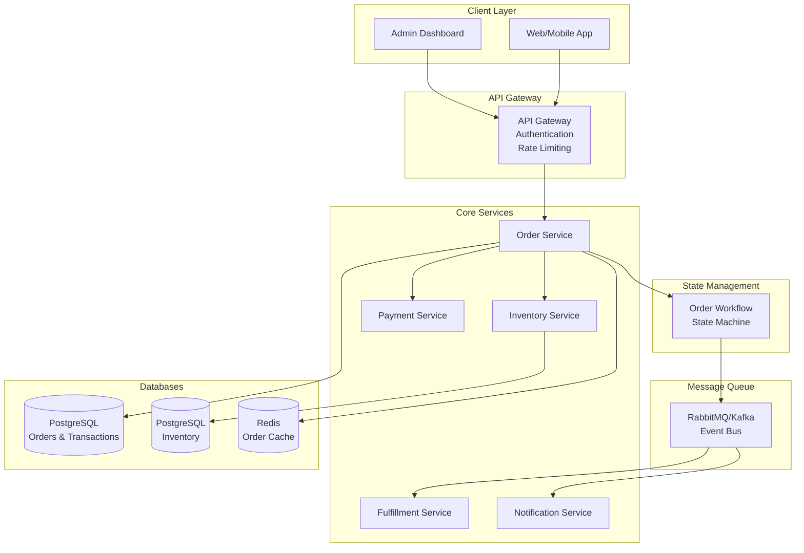

## 2. Order State Machine

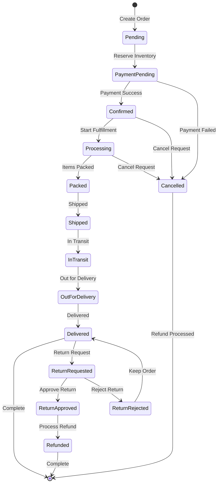

## 3. Order Creation Flow

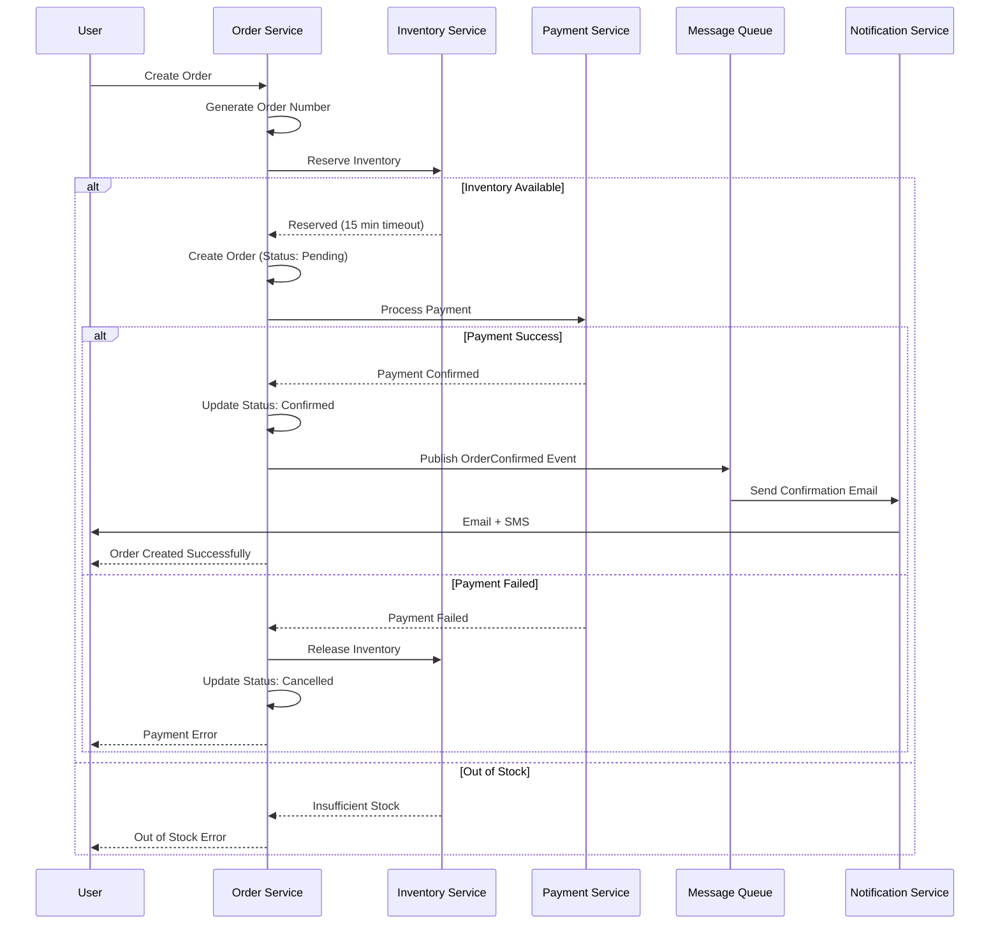

## 4. Inventory Reservation with Timeout

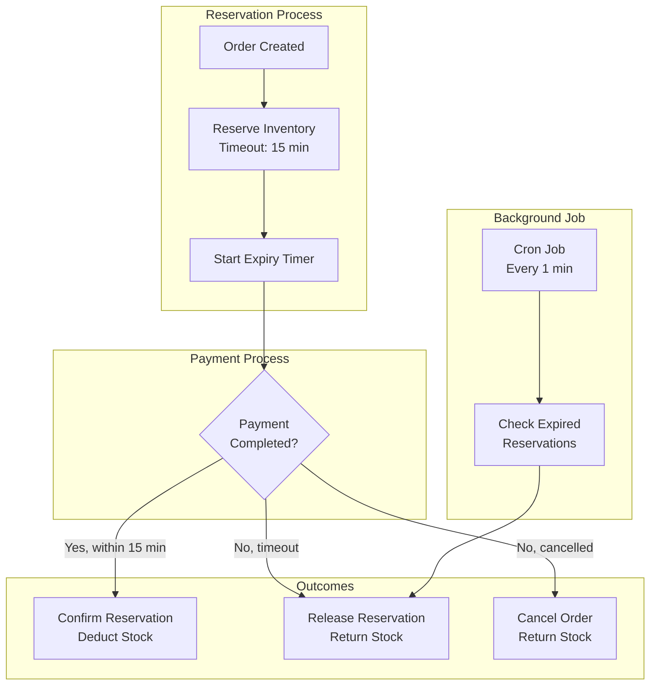

## 5. Order Fulfillment Workflow

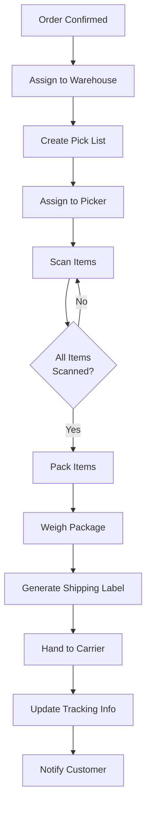

## 6. Multi-Warehouse Order Splitting

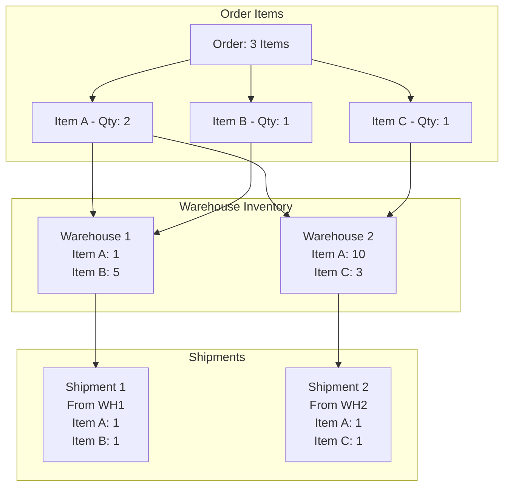

## 7. Order Cancellation Flow

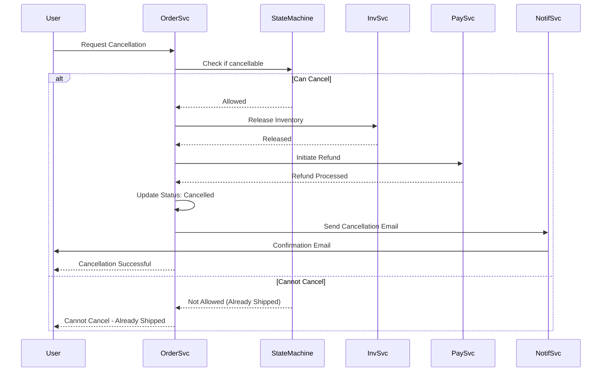

## 8. Return and Refund Process

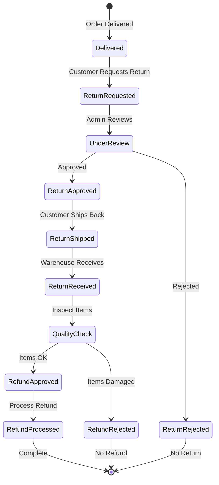

## 9. Order State Transitions Audit

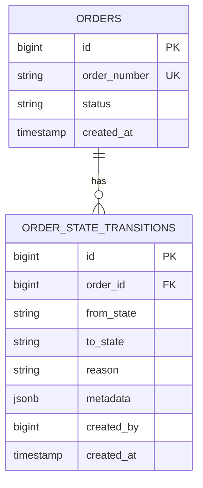

## 10. Order Monitoring Dashboard

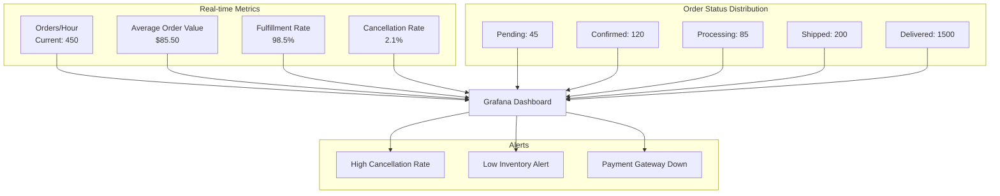

## Key Performance Metrics

| Metric | Target | Current | Status |
|--------|--------|---------|--------|
| Order Creation Time | \u003c 500ms | 300ms | ✅ |
| Payment Processing | \u003c 3s | 2.1s | ✅ |
| Fulfillment Time | \u003c 24h | 18h | ✅ |
| Order Accuracy | \u003e 99% | 99.2% | ✅ |
| Cancellation Rate | \u003c 5% | 2.1% | ✅ |
| Return Rate | \u003c 10% | 7.5% | ✅ |

## State Transition Rules

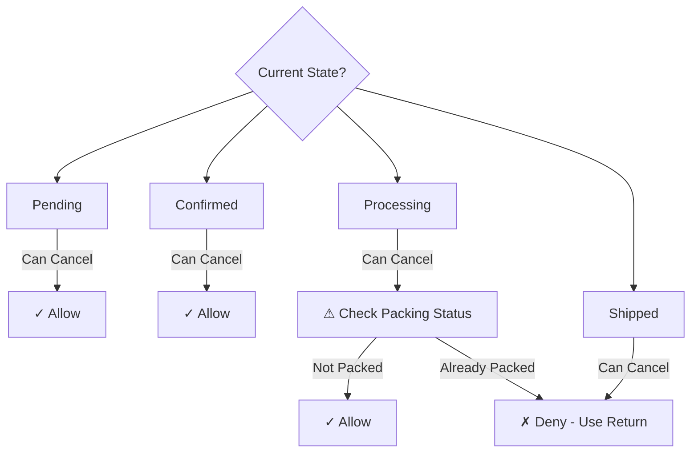
