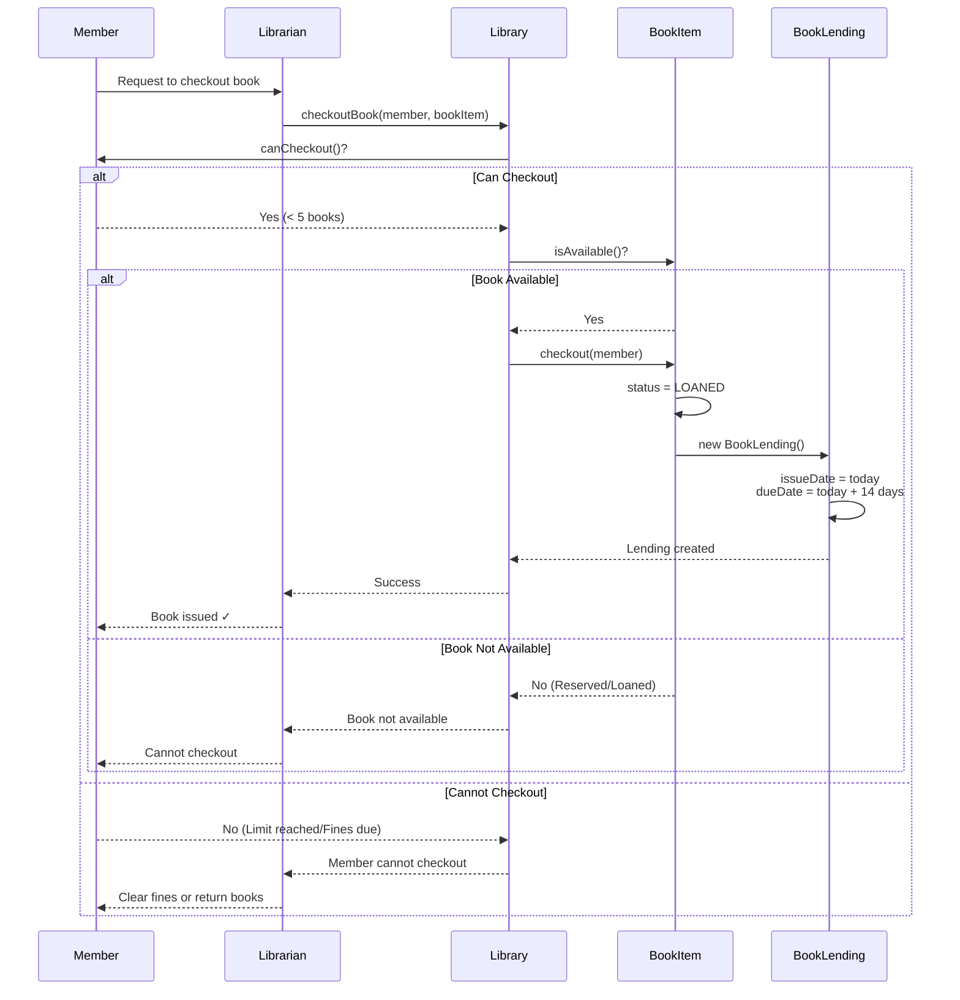
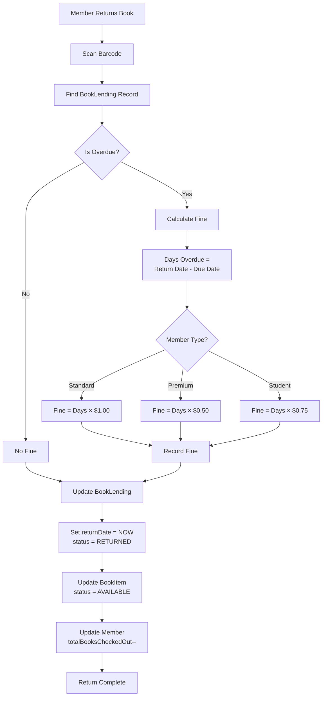
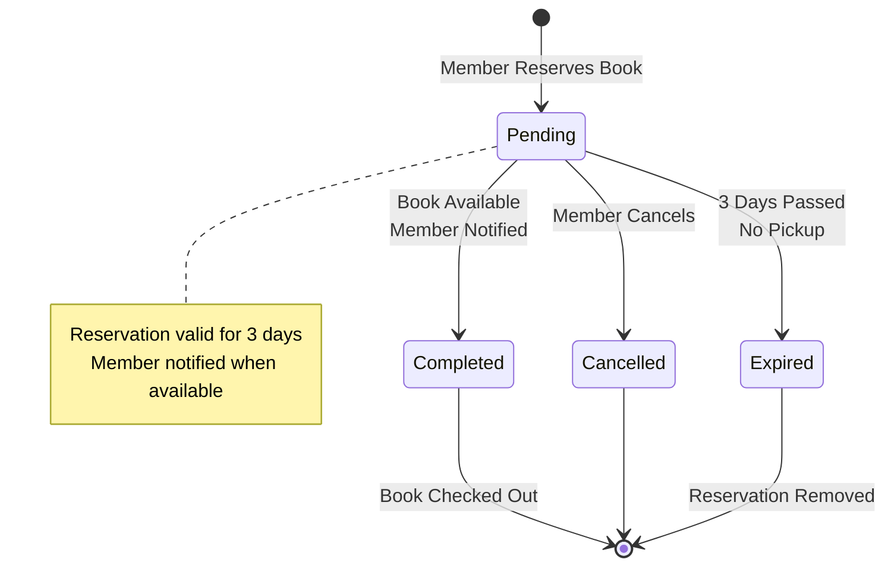
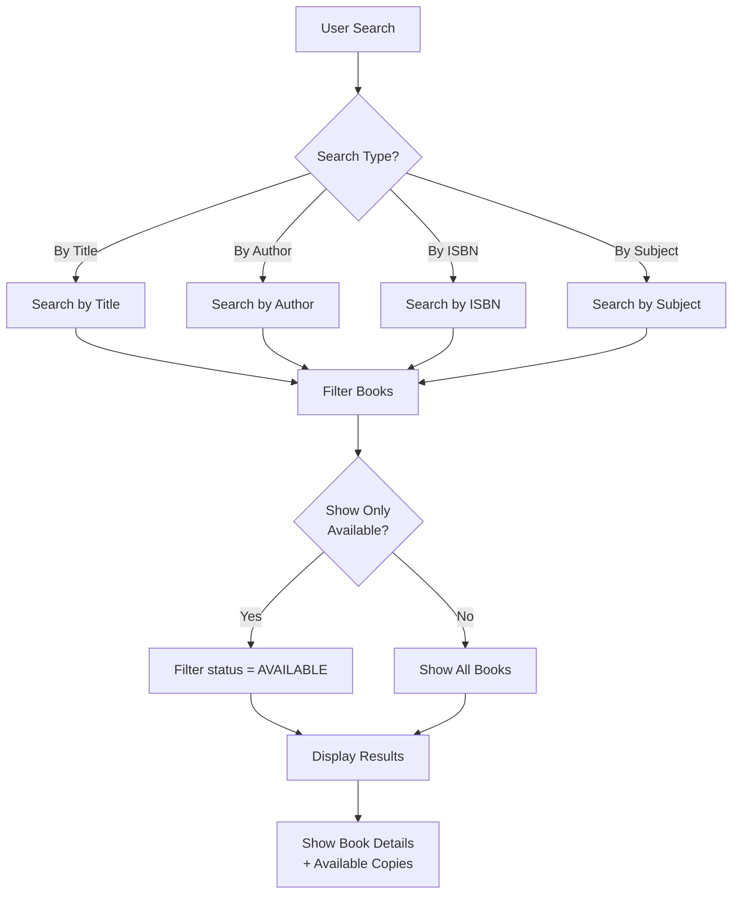
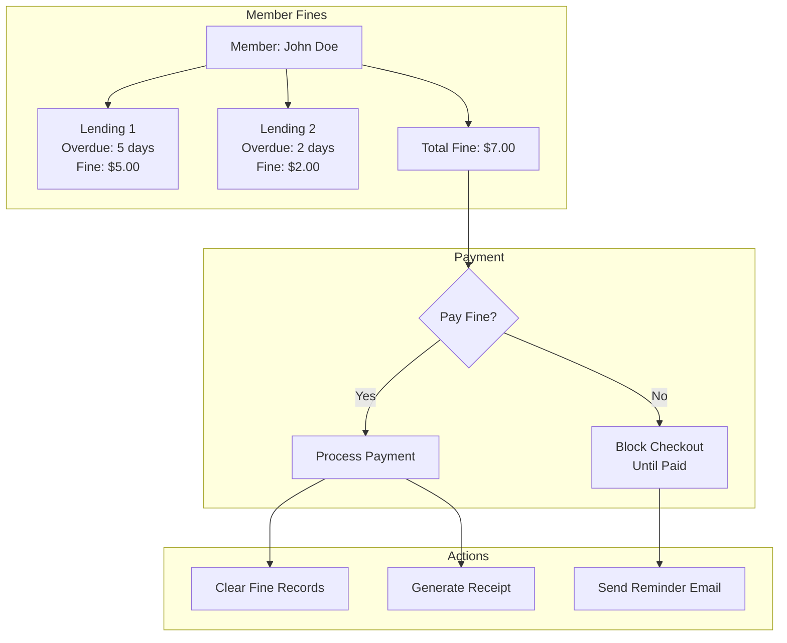
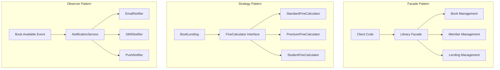
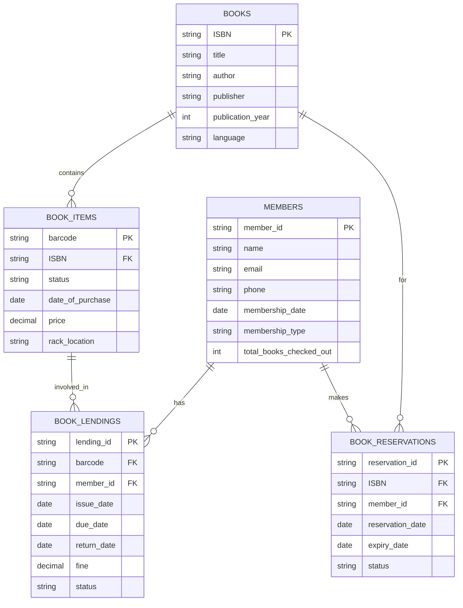
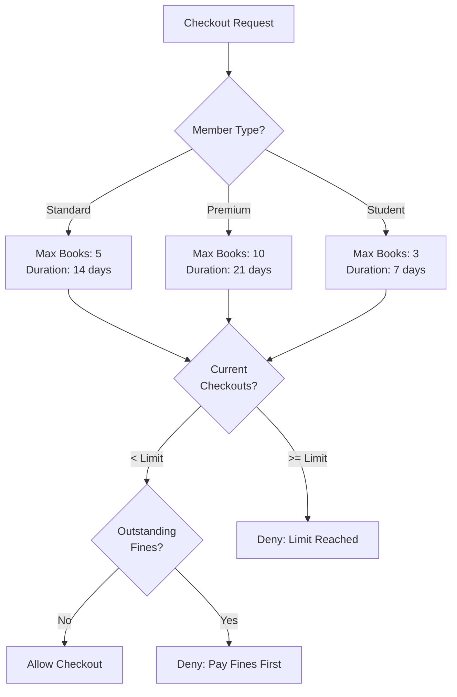

# Library Management System (LLD): Visual Diagrams

## 1. Class Diagram - Complete System

```mermaid
classDiagram
    class Library {
        -String name
        -Address address
        -List~BookItem~ books
        -List~Member~ members
        -List~Librarian~ librarians
        +addBook(Book book)
        +removeBook(String ISBN)
        +searchByTitle(String title)
        +searchByAuthor(String author)
        +searchByISBN(String ISBN)
        +registerMember(Member member)
        +checkoutBook(Member member, BookItem item)
        +returnBook(Member member, BookItem item)
    }
    
    class Book {
        -String ISBN
        -String title
        -String author
        -String publisher
        -int publicationYear
        -List~String~ subjects
        -String language
        -List~BookItem~ items
        +addItem(BookItem item)
        +getAvailableItems()
    }
    
    class BookItem {
        -String barcode
        -Book book
        -BookStatus status
        -Date dateOfPurchase
        -double price
        -String rackLocation
        +checkout(Member member)
        +returnBook()
        +reserve(Member member)
        +isAvailable()
    }
    
    class Member {
        -String memberId
        -String name
        -String email
        -String phone
        -Date membershipDate
        -MembershipType type
        -int totalBooksCheckedOut
        -List~BookLending~ bookLendings
        -List~BookReservation~ reservations
        +checkoutBook(BookItem item)
        +returnBook(BookItem item)
        +reserveBook(Book book)
        +getTotalFine()
        +canCheckout()
    }
    
    class BookLending {
        -String lendingId
        -BookItem bookItem
        -Member member
        -Date issueDate
        -Date dueDate
        -Date returnDate
        -double fine
        -LendingStatus status
        +calculateFine()
        +isOverdue()
        +returnBook()
    }
    
    class BookReservation {
        -String reservationId
        -Book book
        -Member member
        -Date reservationDate
        -Date expiryDate
        -ReservationStatus status
        +cancel()
        +complete()
        +isExpired()
    }
    
    class Librarian {
        -String employeeId
        -String name
        -String email
        +addBookItem(BookItem item)
        +blockMember(Member member)
        +unblockMember(Member member)
        +issueBook(Member member, BookItem item)
        +returnBook(BookItem item)
    }
    
    class FineCalculator {
        <<interface>>
        +calculateFine(int daysOverdue) double
    }
    
    class StandardFineCalculator {
        -double finePerDay
        +calculateFine(int daysOverdue) double
    }
    
    class PremiumFineCalculator {
        -double finePerDay
        +calculateFine(int daysOverdue) double
    }
    
    Library "1" *-- "many" Book
    Library "1" *-- "many" Member
    Library "1" *-- "many" Librarian
    Book "1" *-- "many" BookItem
    Member "1" *-- "many" BookLending
    Member "1" *-- "many" BookReservation
    BookLending "1" --> "1" BookItem
    BookLending "1" --> "1" Member
    BookReservation "1" --> "1" Book
    BookReservation "1" --> "1" Member
    FineCalculator <|.. StandardFineCalculator
    FineCalculator <|.. PremiumFineCalculator
    BookLending --> FineCalculator
    
    <<enumeration>> BookStatus
    BookStatus : AVAILABLE
    BookStatus : RESERVED
    BookStatus : LOANED
    BookStatus : LOST
    
    <<enumeration>> ReservationStatus
    ReservationStatus : PENDING
    ReservationStatus : COMPLETED
    ReservationStatus : CANCELLED
    
    <<enumeration>> MembershipType
    MembershipType : STANDARD
    MembershipType : PREMIUM
    MembershipType : STUDENT
```

## 2. Book Checkout Flow



## 3. Book Return and Fine Calculation



## 4. Book Reservation System



## 5. Search Functionality



## 6. Fine Management



## 7. Design Patterns Implementation



## 8. Database Schema



## 9. Member Checkout Limits



## 10. System Monitoring

```mermaid
graph TB
    subgraph "Library Metrics"
        M1[Total Books: 10,000]
        M2[Available: 7,500]
        M3[Loaned: 2,200]
        M4[Reserved: 300]
    end
    
    subgraph "Member Metrics"
        M5[Active Members: 1,500]
        M6[Books Checked Out: 2,200]
        M7[Overdue Books: 85]
        M8[Total Fines: $425]
    end
    
    subgraph "Daily Activity"
        A1[Checkouts Today: 45]
        A2[Returns Today: 38]
        A3[New Members: 5]
        A4[Reservations: 12]
    end
    
    subgraph "Dashboard"
        Dashboard[Admin Dashboard]
    end
    
    M1 --> Dashboard
    M2 --> Dashboard
    M3 --> Dashboard
    M4 --> Dashboard
    M5 --> Dashboard
    M6 --> Dashboard
    M7 --> Dashboard
    M8 --> Dashboard
    A1 --> Dashboard
    A2 --> Dashboard
    A3 --> Dashboard
    A4 --> Dashboard
```

## SOLID Principles Applied

| Principle | Implementation |
|-----------|----------------|
| **Single Responsibility** | Each class has one responsibility (Book, Member, Lending) |
| **Open/Closed** | FineCalculator interface allows new strategies without modifying existing code |
| **Liskov Substitution** | All FineCalculator implementations are interchangeable |
| **Interface Segregation** | Separate interfaces for different user types (Member, Librarian) |
| **Dependency Inversion** | Depend on FineCalculator interface, not concrete implementations |
