# Parking Lot Reservation System: Visual Diagrams

## 1. Complete System Architecture


## 2. Reservation Flow with Concurrency Control


## 3. Parking Spot State Machine


## 4. Dynamic Pricing Model

```mermaid
graph TB
    subgraph "Pricing Factors"
        Base[Base Rate<br/>$5/hour]
        Time[Time of Day<br/>Peak/Off-peak]
        Demand[Current Demand<br/>Occupancy %]
        Event[Special Events<br/>Concerts, Games]
        Duration[Duration<br/>Hourly/Daily]
    end
    
    subgraph "Calculation"
        Formula[Final Price =<br/>Base × Time Multiplier<br/>× Demand Multiplier<br/>× Event Multiplier]
    end
    
    subgraph "Examples"
        Ex1[Weekday 2 PM<br/>50% Occupancy<br/>$5/hour]
        Ex2[Friday 7 PM<br/>90% Occupancy<br/>Concert Nearby<br/>$15/hour]
        Ex3[Sunday 10 AM<br/>30% Occupancy<br/>$4/hour]
    end
    
    Base --> Formula
    Time --> Formula
    Demand --> Formula
    Event --> Formula
    Duration --> Formula
    
    Formula --> Ex1
    Formula --> Ex2
    Formula --> Ex3
```



## 5. Entry Process Flow

```mermaid
flowchart TD
    Start[Vehicle Arrives] --> Scan{Scan Method?}
    
    Scan -->|QR Code| QR[Scan QR Code<br/>from App]
    Scan -->|License Plate| LPR[Camera OCR<br/>Read Plate]
    Scan -->|Manual| Manual[Enter Code<br/>at Kiosk]
    
    QR --> Validate{Valid<br/>Reservation?}
    LPR --> Validate
    Manual --> Validate
    
    Validate -->|Yes| CheckTime{Within<br/>Time Window?}
    Validate -->|No| Error1[Show Error<br/>Invalid Reservation]
    
    CheckTime -->|Yes| UpdateDB[Update DB<br/>Status: ACTIVE<br/>Entry Time: NOW]
    CheckTime -->|No| Error2[Show Error<br/>Too Early/Late]
    
    UpdateDB --> OpenGate[Open Barrier Gate]
    OpenGate --> Assign[Display Spot Number<br/>"Proceed to Spot #45"]
    Assign --> Close[Close Gate<br/>After Vehicle Passes]
    
    Error1 --> End[Deny Entry]
    Error2 --> End
```

## 6. Exit and Payment Flow


## 7. Real-time Availability Dashboard

```mermaid
graph TB
    subgraph "Parking Lot Overview"
        Total[Total Spots: 500]
        Available[Available: 125]
        Occupied[Occupied: 320]
        Reserved[Reserved: 45]
        Maintenance[Maintenance: 10]
    end
    
    subgraph "By Floor"
        F1[Floor 1<br/>Available: 30/150]
        F2[Floor 2<br/>Available: 45/150]
        F3[Floor 3<br/>Available: 50/200]
    end
    
    subgraph "By Type"
        Regular[Regular: 100/400]
        Compact[Compact: 15/60]
        Handicapped[Handicapped: 8/20]
        EV[EV Charging: 2/20]
    end
    
    subgraph "Occupancy Rate"
        Rate[75% Occupied<br/>🟡 Moderate Demand]
    end
    
    Total --> Available
    Total --> Occupied
    Total --> Reserved
    Total --> Maintenance
    
    Available --> F1
    Available --> F2
    Available --> F3
    
    Available --> Regular
    Available --> Compact
    Available --> Handicapped
    Available --> EV
```



## 8. IoT Sensor Integration


## 9. No-Show Handling


## 10. Multi-Location Search


## Performance Metrics

| Metric | Target | Current | Status |
|--------|--------|---------|--------|
| Reservation Creation | \u003c 500ms | 300ms | ✅ |
| Availability Query | \u003c 200ms | 100ms | ✅ |
| Entry Processing | \u003c 2s | 1.2s | ✅ |
| Exit Processing | \u003c 3s | 2.1s | ✅ |
| Sensor Update Latency | \u003c 1s | 500ms | ✅ |
| System Uptime | \u003e 99.9% | 99.95% | ✅ |

## Concurrency Handling


