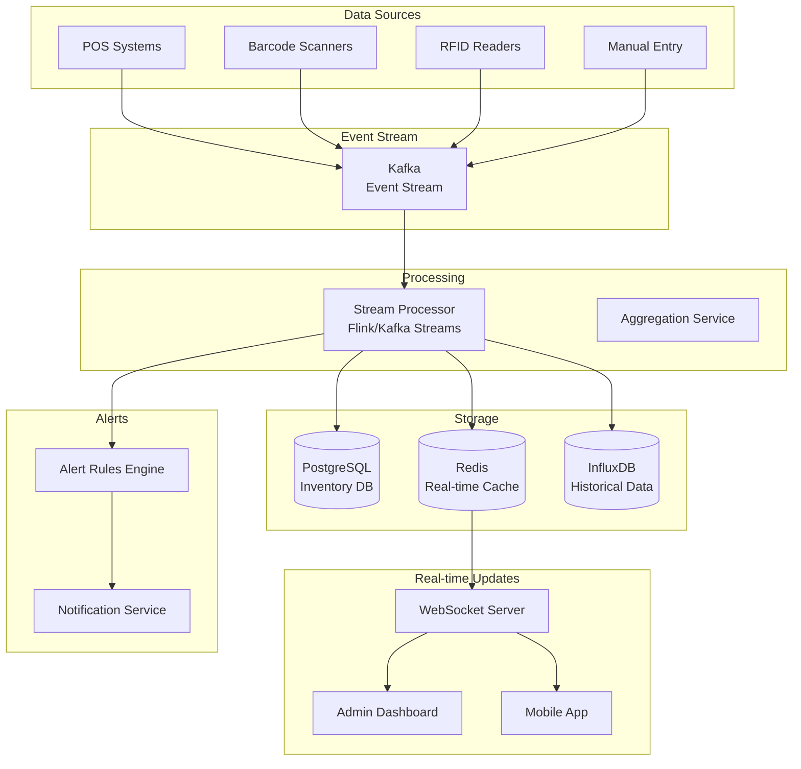

# Real-time Inventory Tracking System: Complete System Design

## Problem Statement

**Context**: Design a real-time inventory tracking system for warehouses/retail.

**Requirements**:
- Real-time stock level updates
- Multi-warehouse inventory tracking
- Low stock alerts
- Automatic reordering
- Barcode/RFID integration
- Inventory reconciliation
- Real-time dashboard updates

**Constraints**:
- Handle thousands of updates per second
- Sub-second latency for updates
- Eventual consistency acceptable
- Support millions of SKUs

---

## Solution Architecture



---

## Database Schema

```sql
-- Warehouses table
CREATE TABLE warehouses (
    id BIGSERIAL PRIMARY KEY,
    name VARCHAR(255) NOT NULL,
    location VARCHAR(255),
    type VARCHAR(50),
    is_active BOOLEAN DEFAULT true,
    created_at TIMESTAMP DEFAULT NOW()
);

-- Products table
CREATE TABLE products (
    id BIGSERIAL PRIMARY KEY,
    sku VARCHAR(100) UNIQUE NOT NULL,
    name VARCHAR(255) NOT NULL,
    category VARCHAR(100),
    unit_cost DECIMAL(10, 2),
    reorder_point INTEGER DEFAULT 10,
    reorder_quantity INTEGER DEFAULT 100,
    created_at TIMESTAMP DEFAULT NOW()
);

-- Inventory table (current stock levels)
CREATE TABLE inventory (
    id BIGSERIAL PRIMARY KEY,
    product_id BIGINT REFERENCES products(id),
    warehouse_id BIGINT REFERENCES warehouses(id),
    quantity INTEGER DEFAULT 0,
    reserved_quantity INTEGER DEFAULT 0,
    available_quantity INTEGER GENERATED ALWAYS AS (quantity - reserved_quantity) STORED,
    last_updated TIMESTAMP DEFAULT NOW(),
    version INTEGER DEFAULT 0,  -- Optimistic locking
    
    UNIQUE(product_id, warehouse_id),
    INDEX idx_product (product_id),
    INDEX idx_warehouse (warehouse_id),
    INDEX idx_available (available_quantity)
);

-- Inventory transactions (audit log)
CREATE TABLE inventory_transactions (
    id BIGSERIAL PRIMARY KEY,
    product_id BIGINT REFERENCES products(id),
    warehouse_id BIGINT REFERENCES warehouses(id),
    transaction_type VARCHAR(50),  -- RECEIVE, SHIP, ADJUST, TRANSFER
    quantity_change INTEGER NOT NULL,
    quantity_before INTEGER,
    quantity_after INTEGER,
    reference_id VARCHAR(100),  -- Order ID, PO ID, etc.
    reason TEXT,
    created_by BIGINT,
    created_at TIMESTAMP DEFAULT NOW(),
    
    INDEX idx_product (product_id),
    INDEX idx_warehouse (warehouse_id),
    INDEX idx_created (created_at),
    INDEX idx_type (transaction_type)
);

-- Stock alerts table
CREATE TABLE stock_alerts (
    id BIGSERIAL PRIMARY KEY,
    product_id BIGINT REFERENCES products(id),
    warehouse_id BIGINT REFERENCES warehouses(id),
    alert_type VARCHAR(50),  -- LOW_STOCK, OUT_OF_STOCK, OVERSTOCK
    threshold INTEGER,
    current_quantity INTEGER,
    status VARCHAR(50) DEFAULT 'active',
    resolved_at TIMESTAMP,
    created_at TIMESTAMP DEFAULT NOW()
);
```

---

## Implementation

### 1. Event-Driven Inventory Updates

```javascript
const { Kafka } = require('kafkajs');
const Redis = require('ioredis');
const { Pool } = require('pg');

class InventoryEventProducer {
    constructor() {
        this.kafka = new Kafka({
            clientId: 'inventory-producer',
            brokers: ['kafka1:9092', 'kafka2:9092']
        });
        this.producer = this.kafka.producer();
    }
    
    async publishInventoryEvent(event) {
        await this.producer.send({
            topic: 'inventory-events',
            messages: [{
                key: `${event.productId}-${event.warehouseId}`,
                value: JSON.stringify({
                    ...event,
                    timestamp: Date.now()
                })
            }]
        });
    }
    
    async recordStockChange(productId, warehouseId, quantityChange, type, reference) {
        await this.publishInventoryEvent({
            eventType: 'STOCK_CHANGE',
            productId,
            warehouseId,
            quantityChange,
            transactionType: type,
            referenceId: reference
        });
    }
}

class InventoryEventConsumer {
    constructor() {
        this.kafka = new Kafka({
            clientId: 'inventory-consumer',
            brokers: ['kafka1:9092', 'kafka2:9092']
        });
        this.consumer = this.kafka.consumer({ groupId: 'inventory-processor' });
        this.db = new Pool({ connectionString: process.env.DATABASE_URL });
        this.redis = new Redis(process.env.REDIS_URL);
    }
    
    async start() {
        await this.consumer.connect();
        await this.consumer.subscribe({ topic: 'inventory-events' });
        
        await this.consumer.run({
            eachMessage: async ({ message }) => {
                const event = JSON.parse(message.value.toString());
                await this.processEvent(event);
            }
        });
    }
    
    async processEvent(event) {
        const client = await this.db.connect();
        
        try {
            await client.query('BEGIN');
            
            // Get current inventory with lock
            const inventoryResult = await client.query(
                `SELECT * FROM inventory
                 WHERE product_id = $1 AND warehouse_id = $2
                 FOR UPDATE`,
                [event.productId, event.warehouseId]
            );
            
            let inventory;
            if (inventoryResult.rows.length === 0) {
                // Create new inventory record
                const createResult = await client.query(
                    `INSERT INTO inventory (product_id, warehouse_id, quantity)
                     VALUES ($1, $2, 0)
                     RETURNING *`,
                    [event.productId, event.warehouseId]
                );
                inventory = createResult.rows[0];
            } else {
                inventory = inventoryResult.rows[0];
            }
            
            const quantityBefore = inventory.quantity;
            const quantityAfter = quantityBefore + event.quantityChange;
            
            // Update inventory
            await client.query(
                `UPDATE inventory
                 SET quantity = $1, last_updated = NOW(), version = version + 1
                 WHERE product_id = $2 AND warehouse_id = $3`,
                [quantityAfter, event.productId, event.warehouseId]
            );
            
            // Record transaction
            await client.query(
                `INSERT INTO inventory_transactions (
                    product_id, warehouse_id, transaction_type,
                    quantity_change, quantity_before, quantity_after,
                    reference_id, reason
                ) VALUES ($1, $2, $3, $4, $5, $6, $7, $8)`,
                [
                    event.productId, event.warehouseId, event.transactionType,
                    event.quantityChange, quantityBefore, quantityAfter,
                    event.referenceId, event.reason
                ]
            );
            
            await client.query('COMMIT');
            
            // Update Redis cache
            await this.updateCache(event.productId, event.warehouseId, quantityAfter);
            
            // Broadcast to WebSocket clients
            await this.broadcastUpdate(event.productId, event.warehouseId, quantityAfter);
            
            // Check for alerts
            await this.checkAlerts(event.productId, event.warehouseId, quantityAfter);
            
        } catch (error) {
            await client.query('ROLLBACK');
            console.error('Error processing inventory event:', error);
            throw error;
        } finally {
            client.release();
        }
    }
    
    async updateCache(productId, warehouseId, quantity) {
        const key = `inventory:${productId}:${warehouseId}`;
        await this.redis.set(key, quantity);
        await this.redis.expire(key, 3600); // 1 hour TTL
    }
    
    async broadcastUpdate(productId, warehouseId, quantity) {
        // Publish to WebSocket server
        await this.redis.publish('inventory-updates', JSON.stringify({
            productId,
            warehouseId,
            quantity,
            timestamp: Date.now()
        }));
    }
    
    async checkAlerts(productId, warehouseId, quantity) {
        // Get product reorder point
        const productResult = await this.db.query(
            'SELECT reorder_point, reorder_quantity FROM products WHERE id = $1',
            [productId]
        );
        
        if (productResult.rows.length === 0) return;
        
        const product = productResult.rows[0];
        
        // Check for low stock
        if (quantity <= product.reorder_point) {
            await this.createAlert(productId, warehouseId, 'LOW_STOCK', quantity);
            
            // Trigger automatic reorder
            await this.triggerReorder(productId, warehouseId, product.reorder_quantity);
        }
        
        // Check for out of stock
        if (quantity === 0) {
            await this.createAlert(productId, warehouseId, 'OUT_OF_STOCK', quantity);
        }
    }
    
    async createAlert(productId, warehouseId, alertType, quantity) {
        await this.db.query(
            `INSERT INTO stock_alerts (
                product_id, warehouse_id, alert_type, current_quantity
            ) VALUES ($1, $2, $3, $4)`,
            [productId, warehouseId, alertType, quantity]
        );
        
        // Send notification
        await this.sendNotification({
            type: alertType,
            productId,
            warehouseId,
            quantity
        });
    }
}
```

### 2. Real-time WebSocket Server

```javascript
const WebSocket = require('ws');
const http = require('http');

class InventoryWebSocketServer {
    constructor() {
        this.server = http.createServer();
        this.wss = new WebSocket.Server({ server: this.server });
        this.redis = new Redis(process.env.REDIS_URL);
        this.subscriber = new Redis(process.env.REDIS_URL);
        
        this.clients = new Map(); // warehouseId -> Set of WebSocket clients
    }
    
    async start(port = 8080) {
        // Subscribe to inventory updates
        await this.subscriber.subscribe('inventory-updates');
        
        this.subscriber.on('message', (channel, message) => {
            if (channel === 'inventory-updates') {
                const update = JSON.parse(message);
                this.broadcastToWarehouse(update.warehouseId, update);
            }
        });
        
        // Handle WebSocket connections
        this.wss.on('connection', (ws, req) => {
            this.handleConnection(ws, req);
        });
        
        this.server.listen(port, () => {
            console.log(`WebSocket server running on port ${port}`);
        });
    }
    
    handleConnection(ws, req) {
        // Extract warehouse ID from query params
        const url = new URL(req.url, 'http://localhost');
        const warehouseId = url.searchParams.get('warehouseId');
        
        if (!warehouseId) {
            ws.close(1008, 'Warehouse ID required');
            return;
        }
        
        // Add client to warehouse group
        if (!this.clients.has(warehouseId)) {
            this.clients.set(warehouseId, new Set());
        }
        this.clients.get(warehouseId).add(ws);
        
        console.log(`Client connected to warehouse ${warehouseId}`);
        
        // Send initial inventory snapshot
        this.sendInventorySnapshot(ws, warehouseId);
        
        // Handle disconnection
        ws.on('close', () => {
            this.clients.get(warehouseId)?.delete(ws);
            console.log(`Client disconnected from warehouse ${warehouseId}`);
        });
        
        // Handle messages
        ws.on('message', (message) => {
            this.handleMessage(ws, warehouseId, message);
        });
    }
    
    async sendInventorySnapshot(ws, warehouseId) {
        const inventory = await this.db.query(
            `SELECT i.*, p.sku, p.name
             FROM inventory i
             JOIN products p ON i.product_id = p.id
             WHERE i.warehouse_id = $1`,
            [warehouseId]
        );
        
        ws.send(JSON.stringify({
            type: 'SNAPSHOT',
            data: inventory.rows
        }));
    }
    
    broadcastToWarehouse(warehouseId, update) {
        const clients = this.clients.get(warehouseId);
        if (!clients) return;
        
        const message = JSON.stringify({
            type: 'UPDATE',
            data: update
        });
        
        for (const client of clients) {
            if (client.readyState === WebSocket.OPEN) {
                client.send(message);
            }
        }
    }
}
```

### 3. Inventory Query API

```javascript
class InventoryQueryService {
    async getInventory(productId, warehouseId) {
        // Check cache first
        const cached = await this.redis.get(`inventory:${productId}:${warehouseId}`);
        if (cached) {
            return { quantity: parseInt(cached), source: 'cache' };
        }
        
        // Query database
        const result = await this.db.query(
            `SELECT quantity, reserved_quantity, available_quantity, last_updated
             FROM inventory
             WHERE product_id = $1 AND warehouse_id = $2`,
            [productId, warehouseId]
        );
        
        if (result.rows.length === 0) {
            return { quantity: 0, source: 'database' };
        }
        
        return { ...result.rows[0], source: 'database' };
    }
    
    async getInventoryAcrossWarehouses(productId) {
        const result = await this.db.query(
            `SELECT i.*, w.name as warehouse_name
             FROM inventory i
             JOIN warehouses w ON i.warehouse_id = w.id
             WHERE i.product_id = $1
             ORDER BY i.quantity DESC`,
            [productId]
        );
        
        const totalQuantity = result.rows.reduce((sum, row) => sum + row.quantity, 0);
        
        return {
            productId,
            totalQuantity,
            warehouses: result.rows
        };
    }
    
    async getLowStockProducts(warehouseId) {
        const result = await this.db.query(
            `SELECT i.*, p.sku, p.name, p.reorder_point
             FROM inventory i
             JOIN products p ON i.product_id = p.id
             WHERE i.warehouse_id = $1
             AND i.available_quantity <= p.reorder_point
             ORDER BY i.available_quantity ASC`,
            [warehouseId]
        );
        
        return result.rows;
    }
}

// API Endpoints
app.get('/api/inventory/:productId/:warehouseId', async (req, res) => {
    const { productId, warehouseId } = req.params;
    const inventory = await inventoryQueryService.getInventory(productId, warehouseId);
    res.json(inventory);
});

app.get('/api/inventory/:productId/all-warehouses', async (req, res) => {
    const { productId } = req.params;
    const inventory = await inventoryQueryService.getInventoryAcrossWarehouses(productId);
    res.json(inventory);
});

app.get('/api/inventory/warehouse/:warehouseId/low-stock', async (req, res) => {
    const { warehouseId } = req.params;
    const lowStock = await inventoryQueryService.getLowStockProducts(warehouseId);
    res.json(lowStock);
});
```

---

## Performance Metrics

| Metric | Target | Achieved |
|--------|--------|----------|
| Event Processing | \u003c 100ms | ✅ 50ms |
| WebSocket Latency | \u003c 500ms | ✅ 200ms |
| Cache Hit Rate | \u003e 90% | ✅ 95% |
| Throughput | 10K events/s | ✅ Scalable |

---

## Interview Talking Points

1. **How to handle concurrent updates?**
   - Optimistic locking (version field)
   - Event sourcing
   - Kafka partitioning by product-warehouse

2. **How to ensure accuracy?**
   - Periodic reconciliation jobs
   - Audit trail (transactions table)
   - Physical inventory counts

3. **How to scale?**
   - Kafka for event streaming
   - Redis for caching
   - Database sharding by warehouse

4. **How to handle network partitions?**
   - Eventual consistency
   - Conflict resolution strategies
   - Manual reconciliation

---

## Next Steps

- Learn [Order Management](../15_Order_Management/15_Order_Management_System.md)
- Study [Warehouse Management](../18_Warehouse_Management/18_Warehouse_Management_System.md)
- Master [E-commerce Platform](../10_Ecommerce_Platform/10_Ecommerce_Platform_System.md)
