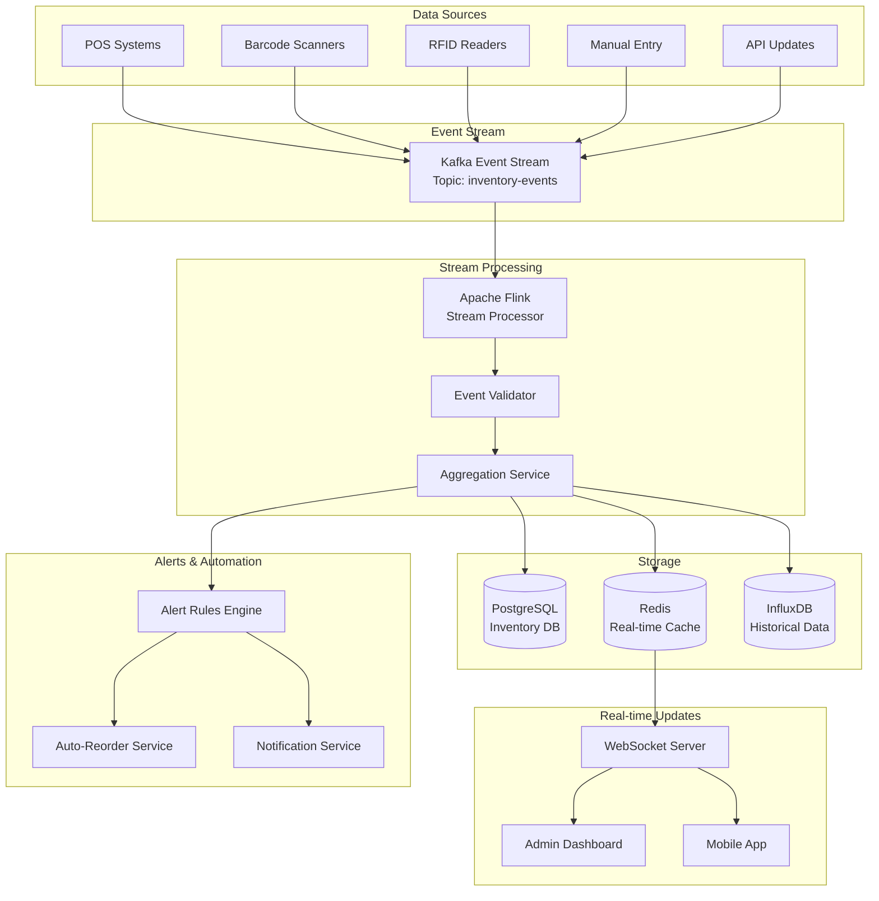
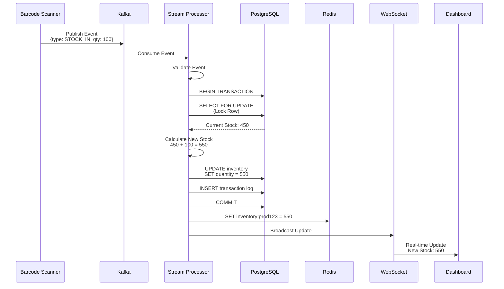
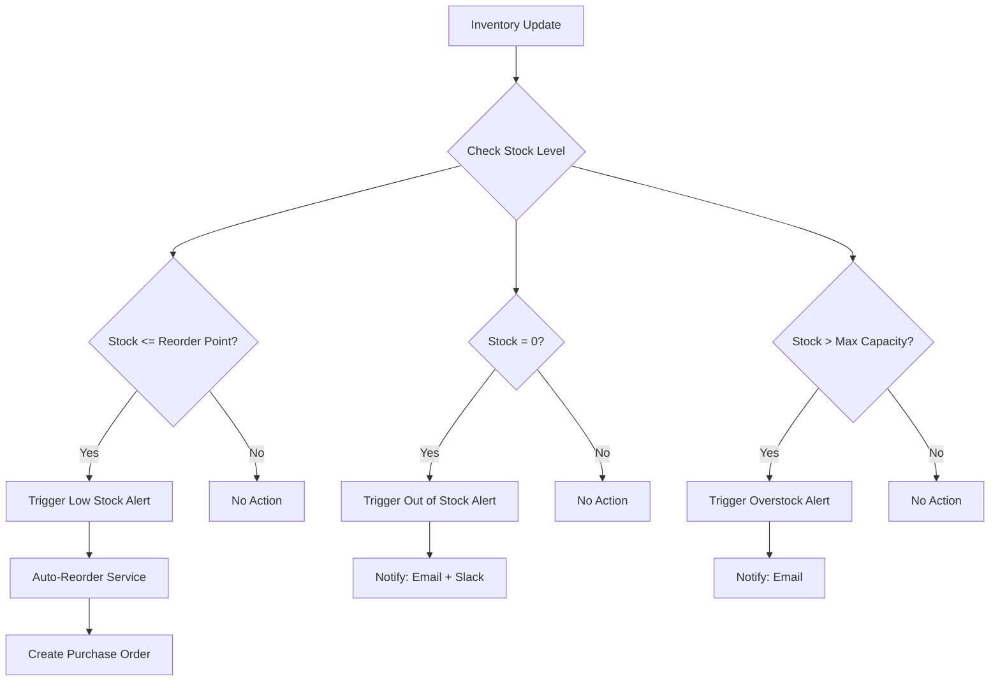
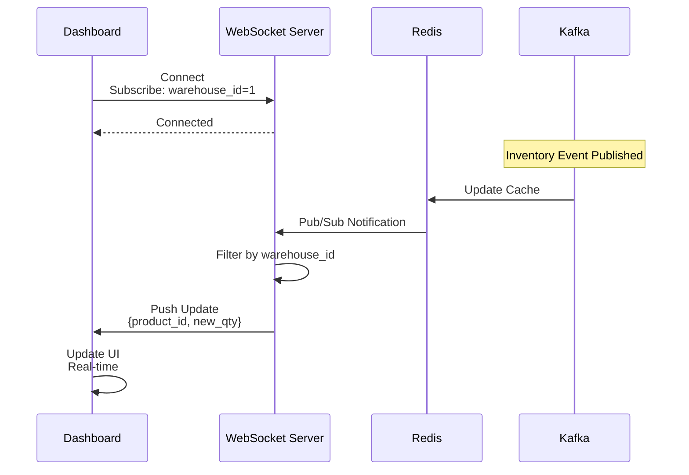
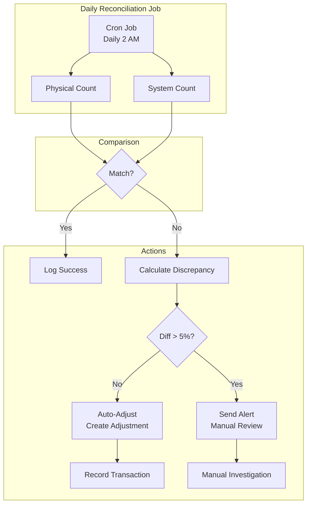
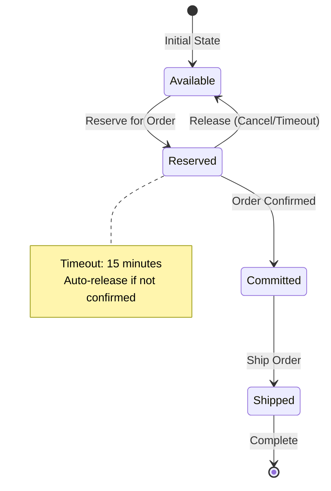
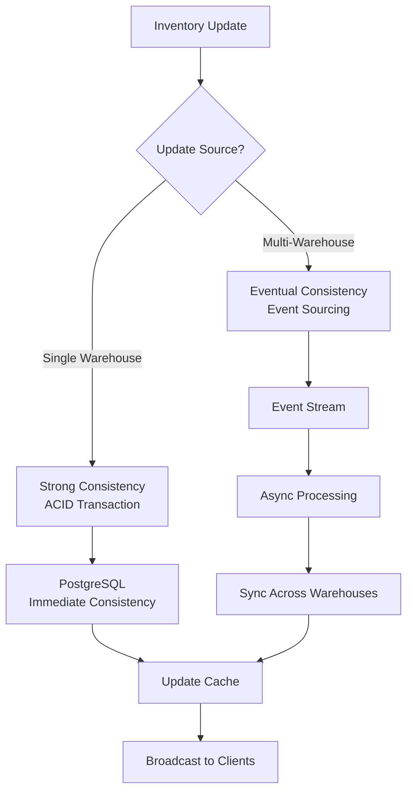

# Real-time Inventory Tracking: Visual Diagrams

## 1. Real-time Inventory Architecture



## 2. Inventory Event Flow



## 3. Inventory Transaction Types

```mermaid
graph LR
    subgraph "Transaction Types"
        IN[STOCK_IN<br/>Receiving]
        OUT[STOCK_OUT<br/>Sales/Shipment]
        ADJ[ADJUSTMENT<br/>Manual Correction]
        TRANS[TRANSFER<br/>Between Warehouses]
        RES[RESERVE<br/>Order Reservation]
        REL[RELEASE<br/>Cancel Reservation]
    end
    
    subgraph "Impact"
        IN -->|+Quantity| Increase[Increase Stock]
        OUT -->|−Quantity| Decrease[Decrease Stock]
        ADJ -->|±Quantity| Adjust[Adjust Stock]
        TRANS -->|−Source<br/>+Destination| Move[Move Stock]
        RES -->|+Reserved| Lock[Lock Stock]
        REL -->|−Reserved| Unlock[Unlock Stock]
    end
```



## 4. Multi-Warehouse Inventory View

```mermaid
graph TB
    subgraph "Product: iPhone 15"
        Total[Total Stock: 1,250]
    end
    
    subgraph "Warehouse Distribution"
        WH1[Warehouse 1<br/>New York<br/>Stock: 450<br/>Reserved: 50<br/>Available: 400]
        WH2[Warehouse 2<br/>Los Angeles<br/>Stock: 380<br/>Reserved: 30<br/>Available: 350]
        WH3[Warehouse 3<br/>Chicago<br/>Stock: 420<br/>Reserved: 70<br/>Available: 350]
    end
    
    subgraph "Status"
        Status[Overall Status: ✓ In Stock<br/>Total Available: 1,100]
    end
    
    Total --> WH1
    Total --> WH2
    Total --> WH3
    
    WH1 --> Status
    WH2 --> Status
    WH3 --> Status
```

## 5. Stock Alert System



## 6. WebSocket Real-time Updates



## 7. Inventory Reconciliation



## 8. Inventory Reservation System



## 9. Stock Movement Tracking

```mermaid
graph LR
    subgraph "Source"
        WH1[Warehouse 1<br/>Stock: 500]
    end
    
    subgraph "Transfer Process"
        Request[Transfer Request<br/>Qty: 100]
        Request --> Approve[Approval]
        Approve --> Pack[Pack Items]
        Pack --> Ship[Ship to WH2]
        Ship --> Receive[Receive at WH2]
    end
    
    subgraph "Destination"
        WH2[Warehouse 2<br/>Stock: 300]
    end
    
    subgraph "System Updates"
        U1[WH1: 500 → 400]
        U2[In Transit: +100]
        U3[WH2: 300 → 400]
        U4[In Transit: −100]
    end
    
    WH1 --> Request
    Receive --> WH2
    
    Pack -.-> U1
    Ship -.-> U2
    Receive -.-> U3
    Receive -.-> U4
```



## 10. Performance Monitoring

```mermaid
graph TB
    subgraph "Real-time Metrics"
        M1[Stock Updates/sec<br/>Current: 1,250]
        M2[WebSocket Connections<br/>Active: 45]
        M3[Cache Hit Rate<br/>95.2%]
        M4[Event Processing Lag<br/>50ms]
    end
    
    subgraph "Business Metrics"
        B1[Stock Accuracy<br/>99.8%]
        B2[Out of Stock Events<br/>12 today]
        B3[Auto-Reorders Triggered<br/>8 today]
        B4[Inventory Turnover<br/>6.5x/year]
    end
    
    subgraph "Alerts"
        A1[⚠ Low Stock: 23 items]
        A2[🔴 Out of Stock: 5 items]
        A3[✓ System Healthy]
    end
    
    M1 --> Dashboard[Grafana Dashboard]
    M2 --> Dashboard
    M3 --> Dashboard
    M4 --> Dashboard
    B1 --> Dashboard
    B2 --> Dashboard
    B3 --> Dashboard
    B4 --> Dashboard
    
    Dashboard --> A1
    Dashboard --> A2
    Dashboard --> A3
```



## Key Performance Indicators

| Metric | Target | Current | Status |
|--------|--------|---------|--------|
| Event Processing Latency | \u003c 100ms | 50ms | ✅ |
| WebSocket Update Latency | \u003c 500ms | 200ms | ✅ |
| Cache Hit Rate | \u003e 90% | 95.2% | ✅ |
| Stock Accuracy | \u003e 99% | 99.8% | ✅ |
| System Uptime | \u003e 99.9% | 99.95% | ✅ |
| Throughput | 10K events/s | 8.5K events/s | ✅ |

## Data Consistency Model


