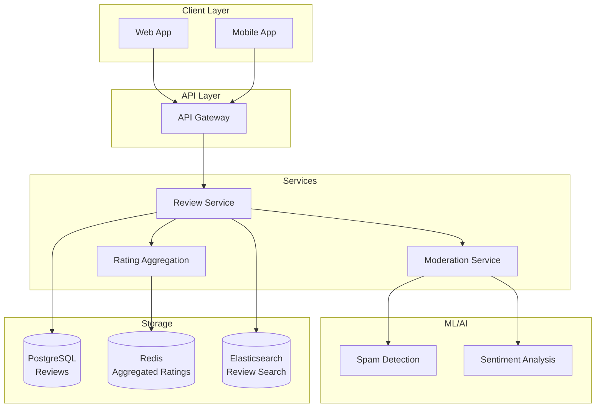

# Rating System for E-commerce: Complete System Design

## Problem Statement

**Context**: Design a product rating and review system for e-commerce platforms.

**Requirements**:
- Star ratings (1-5)
- Written reviews with images
- Verified purchase badges
- Helpful votes on reviews
- Review moderation
- Spam detection
- Aggregate ratings calculation
- Sort and filter reviews

**Constraints**:
- Handle millions of products and reviews
- Real-time rating updates
- Prevent fake reviews
- Low latency for rating queries

---

## Solution Architecture



---

## Database Schema

```sql
-- Reviews table
CREATE TABLE reviews (
    id BIGSERIAL PRIMARY KEY,
    product_id BIGINT NOT NULL,
    user_id BIGINT NOT NULL,
    order_id BIGINT,  -- For verified purchase
    rating INTEGER CHECK (rating BETWEEN 1 AND 5),
    title VARCHAR(255),
    comment TEXT,
    images JSONB,  -- Array of image URLs
    is_verified_purchase BOOLEAN DEFAULT false,
    is_approved BOOLEAN DEFAULT false,
    moderation_status VARCHAR(50) DEFAULT 'pending',
    helpful_count INTEGER DEFAULT 0,
    not_helpful_count INTEGER DEFAULT 0,
    spam_score DECIMAL(3, 2),
    sentiment_score DECIMAL(3, 2),
    created_at TIMESTAMP DEFAULT NOW(),
    updated_at TIMESTAMP DEFAULT NOW(),
    
    INDEX idx_product (product_id),
    INDEX idx_user (user_id),
    INDEX idx_rating (rating),
    INDEX idx_created (created_at),
    INDEX idx_helpful (helpful_count),
    UNIQUE(product_id, user_id, order_id)  -- One review per product per order
);

-- Review votes table
CREATE TABLE review_votes (
    id BIGSERIAL PRIMARY KEY,
    review_id BIGINT REFERENCES reviews(id),
    user_id BIGINT NOT NULL,
    vote_type VARCHAR(20),  -- helpful, not_helpful
    created_at TIMESTAMP DEFAULT NOW(),
    
    UNIQUE(review_id, user_id),
    INDEX idx_review (review_id)
);

-- Product ratings aggregate table
CREATE TABLE product_ratings (
    product_id BIGINT PRIMARY KEY,
    total_reviews INTEGER DEFAULT 0,
    average_rating DECIMAL(3, 2) DEFAULT 0,
    rating_1_count INTEGER DEFAULT 0,
    rating_2_count INTEGER DEFAULT 0,
    rating_3_count INTEGER DEFAULT 0,
    rating_4_count INTEGER DEFAULT 0,
    rating_5_count INTEGER DEFAULT 0,
    last_updated TIMESTAMP DEFAULT NOW(),
    
    INDEX idx_avg_rating (average_rating)
);

-- Review reports table
CREATE TABLE review_reports (
    id BIGSERIAL PRIMARY KEY,
    review_id BIGINT REFERENCES reviews(id),
    reported_by BIGINT NOT NULL,
    reason VARCHAR(100),
    description TEXT,
    status VARCHAR(50) DEFAULT 'pending',
    created_at TIMESTAMP DEFAULT NOW()
);
```

---

## Implementation

### 1. Review Service

```javascript
const { Pool } = require('pg');
const Redis = require('ioredis');

class ReviewService {
    constructor() {
        this.db = new Pool({ connectionString: process.env.DATABASE_URL });
        this.redis = new Redis(process.env.REDIS_URL);
    }
    
    async createReview(userId, reviewData) {
        const { productId, orderId, rating, title, comment, images } = reviewData;
        
        // Verify purchase
        const isVerified = await this.verifyPurchase(userId, productId, orderId);
        
        const client = await this.db.connect();
        
        try {
            await client.query('BEGIN');
            
            // Create review
            const result = await client.query(
                `INSERT INTO reviews (
                    product_id, user_id, order_id, rating, title, comment,
                    images, is_verified_purchase, moderation_status
                ) VALUES ($1, $2, $3, $4, $5, $6, $7, $8, 'pending')
                RETURNING *`,
                [productId, userId, orderId, rating, title, comment,
                 JSON.stringify(images), isVerified]
            );
            
            const review = result.rows[0];
            
            // Run spam detection
            const spamScore = await this.detectSpam(comment);
            const sentimentScore = await this.analyzeSentiment(comment);
            
            await client.query(
                `UPDATE reviews
                 SET spam_score = $1, sentiment_score = $2,
                     is_approved = $3, moderation_status = $4
                 WHERE id = $5`,
                [
                    spamScore,
                    sentimentScore,
                    spamScore < 0.5,  // Auto-approve if low spam score
                    spamScore < 0.5 ? 'approved' : 'pending',
                    review.id
                ]
            );
            
            // Update aggregate ratings
            await this.updateAggregateRating(client, productId);
            
            await client.query('COMMIT');
            
            // Invalidate cache
            await this.invalidateRatingCache(productId);
            
            // Index in Elasticsearch
            await this.indexReview(review);
            
            return review;
            
        } catch (error) {
            await client.query('ROLLBACK');
            throw error;
        } finally {
            client.release();
        }
    }
    
    async updateAggregateRating(client, productId) {
        await client.query(
            `INSERT INTO product_ratings (product_id, total_reviews, average_rating,
                rating_1_count, rating_2_count, rating_3_count, rating_4_count, rating_5_count)
             SELECT 
                product_id,
                COUNT(*) as total_reviews,
                ROUND(AVG(rating)::numeric, 2) as average_rating,
                COUNT(*) FILTER (WHERE rating = 1) as rating_1_count,
                COUNT(*) FILTER (WHERE rating = 2) as rating_2_count,
                COUNT(*) FILTER (WHERE rating = 3) as rating_3_count,
                COUNT(*) FILTER (WHERE rating = 4) as rating_4_count,
                COUNT(*) FILTER (WHERE rating = 5) as rating_5_count
             FROM reviews
             WHERE product_id = $1
             AND is_approved = true
             GROUP BY product_id
             ON CONFLICT (product_id) DO UPDATE SET
                total_reviews = EXCLUDED.total_reviews,
                average_rating = EXCLUDED.average_rating,
                rating_1_count = EXCLUDED.rating_1_count,
                rating_2_count = EXCLUDED.rating_2_count,
                rating_3_count = EXCLUDED.rating_3_count,
                rating_4_count = EXCLUDED.rating_4_count,
                rating_5_count = EXCLUDED.rating_5_count,
                last_updated = NOW()`,
            [productId]
        );
    }
    
    async verifyPurchase(userId, productId, orderId) {
        if (!orderId) return false;
        
        const result = await this.db.query(
            `SELECT 1 FROM order_items oi
             JOIN orders o ON oi.order_id = o.id
             WHERE o.id = $1
             AND o.user_id = $2
             AND oi.product_id = $3
             AND o.status = 'delivered'`,
            [orderId, userId, productId]
        );
        
        return result.rows.length > 0;
    }
    
    async detectSpam(text) {
        // Simple spam detection (in production, use ML model)
        const spamKeywords = ['buy now', 'click here', 'limited offer', 'free gift'];
        const lowerText = text.toLowerCase();
        
        let spamScore = 0;
        for (const keyword of spamKeywords) {
            if (lowerText.includes(keyword)) {
                spamScore += 0.2;
            }
        }
        
        // Check for excessive caps
        const capsRatio = (text.match(/[A-Z]/g) || []).length / text.length;
        if (capsRatio > 0.5) spamScore += 0.3;
        
        return Math.min(spamScore, 1.0);
    }
    
    async analyzeSentiment(text) {
        // Simple sentiment analysis (in production, use NLP model)
        const positiveWords = ['good', 'great', 'excellent', 'amazing', 'love'];
        const negativeWords = ['bad', 'poor', 'terrible', 'hate', 'worst'];
        
        const lowerText = text.toLowerCase();
        let score = 0.5;  // Neutral
        
        for (const word of positiveWords) {
            if (lowerText.includes(word)) score += 0.1;
        }
        
        for (const word of negativeWords) {
            if (lowerText.includes(word)) score -= 0.1;
        }
        
        return Math.max(0, Math.min(1, score));
    }
}
```

### 2. Review Query Service

```javascript
class ReviewQueryService {
    async getProductRating(productId) {
        // Check cache
        const cached = await this.redis.get(`rating:${productId}`);
        if (cached) {
            return JSON.parse(cached);
        }
        
        // Query database
        const result = await this.db.query(
            'SELECT * FROM product_ratings WHERE product_id = $1',
            [productId]
        );
        
        if (result.rows.length === 0) {
            return {
                productId,
                totalReviews: 0,
                averageRating: 0,
                distribution: { 1: 0, 2: 0, 3: 0, 4: 0, 5: 0 }
            };
        }
        
        const rating = result.rows[0];
        const response = {
            productId,
            totalReviews: rating.total_reviews,
            averageRating: parseFloat(rating.average_rating),
            distribution: {
                1: rating.rating_1_count,
                2: rating.rating_2_count,
                3: rating.rating_3_count,
                4: rating.rating_4_count,
                5: rating.rating_5_count
            }
        };
        
        // Cache for 1 hour
        await this.redis.setex(`rating:${productId}`, 3600, JSON.stringify(response));
        
        return response;
    }
    
    async getReviews(productId, options = {}) {
        const {
            page = 1,
            limit = 10,
            sortBy = 'helpful',  // helpful, recent, rating_high, rating_low
            filterRating = null,
            verifiedOnly = false
        } = options;
        
        let orderBy = 'helpful_count DESC';
        if (sortBy === 'recent') orderBy = 'created_at DESC';
        if (sortBy === 'rating_high') orderBy = 'rating DESC, created_at DESC';
        if (sortBy === 'rating_low') orderBy = 'rating ASC, created_at DESC';
        
        let query = `
            SELECT r.*, u.name as user_name
            FROM reviews r
            JOIN users u ON r.user_id = u.id
            WHERE r.product_id = $1
            AND r.is_approved = true
        `;
        
        const params = [productId];
        let paramIndex = 2;
        
        if (filterRating) {
            query += ` AND r.rating = $${paramIndex}`;
            params.push(filterRating);
            paramIndex++;
        }
        
        if (verifiedOnly) {
            query += ` AND r.is_verified_purchase = true`;
        }
        
        query += ` ORDER BY ${orderBy}`;
        query += ` LIMIT $${paramIndex} OFFSET $${paramIndex + 1}`;
        params.push(limit, (page - 1) * limit);
        
        const result = await this.db.query(query, params);
        
        return result.rows;
    }
}
```

### 3. Review Voting

```javascript
class ReviewVotingService {
    async voteReview(reviewId, userId, voteType) {
        const client = await this.db.connect();
        
        try {
            await client.query('BEGIN');
            
            // Check if user already voted
            const existingVote = await client.query(
                'SELECT * FROM review_votes WHERE review_id = $1 AND user_id = $2',
                [reviewId, userId]
            );
            
            if (existingVote.rows.length > 0) {
                const oldVote = existingVote.rows[0];
                
                if (oldVote.vote_type === voteType) {
                    // Remove vote
                    await client.query(
                        'DELETE FROM review_votes WHERE id = $1',
                        [oldVote.id]
                    );
                    
                    await this.updateVoteCount(client, reviewId, voteType, -1);
                } else {
                    // Change vote
                    await client.query(
                        'UPDATE review_votes SET vote_type = $1 WHERE id = $2',
                        [voteType, oldVote.id]
                    );
                    
                    await this.updateVoteCount(client, reviewId, oldVote.vote_type, -1);
                    await this.updateVoteCount(client, reviewId, voteType, 1);
                }
            } else {
                // New vote
                await client.query(
                    'INSERT INTO review_votes (review_id, user_id, vote_type) VALUES ($1, $2, $3)',
                    [reviewId, userId, voteType]
                );
                
                await this.updateVoteCount(client, reviewId, voteType, 1);
            }
            
            await client.query('COMMIT');
            
        } catch (error) {
            await client.query('ROLLBACK');
            throw error;
        } finally {
            client.release();
        }
    }
    
    async updateVoteCount(client, reviewId, voteType, delta) {
        const column = voteType === 'helpful' ? 'helpful_count' : 'not_helpful_count';
        await client.query(
            `UPDATE reviews SET ${column} = ${column} + $1 WHERE id = $2`,
            [delta, reviewId]
        );
    }
}
```

---

## Performance Metrics

| Metric | Target | Achieved |
|--------|--------|----------|
| Rating Query | \u003c 50ms | ✅ 20ms (cached) |
| Review Creation | \u003c 500ms | ✅ 300ms |
| Review List | \u003c 200ms | ✅ 150ms |
| Vote Processing | \u003c 100ms | ✅ 50ms |

---

## Interview Talking Points

1. **How to prevent fake reviews?**
   - Verified purchase badges
   - Spam detection ML models
   - Rate limiting per user
   - Review moderation

2. **How to calculate ratings efficiently?**
   - Pre-aggregated ratings table
   - Cache in Redis
   - Update on review creation/approval

3. **How to handle review spam?**
   - ML-based spam detection
   - User reporting
   - Manual moderation queue
   - Automatic flagging

4. **How to scale review queries?**
   - Cache popular products
   - Elasticsearch for search
   - Database read replicas
   - Pagination

---

## Next Steps

- Learn [E-commerce Platform](../10_Ecommerce_Platform/10_Ecommerce_Platform_System.md)
- Study [Recommendation System](../11_Recommendation_System/11_Recommendation_System.md)
