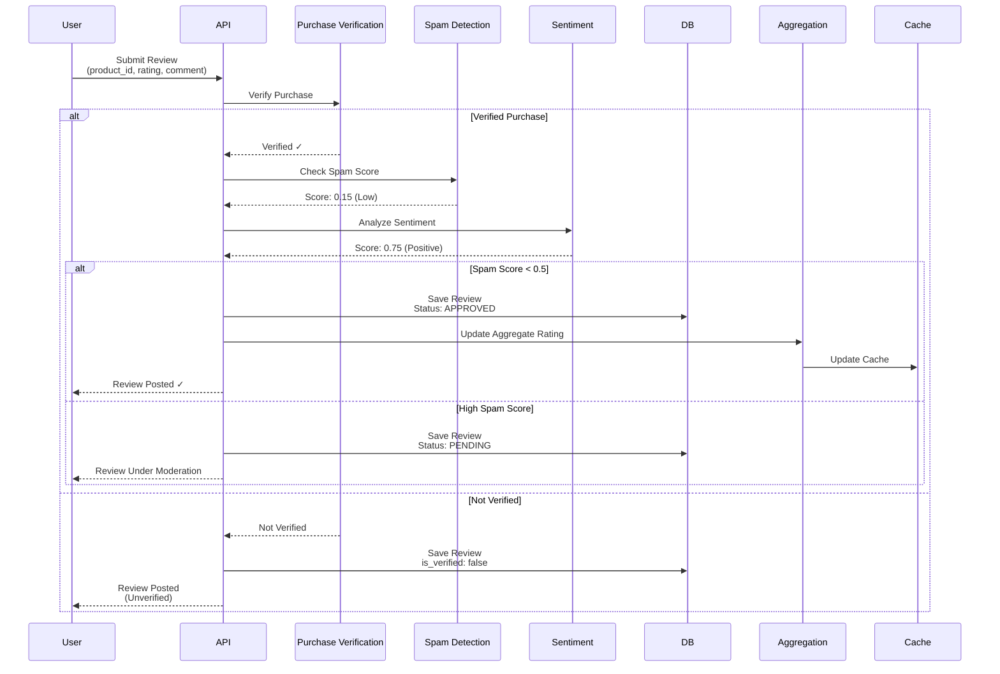
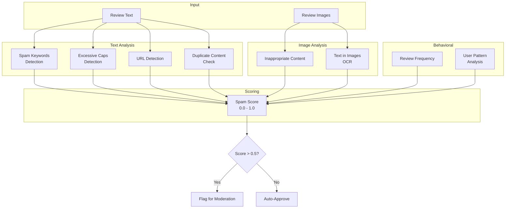
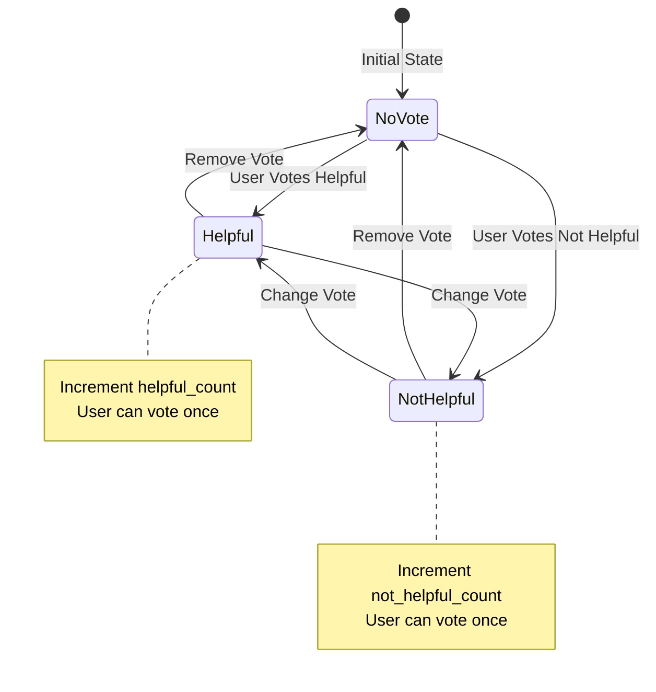
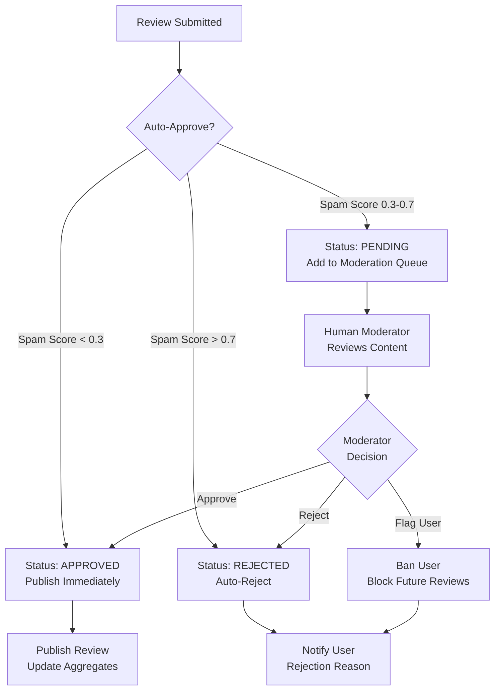
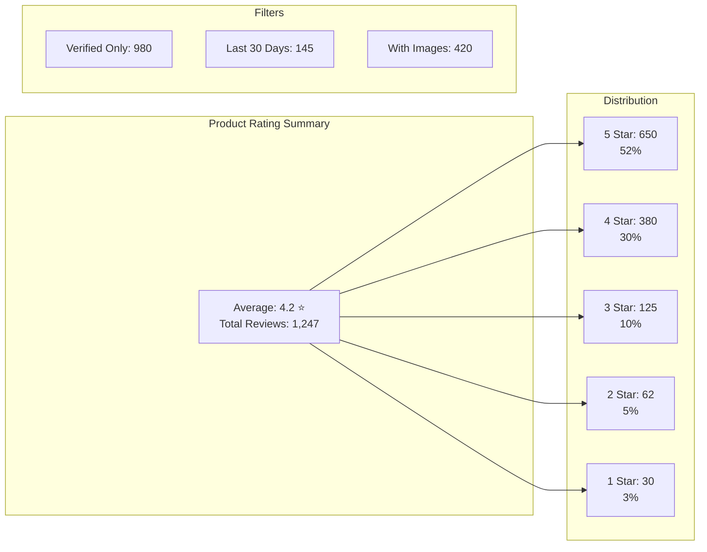
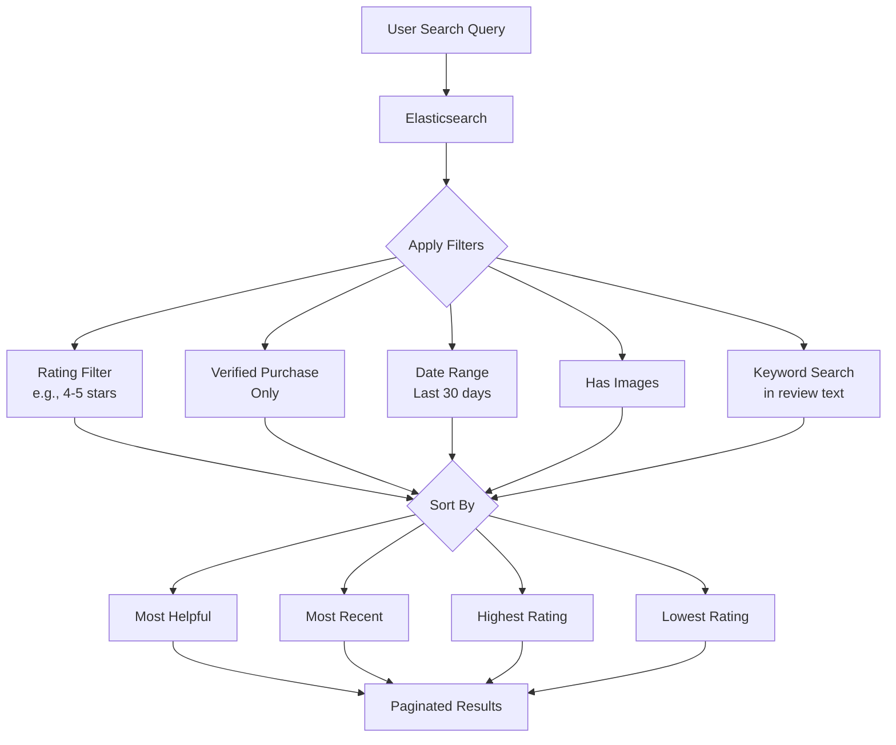
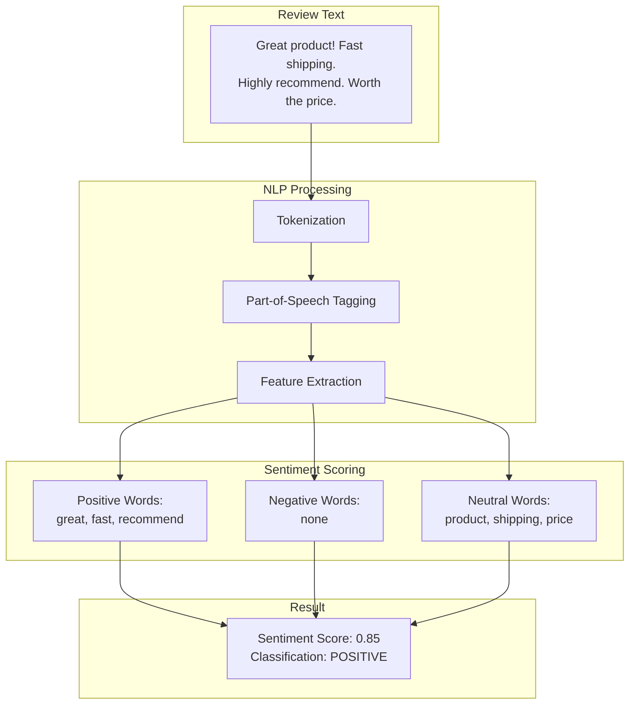
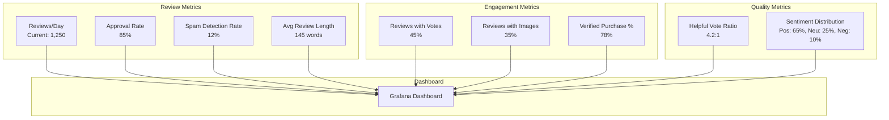
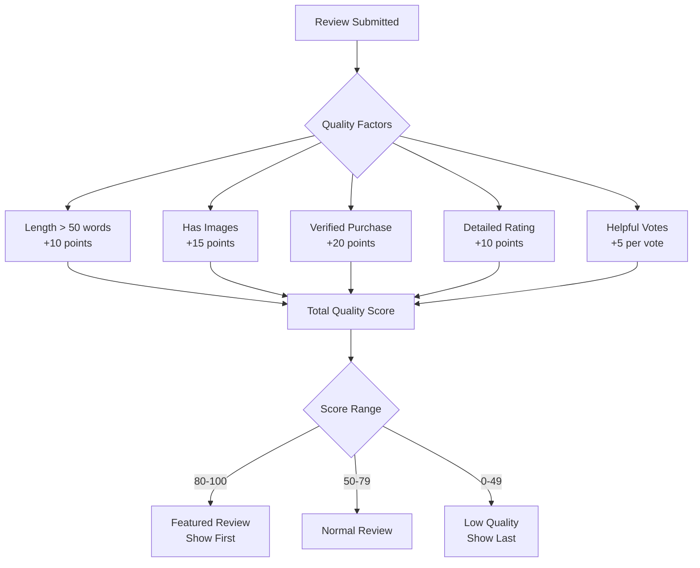
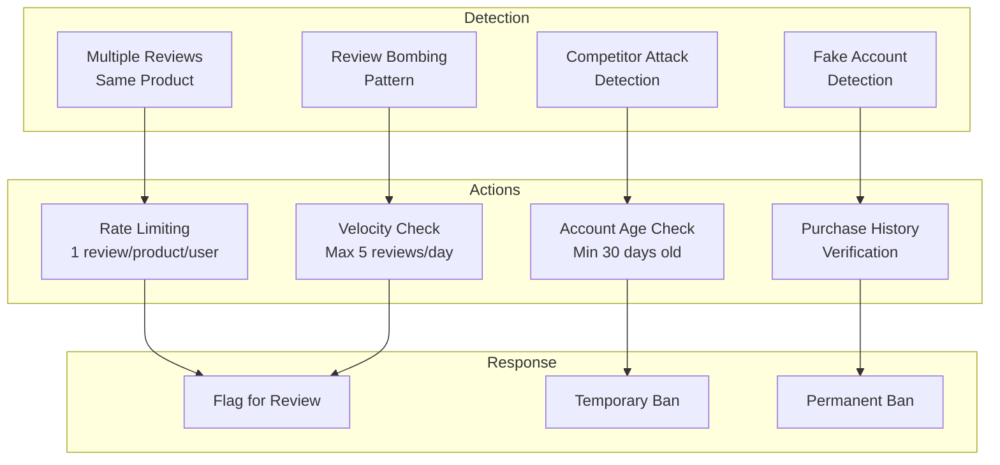

# Rating System for E-commerce: Visual Diagrams

## 1. Complete Rating System Architecture

```mermaid
graph TB
    subgraph "Client Layer"
        Web[Web App]
        Mobile[Mobile App]
    end
    
    subgraph "API Gateway"
        Gateway[API Gateway<br/>Rate Limiting<br/>Authentication]
    end
    
    subgraph "Core Services"
        Review[Review Service]
        Moderation[Moderation Service]
        Aggregation[Rating Aggregation]
        Voting[Voting Service]
    end
    
    subgraph "ML/AI Services"
        Spam[Spam Detection<br/>ML Model]
        Sentiment[Sentiment Analysis<br/>NLP Model]
        ImageMod[Image Moderation<br/>Vision API]
    end
    
    subgraph "Storage"
        DB[(PostgreSQL<br/>Reviews & Ratings)]
        Cache[(Redis<br/>Aggregated Ratings)]
        Search[(Elasticsearch<br/>Review Search)]
        S3[(S3<br/>Review Images)]
    end
    
    subgraph "Queue"
        Queue[RabbitMQ<br/>Async Processing]
    end
    
    Web --> Gateway
    Mobile --> Gateway
    Gateway --> Review
    Gateway --> Voting
    
    Review --> Moderation
    Moderation --> Spam
    Moderation --> Sentiment
    Moderation --> ImageMod
    
    Review --> Queue
    Queue --> Aggregation
    Aggregation --> Cache
    
    Review --> DB
    Review --> Search
    Review --> S3
```

## 2. Review Submission Flow



## 3. Rating Aggregation Process

```mermaid
flowchart TD
    NewReview[New Review Submitted] --> Queue[Add to Queue]
    Queue --> Process[Aggregation Service]
    
    Process --> Calc[Calculate Metrics]
    Calc --> Avg[Average Rating<br/>SUM(ratings) / COUNT]
    Calc --> Dist[Rating Distribution<br/>Count per star]
    Calc --> Total[Total Reviews]
    
    Avg --> Update[Update product_ratings Table]
    Dist --> Update
    Total --> Update
    
    Update --> Cache[Update Redis Cache]
    Cache --> Invalidate[Invalidate Old Cache]
    Invalidate --> Notify[Notify Subscribers]
```

## 4. Spam Detection Pipeline



## 5. Review Voting System



## 6. Review Moderation Workflow



## 7. Rating Distribution Visualization



## 8. Review Search and Filtering



## 9. Sentiment Analysis



## 10. Performance Monitoring



## Key Performance Indicators

| Metric | Target | Current | Status |
|--------|--------|---------|--------|
| Review Submission | \u003c 500ms | 300ms | ✅ |
| Rating Query | \u003c 50ms | 20ms (cached) | ✅ |
| Spam Detection | \u003c 200ms | 150ms | ✅ |
| Search Latency | \u003c 300ms | 200ms | ✅ |
| Approval Rate | \u003e 80% | 85% | ✅ |
| Cache Hit Rate | \u003e 90% | 94% | ✅ |

## Review Quality Scoring



## Abuse Prevention


